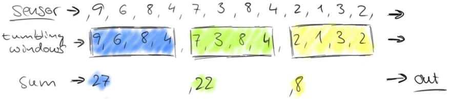
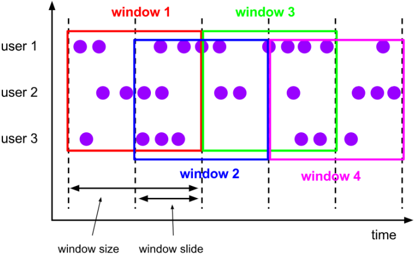
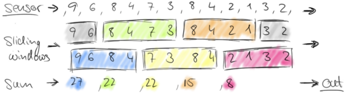
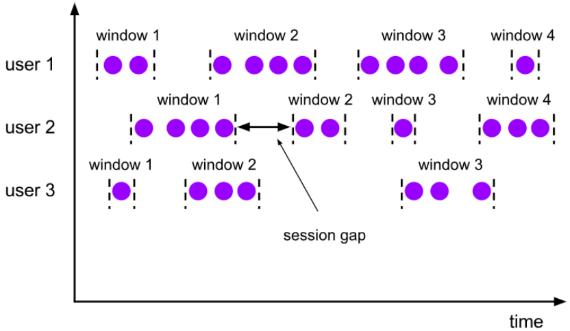

# flink_window

在流处理应用中，数据是连续不断的，有时我们需要做一些聚合类的处理，例如：在过去的1分钟内有多少用户点击了我们的网页。在这种情况下，我们必须定义一个窗口(window)，用来收集最近1分钟内的数据，并对这个窗口内的数据进行计算。
Flink 认为 Batch 是 Streaming 的一个特例，所以Flink是在底层的流式引擎上实现了流处理和批处理。而窗口(window)就是从 Streaming 到 Batch 的一个桥梁。
在 Flink 中 Window  可以将无限流切分成有限流，是处理有限流的核心组件，Flink 提供了非常完善的窗口机制。

## 6.1.2.Window

对于TimeWindow，可以根据窗口实现原理的不同分成三类：滚动窗口(Tumbling Window)、滑动窗口(Sliding Window)和会话窗口(Session Window)。

### 6.2.1.tumbling-time-window (翻滚窗口-无重叠数据)

将数据依据固定的窗口长度对数据进行切片。

滚动窗口分配器将每个元素分配到一个指定窗口大小的窗口中，滚动窗口有一个固定的大小，并且不会出现重叠。例如：如果你指定了一个5分钟大小的滚动窗口，窗口的创建如下图所示：

适用场景：适合做BI统计等(做每个时间段的聚合计算)。

示例:
1.红绿灯路口会有汽车通过，一共会有多少汽车通过，无法计算。因为车流源源不断，计算没有边界。
2.每5秒钟统计一次，在这过去的5秒钟内，各个路口通过红绿灯汽车的数量

### 6.2.2.sliding-time-window (滑动窗口-有重叠数据)

滑动窗口分配器将元素分配到固定长度的窗口中，与滚动窗口类似，窗口的大小由窗口大小参数来配置，另一个窗口滑动参数控制滑动窗口开始的频率。因此，滑动窗口如果滑动参数小于窗口大小的话，窗口是可以重叠的，在这种情况下元素会被分配到多个窗口中。
例如，你有10分钟的窗口和5分钟的滑动，那么每个窗口中5分钟的窗口里包含着上个10分钟产生的数据，如下图所示：

适用场景：对最近一个时间段内的统计(求某接口最近5min的失败率来决定是否要报警)。
5秒钟统计一次，在这过去的10秒钟内，各个路口通过红绿灯汽车的数量

1. 如果窗口计算时间 < 窗口时间，会出现数据重复计算
2. 如果窗口计算时间 = 窗口时间，数据不会被重复计算
3. 如果窗口计算时间 > 窗口时间，会出现数据丢失

### 6.2.3.session-time-windows(会话窗口)

由一系列事件组合一个指定时间长度的timeout间隙组成，类似于web应用的session，也就是一段时间没有接收到新数据就会生成新的窗口。

## Count-Window

### 6.3.1.tumbling-count-window (无重叠数据)

按照个数进行统计，比如：
对每个路口分别统计,统计在最近5条消息中,各自路口通过的汽车数量,相同的key每出现5次进行统计
即对应的key出现的次数达到5次作为一个窗口,即相同的key出现5次才做一次sum聚合

### 6.3.2.sliding-count-window (有重叠数据)

对每个路口分别统计,统计在最近5条消息中,各自路口通过的汽车数量,相同的key每出现3次进行统计
同样也是窗口长度和滑动窗口的操作：窗口长度是5，滑动长度是3

