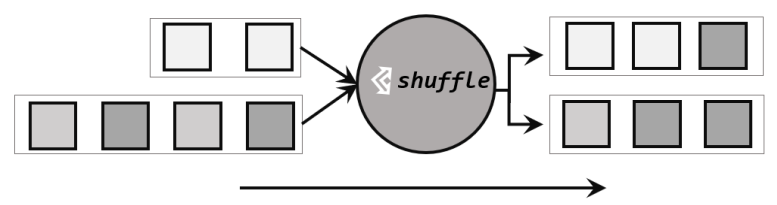
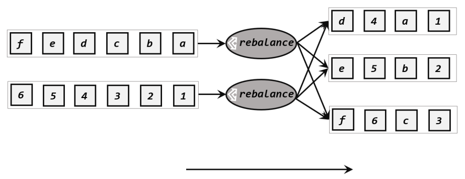
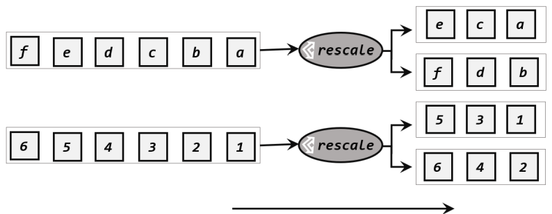

# partition


## shuffle
通过调用 DataStream 的.shuffle()方法，将数据随机地分配到下游算子的并行任务中去。随机分区服从均匀分布（uniform distribution），所以可以把流中的数据随机打乱，均匀地传递到下游任务分区
经过随机分区之后，得到的依然是一个 DataStream。 




## rebalance
按照先后顺序将数据做依次分发,通过调用 DataStream 的.rebalance()方法，就可以实现轮询重分区。rebalance
使用的是 Round-Robin 负载均衡算法，可以将输入流数据平均分配到下游的并行任务中去。 
注：Round-Robin 算法用在了很多地方，例如 Kafka 和 Nginx。 



## rescale
当调用 rescale()方法时，其实底层也是使用 Round-Robin
算法进行轮询，但是只会将数据轮询发送到下游并行任务的一部分中，如图 5-11 所示。也就
是说，“发牌人”如果有多个，那么 rebalance 的方式是每个发牌人都面向所有人发牌；而 rescale
的做法是分成小团体，发牌人只给自己团体内的所有人轮流发牌。

当下游任务（数据接收方）的数量是上游任务（数据发送方）数量的整数倍时，rescale
的效率明显会更高。比如当上游任务数量是 2，下游任务数量是 6 时，上游任务其中一个分区
的数据就将会平均分配到下游任务的 3 个分区中。


## broadcast
这种方式其实不应该叫做“重分区”，因为经过广播之后，数据会在不同的分区都保留一
份，可能进行重复处理。可以通过调用 DataStream 的 broadcast()方法，将输入数据复制并发送
到下游算子的所有并行任务中去。


## partition_custom
自定义分区
```python
data_stream = env.from_collection(collection=[(2, 'a'), (2, 'a'), (3, 'b')])
data_stream.partition_custom(lambda key, num_partition: key % partition, lambda x: x[0])
```

refs:
https://nightlies.apache.org/flink/flink-docs-release-1.15/docs/dev/datastream/operators/overview/#physical-partitioning
