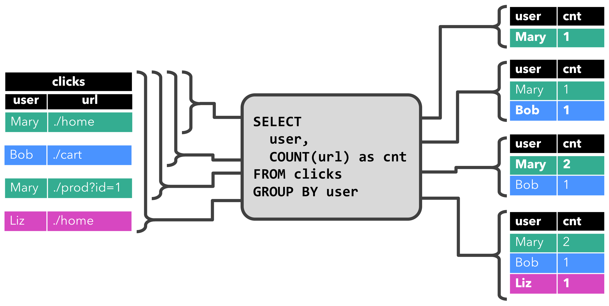

# dynamicTable

## Concept

In contrast to the `static tables` that represent `batch data`, `dynamic tables` change over time.
Querying dynamic tables yields a Continuous Query. A continuous query **never terminates** and **produces dynamic results** - another dynamic table. The query continuously updates its (dynamic) result table to reflect changes on its (dynamic) input tables.
The following figure visualizes the relationship of streams, dynamic tables, and continuous queries:

1. A stream is converted into a dynamic table.
2. A continuous query is evaluated on the dynamic table yielding a new dynamic table.
3. The resulting dynamic table is converted back into a stream.
NOTE: Dynamic tables are foremost a *logical concept**. Dynamic tables are **not necessarily (fully) materialized** during query execution.

## Defining a Table on a Stream
The following figure visualizes how the stream of click event (left-hand side) is converted into a table (right-hand side). The resulting table is continuously growing as more records of the click stream are inserted.

NOTE: Remember, a table defined on a stream is internally **not materialized**.

## Continuous Queries

A continuous query is evaluated on a dynamic table and produces a new dynamic table as a result. In contrast to a batch query, a continuous query **never terminates** and **updates its result table according to its input tables’ updates**.

### groupby
The following figure shows how the query is evaluated over time as the clicks table is updated with additional rows.

When the query starts, the `clicks` table (left-hand side) is empty.
The query computes the result table when the first row is `inserted`. After the first row `[Mary, ./home]` arrives, the result table (right-hand side, top) consists of a single row `[Mary, 1]`.
When the second row `[Bob, ./cart]` is `inserted` into the clicks table, the query updates the result table and inserts a new row `[Bob, 1]`.
The third row, `[Mary, ./prod?id=1]` yields an `update` of an already computed result row such that `[Mary, 1]` is updated to `[Mary, 2]`.

### window
The second query is similar to the first one but groups the `clicks` table in addition to the user attribute also on an `hourly tumbling window` before it counts the number of URLs.

The query **continuously computes results every hour** and updates the result table.
The clicks table contains four rows with timestamps (cTime) between 12:00:00 and 12:59:59.The query computes two results rows from this input (one for each user) and `appends` them to the result table.
For the next window between 13:00:00 and 13:59:59, the clicks table contains three rows, which results in another two rows being `appended` to the result table.
The result table is updated as more rows are `appended` to clicks over time.

### Update and Append Queries
The first query updates previously emitted results, i.e., the changelog stream that defines the result table contains `INSERT` and `UPDATE` changes.
The second query only appends to the result table, i.e., the result table’s changelog stream only consists of `INSERT` changes.

### Query Restrictions
Some queries are too expensive to compute, either due to the size of state they need to maintain or because computing updates is too expensive.

- **State Size**: Continuous queries are evaluated on unbounded streams and are often supposed to run for weeks or months. Hence, the total amount of data that a continuous query processes can be very large. 

- **Computing Updates**: Some queries require to recompute and update a large fraction of the emitted result rows even if only a single input record is added or updated.  An example is the query that computes a RANK for each user based on the time of the last click. 

## Table to Stream Conversion
A dynamic table can be continuously modified by `INSERT`, `UPDATE`, and `DELETE` changes just like a regular database table.When converting a dynamic table into a stream or writing it to an external system, these changes need to be encoded. Flink’s Table API and SQL support three ways to encode the changes of a dynamic table:

- **Append-only stream**: A dynamic table that is only modified by INSERT changes can be converted into a stream by emitting the inserted rows.

- **Retract stream**: A retract stream is a stream with two types of messages, `add messages` and `retract messages`.A dynamic table is converted into a retract stream by encoding an `INSERT` change as `add message`, a `DELETE` change as a `retract message`, and an `UPDATE` change as a `retract message for the updated (previous) row`, and an additional message for the updating (new) row.

- **Upsert stream**: An upsert stream is a stream with two types of messages, `upsert messages` and `delete messages`. A dynamic table that is converted into an upsert stream requires a (possibly composite) **unique key**. A dynamic table with a unique key is transformed into a stream by encoding `INSERT` and `UPDATE` changes as `upsert messages` and `DELETE` changes as `delete messages`. **The stream consuming operator needs to be aware of the unique key attribute to apply messages correctly**. The main difference to a retract stream is that UPDATE changes are encoded with a single message and hence more efficient. 

refs:
https://nightlies.apache.org/flink/flink-docs-master/docs/dev/table/concepts/dynamic_tables/