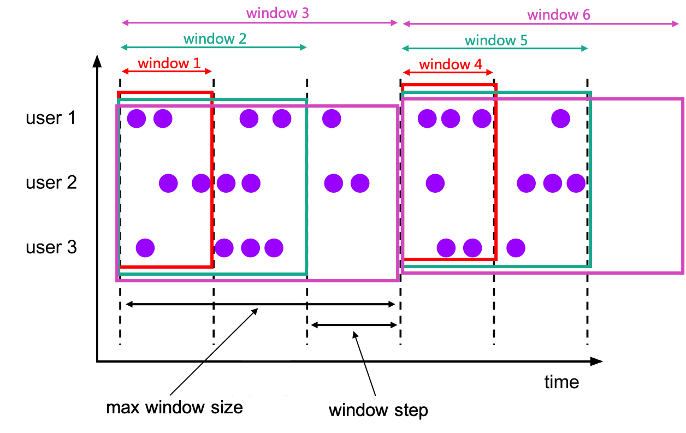

# window

Windows split the infinit stream into “buckets” of finite size, over which we can apply computations.


### TUMBLE
Tumbling windows have a fixed size and do not overlap.


 In `streaming mode`, the time attribute field must be either `event` or `processing` time attributes. 
 In `batch mode`, the time attribute field of window table function must be an attribute of type `TIMESTAMP` or `TIMESTAMP_LTZ`.


#### funciton
`TUMBLE(TABLE data, DESCRIPTOR(timecol), size [, offset ])`

- **data**: is a table parameter that can be any relation with a time attribute column.
- **timecol**: is a column descriptor indicating which time attributes column of data should be mapped to - tumbling windows.
- **size**: is a duration specifying the width of the tumbling windows.
- **offset**: is an optional parameter to specify the offset which window start would be shifted by.

#### example
```sql
Flink SQL> SELECT * FROM Bid;
+------------------+-------+------+
|          bidtime | price | item |
+------------------+-------+------+
| 2020-04-15 08:05 |  4.00 | C    |
| 2020-04-15 08:07 |  2.00 | A    |
| 2020-04-15 08:09 |  5.00 | D    |
| 2020-04-15 08:11 |  3.00 | B    |
| 2020-04-15 08:13 |  1.00 | E    |
| 2020-04-15 08:17 |  6.00 | F    |
+------------------+-------+------+

Flink SQL> SELECT * FROM TABLE(
   TUMBLE(
     DATA => TABLE Bid,
     TIMECOL => DESCRIPTOR(bidtime),
     SIZE => INTERVAL '10' MINUTES));
+------------------+-------+------+------------------+------------------+-------------------------+
|          bidtime | price | item |     window_start |       window_end |            window_time  |
+------------------+-------+------+------------------+------------------+-------------------------+
| 2020-04-15 08:05 |  4.00 | C    | 2020-04-15 08:00 | 2020-04-15 08:10 | 2020-04-15 08:09:59.999 |
| 2020-04-15 08:07 |  2.00 | A    | 2020-04-15 08:00 | 2020-04-15 08:10 | 2020-04-15 08:09:59.999 |
| 2020-04-15 08:09 |  5.00 | D    | 2020-04-15 08:00 | 2020-04-15 08:10 | 2020-04-15 08:09:59.999 |
| 2020-04-15 08:11 |  3.00 | B    | 2020-04-15 08:10 | 2020-04-15 08:20 | 2020-04-15 08:19:59.999 |
| 2020-04-15 08:13 |  1.00 | E    | 2020-04-15 08:10 | 2020-04-15 08:20 | 2020-04-15 08:19:59.999 |
| 2020-04-15 08:17 |  6.00 | F    | 2020-04-15 08:10 | 2020-04-15 08:20 | 2020-04-15 08:19:59.999 |
+------------------+-------+------+------------------+------------------+-------------------------+
```

### HOP
The HOP function assigns elements to windows of fixed length. Like a TUMBLE windowing function, the size of the windows is configured by the window size parameter. An additional window slide parameter controls how frequently a hopping window is started. Hence, hopping windows can be overlapping if the slide is smaller than the window size. 


 In `streaming mode`, the time attribute field must be either `event` or `processing` time attributes. 
 In `batch mode`, the time attribute field of window table function must be an attribute of type `TIMESTAMP` or `TIMESTAMP_LTZ`.

#### function
`HOP(TABLE data, DESCRIPTOR(timecol), slide, size [, offset ])`

- data: is a table parameter that can be any relation with an time attribute column.
- timecol: is a column descriptor indicating which time attributes column of data should be mapped to - hopping windows.
- slide: is a duration specifying the duration between the start of sequential hopping windows
- size: is a duration specifying the width of the hopping windows.
- offset: is an optional parameter to specify the offset which window start would be shifted by.

#### example

```sql
> SELECT * FROM TABLE(
    HOP(
      DATA => TABLE Bid,
      TIMECOL => DESCRIPTOR(bidtime),
      SLIDE => INTERVAL '5' MINUTES,
      SIZE => INTERVAL '10' MINUTES));
+------------------+-------+------+------------------+------------------+-------------------------+
|          bidtime | price | item |     window_start |       window_end |           window_time   |
+------------------+-------+------+------------------+------------------+-------------------------+
| 2020-04-15 08:05 |  4.00 | C    | 2020-04-15 08:00 | 2020-04-15 08:10 | 2020-04-15 08:09:59.999 |
| 2020-04-15 08:05 |  4.00 | C    | 2020-04-15 08:05 | 2020-04-15 08:15 | 2020-04-15 08:14:59.999 |
| 2020-04-15 08:07 |  2.00 | A    | 2020-04-15 08:00 | 2020-04-15 08:10 | 2020-04-15 08:09:59.999 |
| 2020-04-15 08:07 |  2.00 | A    | 2020-04-15 08:05 | 2020-04-15 08:15 | 2020-04-15 08:14:59.999 |
| 2020-04-15 08:09 |  5.00 | D    | 2020-04-15 08:00 | 2020-04-15 08:10 | 2020-04-15 08:09:59.999 |
| 2020-04-15 08:09 |  5.00 | D    | 2020-04-15 08:05 | 2020-04-15 08:15 | 2020-04-15 08:14:59.999 |
| 2020-04-15 08:11 |  3.00 | B    | 2020-04-15 08:05 | 2020-04-15 08:15 | 2020-04-15 08:14:59.999 |
| 2020-04-15 08:11 |  3.00 | B    | 2020-04-15 08:10 | 2020-04-15 08:20 | 2020-04-15 08:19:59.999 |
| 2020-04-15 08:13 |  1.00 | E    | 2020-04-15 08:05 | 2020-04-15 08:15 | 2020-04-15 08:14:59.999 |
| 2020-04-15 08:13 |  1.00 | E    | 2020-04-15 08:10 | 2020-04-15 08:20 | 2020-04-15 08:19:59.999 |
| 2020-04-15 08:17 |  6.00 | F    | 2020-04-15 08:10 | 2020-04-15 08:20 | 2020-04-15 08:19:59.999 |
| 2020-04-15 08:17 |  6.00 | F    | 2020-04-15 08:15 | 2020-04-15 08:25 | 2020-04-15 08:24:59.999 |
+------------------+-------+------+------------------+------------------+-------------------------+
```

### CUMULATE
The `CUMULATE` function assigns elements to windows that cover rows within an initial interval of step size and expand to one more step size (keep window start fixed) every step until the max window size.You can think CUMULATE function as applying TUMBLE windowing with max window size first, and split each tumbling windows into several windows with same window start and window ends of step-size difference.



In `streaming mode`, the time attribute field must be either `event` or `processing` time attributes. 
In `batch mode`, the time attribute field of window table function must be an attribute of type `TIMESTAMP` or `TIMESTAMP_LTZ`.


#### function

`CUMULATE(TABLE data, DESCRIPTOR(timecol), step, size)`

- data: is a table parameter that can be any relation with an time attribute column.
- timecol: is a column descriptor indicating which time attributes column of data should be mapped to cumulating windows.
- step: is a duration specifying the increased window size between the end of sequential cumulating windows.
- size: is a duration specifying the max width of the cumulating windows. size must be an integral multiple of step.
- offset: is an optional parameter to specify the offset which window start would be shifted by.


#### example
```sql
> SELECT * FROM TABLE(
    CUMULATE(
      DATA => TABLE Bid,
      TIMECOL => DESCRIPTOR(bidtime),
      STEP => INTERVAL '2' MINUTES,
      SIZE => INTERVAL '10' MINUTES));
+------------------+-------+------+------------------+------------------+-------------------------+
|          bidtime | price | item |     window_start |       window_end |            window_time  |
+------------------+-------+------+------------------+------------------+-------------------------+
| 2020-04-15 08:05 |  4.00 | C    | 2020-04-15 08:00 | 2020-04-15 08:06 | 2020-04-15 08:05:59.999 |
| 2020-04-15 08:05 |  4.00 | C    | 2020-04-15 08:00 | 2020-04-15 08:08 | 2020-04-15 08:07:59.999 |
| 2020-04-15 08:05 |  4.00 | C    | 2020-04-15 08:00 | 2020-04-15 08:10 | 2020-04-15 08:09:59.999 |
| 2020-04-15 08:07 |  2.00 | A    | 2020-04-15 08:00 | 2020-04-15 08:08 | 2020-04-15 08:07:59.999 |
| 2020-04-15 08:07 |  2.00 | A    | 2020-04-15 08:00 | 2020-04-15 08:10 | 2020-04-15 08:09:59.999 |
| 2020-04-15 08:09 |  5.00 | D    | 2020-04-15 08:00 | 2020-04-15 08:10 | 2020-04-15 08:09:59.999 |
| 2020-04-15 08:11 |  3.00 | B    | 2020-04-15 08:10 | 2020-04-15 08:12 | 2020-04-15 08:11:59.999 |
| 2020-04-15 08:11 |  3.00 | B    | 2020-04-15 08:10 | 2020-04-15 08:14 | 2020-04-15 08:13:59.999 |
| 2020-04-15 08:11 |  3.00 | B    | 2020-04-15 08:10 | 2020-04-15 08:16 | 2020-04-15 08:15:59.999 |
| 2020-04-15 08:11 |  3.00 | B    | 2020-04-15 08:10 | 2020-04-15 08:18 | 2020-04-15 08:17:59.999 |
| 2020-04-15 08:11 |  3.00 | B    | 2020-04-15 08:10 | 2020-04-15 08:20 | 2020-04-15 08:19:59.999 |
| 2020-04-15 08:13 |  1.00 | E    | 2020-04-15 08:10 | 2020-04-15 08:14 | 2020-04-15 08:13:59.999 |
| 2020-04-15 08:13 |  1.00 | E    | 2020-04-15 08:10 | 2020-04-15 08:16 | 2020-04-15 08:15:59.999 |
| 2020-04-15 08:13 |  1.00 | E    | 2020-04-15 08:10 | 2020-04-15 08:18 | 2020-04-15 08:17:59.999 |
| 2020-04-15 08:13 |  1.00 | E    | 2020-04-15 08:10 | 2020-04-15 08:20 | 2020-04-15 08:19:59.999 |
| 2020-04-15 08:17 |  6.00 | F    | 2020-04-15 08:10 | 2020-04-15 08:18 | 2020-04-15 08:17:59.999 |
| 2020-04-15 08:17 |  6.00 | F    | 2020-04-15 08:10 | 2020-04-15 08:20 | 2020-04-15 08:19:59.999 |
+------------------+-------+------+------------------+------------------+-------------------------+
```


## Window Offset
For example, which window would be assigned to for a record with timestamp 2021-06-30 00:00:04 for a Tumble window with 10 MINUTE as size?

If offset is 0, the record assigns to window [2021-06-30 00:00:00, 2021-06-30 00:10:00).
If offset is 4 MINUTE, the record assigns to window [2021-06-29 23:54:00, 2021-06-30 00:04:00).
If offset is -4 MINUTE, the record assigns to window [2021-06-29 23:56:00, 2021-06-30 00:06:00).


```sql
Flink SQL> SELECT * FROM TABLE(
   TUMBLE(
     DATA => TABLE Bid,
     TIMECOL => DESCRIPTOR(bidtime),
     SIZE => INTERVAL '10' MINUTES,
     OFFSET => INTERVAL '1' MINUTES));
+------------------+-------+------+------------------+------------------+-------------------------+
|          bidtime | price | item |     window_start |       window_end |            window_time  |
+------------------+-------+------+------------------+------------------+-------------------------+
| 2020-04-15 08:05 |  4.00 | C    | 2020-04-15 08:01 | 2020-04-15 08:11 | 2020-04-15 08:10:59.999 |
| 2020-04-15 08:07 |  2.00 | A    | 2020-04-15 08:01 | 2020-04-15 08:11 | 2020-04-15 08:10:59.999 |
| 2020-04-15 08:09 |  5.00 | D    | 2020-04-15 08:01 | 2020-04-15 08:11 | 2020-04-15 08:10:59.999 |
| 2020-04-15 08:11 |  3.00 | B    | 2020-04-15 08:11 | 2020-04-15 08:21 | 2020-04-15 08:20:59.999 |
| 2020-04-15 08:13 |  1.00 | E    | 2020-04-15 08:11 | 2020-04-15 08:21 | 2020-04-15 08:20:59.999 |
| 2020-04-15 08:17 |  6.00 | F    | 2020-04-15 08:11 | 2020-04-15 08:21 | 2020-04-15 08:20:59.999 |
+------------------+-------+------+------------------+------------------+-------------------------+
```

## Window Aggregation

Window aggregations are defined in the GROUP BY clause contains “window_start” and “window_end” columns of the relation applied Windowing TVF. Just like queries with regular GROUP BY clauses, queries with a group by window aggregation will compute a single result row per group.

```sql
Flink SQL> SELECT * FROM Bid;
+------------------+-------+------+-------------+
|          bidtime | price | item | supplier_id |
+------------------+-------+------+-------------+
| 2020-04-15 08:05 | 4.00  | C    | supplier1   |
| 2020-04-15 08:07 | 2.00  | A    | supplier1   |
| 2020-04-15 08:09 | 5.00  | D    | supplier2   |
| 2020-04-15 08:11 | 3.00  | B    | supplier2   |
| 2020-04-15 08:13 | 1.00  | E    | supplier1   |
| 2020-04-15 08:17 | 6.00  | F    | supplier2   |
+------------------+-------+------+-------------+

-- tumbling window aggregation
Flink SQL> SELECT window_start, window_end, SUM(price)
  FROM TABLE(
    TUMBLE(TABLE Bid, DESCRIPTOR(bidtime), INTERVAL '10' MINUTES))
  GROUP BY window_start, window_end;
+------------------+------------------+-------+
|     window_start |       window_end | price |
+------------------+------------------+-------+
| 2020-04-15 08:00 | 2020-04-15 08:10 | 11.00 |
| 2020-04-15 08:10 | 2020-04-15 08:20 | 10.00 |
+------------------+------------------+-------+
```

refs:
https://nightlies.apache.org/flink/flink-docs-release-1.15/docs/dev/table/sql/queries/window-tvf/
https://nightlies.apache.org/flink/flink-docs-release-1.15/docs/dev/table/sql/queries/window-agg/