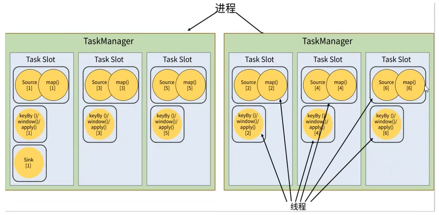

# frameConcept

## parallelism
parallelism 并行度 每个operator都可以进行并行计算
`env.setParallelism()` 对application进行并行度设置，优先级中
`dataStream.setParallelism()` 对算子进行并行度设置，优先级最高
`conf/flink.yaml,parallelism.default:1` 提交任务时设置

## dataflow dag
one-to-one(forwarding): map,filter,flatMap 
one-to-many(redistributing,shuffle):keyby
在 one-to-one中 通过本地转发(local forward)方式进行连接成一个task，比如map->map两个算子。

Every Flink application needs an execution environment, env in this example.

FlinkMaster：集群服务器，一台物理机
TaskManager: 一个进程
TaskSlot: 一个线程，CPU的一个核心

refs:
https://nightlies.apache.org/flink/flink-docs-release-1.15/docs/learn-flink/overview/