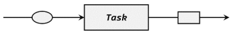
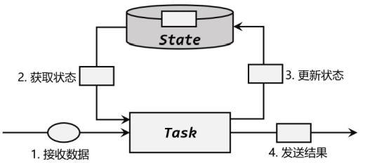

# state

Flink 处理机制的核心，就是“有状态的流式计算”

### 有状态算子
无状态的算子任务只需要观察每个独立事件，根据当前输入的数据直接转换输出结果，如 map、filter、flatMap，如下图所示：

而有状态的算子任务，则除当前数据之外，还需要一些状态（state）来得到计算结果。聚合算子、窗口算子都属于有状态的算子。如下图：

（1）算子任务接收到上游发来的数据； 
（2）获取当前状态； 
（3）根据业务逻辑进行计算，更新状态； 
（4）得到计算结果，输出发送到下游任务。 

refs:
https://nightlies.apache.org/flink/flink-docs-master/docs/dev/datastream/fault-tolerance/state/