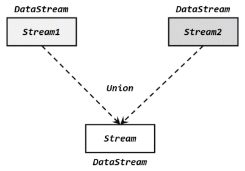
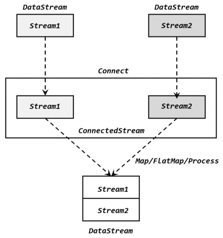

# join


在实际应用中，可能需要将不同来源的数据连接合并在一起处理，也有可能需要将一条流拆分开，所以经常会有对多条流进行处理的场景。


## 分流
所谓“分流”，就是将一条数据流拆分成完全独立的两条、甚至多条流。也就是基于一个DataStream，得到完全平等的多个子 DataStream，如下图所示。一般来说，我们会定义一些筛选条件，将符合条件的数据拣选出来放到对应的流里。 


## 合流

### Union
联合操作要求必须流中的数据类型必须相同，合并之后的新流会包括所有流中的元素，数据类型不变。这种合流方式非常简单粗暴，就像公路上多个车道汇在一起一样。


```python
from pyflink.common import  Types
from pyflink.datastream import StreamExecutionEnvironment, RuntimeExecutionMode

## declare an execution environment
env = StreamExecutionEnvironment.get_execution_environment()
env.set_runtime_mode(RuntimeExecutionMode.BATCH)
env.set_parallelism(1) # write all the data to one file
## define the source
data_stream1 = env.from_collection(collection=[('a'), ('b'), ('c')])
data_stream2 = env.from_collection(collection=[('d'), ('e'), ('f')])
## transform
union_ds = data_stream1.union(data_stream2)
## define the sink
union_ds.print()
## submit for execution
env.execute()
```


### Connect

#### ConnectedStreams
但我们知道一个 DataStream 中的数 据 只 能 有 唯 一 的 类 型 ， 所 以 连 接 得 到 的 并 不 是 DataStream ， 而 是 一个 “ 连 接 流 ”（ConnectedStreams）。连接流可以看成是两条流形式上的“统一”，被放在了一个同一个流中；事实上内部仍保持各自的数据形式不变，彼此之间是相互独立的。要想得到新的 DataStream，还需要进一步定义一个“同处理”（co-process）转换操作，用来说明对于不同来源、不同类型的数据，怎样分别进行处理转换、得到统一的输出类型。所以整体上来，两条流的连接就像是“一国两制”，两条流可以保持各自的数据类型、处理方式也可以不同，不过最终还是会统一到同一个 DataStream 中，如下图：




## join

对于两条流的合并，很多情况我们并不是简单地将所有数据放在一起，而是希望根据某个字段的值将它们联结起来，“配对”去做处理。

### Window Join

#### Tumbling Window Join


refs:
https://nightlies.apache.org/flink/flink-docs-master/docs/dev/datastream/operators/overview/
https://nightlies.apache.org/flink/flink-docs-master/docs/dev/datastream/operators/joining/