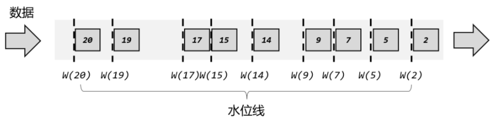
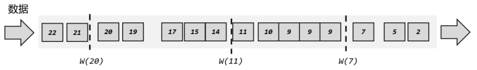
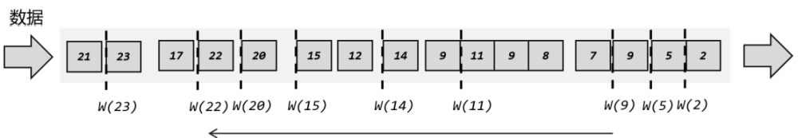
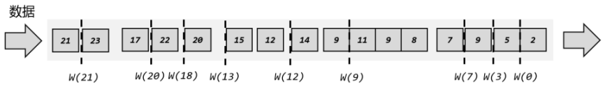
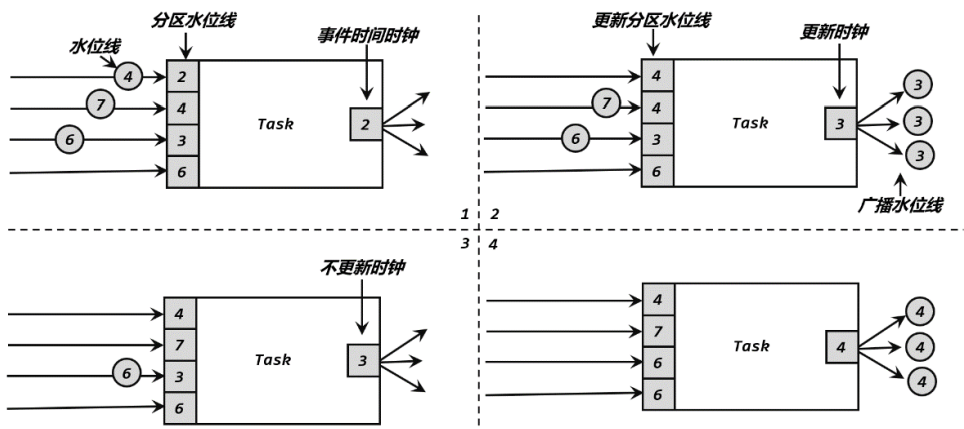

# time


## 时间(time)
处理时间（Processing Time）就是指执行处理操作的机器的系统时间。 
事件时间（Event Time）是指每个事件在对应的设备上发生的时间，也就是数据生成的时间。 

## 水位线(Watermark)

每个事件产生的数据，都包含了一个时间戳，我们直接用一个整数表示。这里没有指定单位，可以理解为秒或者毫秒（方便起见，下面讲述统一认为是秒）。当产生于2 秒的数据到来之后，当前的事件时间就是 2 秒；在后面插入一个时间戳也为 2 秒的水位线，随着数据一起向下游流动。而当 5 秒产生的数据到来之后，同样在后面插入一个水位线，时间戳也为 5，当前的时钟就推进到了 5 秒。这样，如果出现下游有多个并行子任务的情形，我们只要将水位线广播出去，就可以通知到所有下游任务当前的时间进度了。


### 1.有序流中的水位线 
实际应用中，如果当前数据量非常大，可能会有很多数据的时间戳是相同的，这时每来一条数据就提取时间戳、插入水位线就做了大量的无用功。而且即使时间戳不同，同时涌来的数据时间差会非常小（比如几毫秒），往往对处理计算也没什么影响。所以为了提高效率，一般会每隔一段时间生成一个水位线，这个水位线的时间戳，就是当前最新数据的时间戳，所以这时的水位线，其实就是有序流中的一个周期性出现的时间标记。如下图：

这里需要注意的是，水位线插入的“周期”，本身也是一个时间概念。在当前事件时间语义下，假如我们设定了每隔 100ms 生成一次水位线，那就是要等事件时钟推进 100ms 才能插入；但是事件时钟本身的进展，本身就是靠水位线来表示的——现在要插入一个水位线，可前提又是水位线要向前推进 100ms，这就陷入了死循环。所以对于水位线的周期性生成，周期时间是指处理时间（系统时间），而不是事件时间。 


### 2.乱序流中的水位线 
“乱序”（out-of-order），是指数据的先后顺序不一致，主要就是基于数据的产生时间而言的。如图 6-7 所示，一个 7 秒时产生的数据，生成时间自然要比 9 秒的数据早；但是经过数据缓存和传输之后，处理任务可能先收到了 9 秒的数据，之后 7 秒的数据才姗姗来迟。如何插入水位线呢？如下图：

最直观的想法自然是跟之前一样，我们还是靠数据来驱动，每来一个数据就提取它的时间戳、插入一个水位线。不过现在的情况是数据乱序，所以有可能新的时间戳比之前的还小，如果直接将这个时间的水位线再插入，我们的“时钟”就回退了——水位线就代表了时钟，时光不能倒流，所以水位线的时间戳也不能减小。 
解决思路也很简单：我们插入新的水位线时，要先判断一下时间戳是否比之前的大，否则就不再生成新的水位线，。也就是说，只有数据的时间戳比当前时钟大，才能推动时钟前进，这时才插入水位线。如下图：


如果考虑到大量数据同时到来的处理效率，我们同样可以周期性地生成水位线。这时只需要保存一下之前所有数据中的最大时间戳，需要插入水位线时，就直接以它作为时间戳生成新的水位线，如下图：

这样做尽管可以定义出一个事件时钟，却也会带来一个非常大的问题：我们无法正确处理“迟到”的数据。在上面的例子中，当 9 秒产生的数据到来之后，我们就直接将时钟推进到了9 秒；如果有一个窗口结束时间就是 9 秒（比如，要统计 0~9 秒的所有数据），那么这时窗口就应该关闭、将收集到的所有数据计算输出结果了。但事实上，由于数据是乱序的，还可能有时间戳为 7 秒、8 秒的数据在 9 秒的数据之后才到来，这就是“迟到数据”（late  data）。它们本来也应该属于 0~9 秒这个窗口，但此时窗口已经关闭，于是这些数据就被遗漏了，这会导致统计结果不正确。
为了让窗口能够正确收集到迟到的数据，我们也可以等上 2 秒；也就是用当前已有数据的最大时间戳减去 2 秒，就是要插入的水位线的时间戳，如图 6-10 所示。这样的话，9 秒的数据到来之后，事件时钟不会直接推进到 9 秒，而是进展到了 7 秒；必须等到11 秒的数据到来之后，事件时钟才会进展到 9 秒，这时迟到数据也都已收集齐，0~9 秒的窗口就可以正确计算结果了。



## 如何生成水位线
here are two places in Flink applications where a WatermarkStrategy can be used: 
1. directly on sources 
2. after non-source operation


### directly on sources 

```python
kafka_source = FlinkKafkaConsumer("timer-stream-source", schema, props)

stream = env
    .add_source(kafka_source)
    .assign_timestamps_and_watermarks(
        WatermarkStrategy
            .for_bounded_out_of_orderness(Duration.of_seconds(20)))
```

### after non-source operation

```python
env = StreamExecutionEnvironment.get_execution_environment()

## currently read_file is not supported in PyFlink
stream = env \
    .read_text_file(my_file_path, charset) \
    .map(lambda s: MyEvent.from_string(s))

with_timestamp_and_watermarks = stream \
    .filter(lambda e: e.severity() == WARNING) \
    .assign_timestamp_and_watermarks(<watermark strategy>)

with_timestamp_and_watermarks \
    .key_by(lambda e: e.get_group()) \
    .window(TumblingEventTimeWindows.of(Time.seconds(10))) \
    .reduce(lambda a, b: a.add(b)) \
    .add_sink(...)
```


## 重分区问题
实际应用中往往上下游都有多个并行子任务，为了统一推进事件时间的进展，我们要求上游任务处理完水位线、时钟改变之后，要把当前的水位线再次发出，广播给所有的下游子任务。这样，后续任务就不需要依赖原始数据中的时间戳（经过转化处理后，数据可能已经改变了），也可以知道当前事件时间了。
可是还有另外一个问题，那就是在“重分区”（redistributing）的传输模式下，一个任务有可能会收到来自不同分区上游子任务的数据。而不同分区的子任务时钟并不同步，所以同一时刻发给下游任务的水位线可能并不相同。这时下游任务又该听谁的呢？

所以如果一个任务收到了来自上游并行任务的不同的水位线，说明上游各个分区处理得有快有慢，进度各不相同比如上游有两个并行子任务都发来了水位线，一个是 5 秒，一个是 7 秒；这代表第一个并行任务已经处理完 5 秒之前的所有数据，而第二个并行任务处理到了 7 秒。那这时自己的时钟怎么确定呢？当然也要以“这之前的数据全部到齐”为标准。如果我们以较大的水位线 7 秒作为当前时间，那就表示“7 秒前的数据都已经处理完”，这显然不是事实——第一个上游分区才处理到 5 秒，5~7 秒的数据还会不停地发来；而如果以最小的水位线 5 秒作为当前时钟就不会有这个问题了，因为确实所有上游分区都已经处理完，不会再发 5 秒前的数据了。这让我们想到“木桶原理”：所有的上游并行任务就像围成木桶的一块块木板，它们中最短的那一块，决定了我们桶中的水位。 


如上图所示，当前任务的上游，有四个并行子任务，所以会接收到来自四个分区的水位线；而下游有三个并行子任务，所以会向三个分区发出水位线。具体过程如下： 
（1）上游并行子任务发来不同的水位线，当前任务会为每一个分区设置一个“分区水位线”（Partition  Watermark），这是一个分区时钟；而当前任务自己的时钟，就是所有分区时钟里最小的那个。 
（2）当有一个新的水位线（第一分区的 4）从上游传来时，当前任务会首先更新对应的分区时钟；然后再次判断所有分区时钟中的最小值，如果比之前大，说明事件时间有了进展，当前任务的时钟也就可以更新了。这里要注意，更新后的任务时钟，并不一定是新来的那个分区水位线，比如这里改变的是第一分区的时钟，但最小的分区时钟是第三分区的 3，于是当前任务时钟就推进到了 3。当时钟有进展时，当前任务就会将自己的时钟以水位线的形式，广播给下游所有子任务。 
（3）再次收到新的水位线（第二分区的 7）后，执行同样的处理流程。首先将第二个分区时钟更新为 7，然后比较所有分区时钟；发现最小值没有变化，那么当前任务的时钟也不变，
也不会向下游任务发出水位线。 
（4）同样道理，当又一次收到新的水位线（第三分区的 6）之后，第三个分区时钟更新为6，同时所有分区时钟最小值变成了第一分区的 4，所以当前任务的时钟推进到 4，并发出时间戳为 4 的水位线，广播到下游各个分区任务。

refs:
https://nightlies.apache.org/flink/flink-docs-master/docs/dev/datastream/event-time/generating_watermarks/