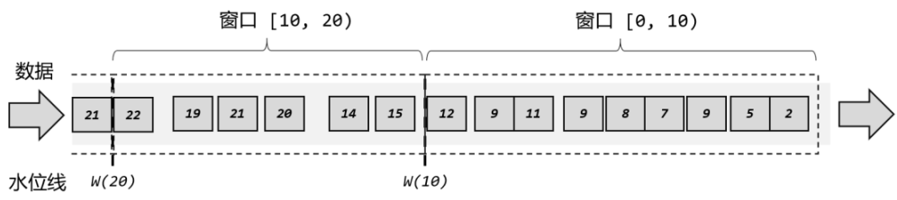
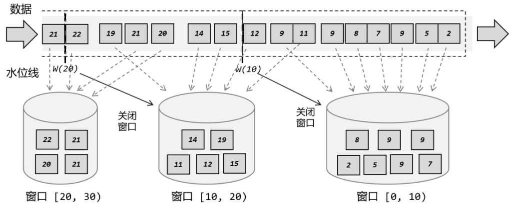
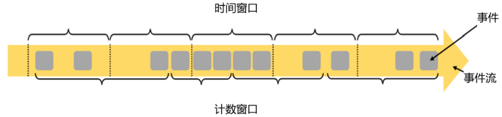

# window


在流处理中，我们往往需要面对的是连续不断、无休无止的无界流，不可能等到所有所有数据都到齐了才开始处理。所以聚合计算其实只能针对当前已有的数据，之后再有数据到来，就需要继续叠加、再次输出结果。这样似乎很“实时”，但现实中大量数据一般会同时到来，需要并行处理，这样频繁地更新结果就会给系统带来很大负担了。 

更加高效的做法是，把无界流进行切分，每一段数据分别进行聚合，结果只输出一次。这就相当于将无界流的聚合转化为了有界数据集的聚合，这就是所谓的“窗口”（Window）聚合操作。窗口聚合其实是对实时性和处理效率的一个权衡。在实际应用中，我们往往更关心一段时间内数据的统计结果，比如在过去的 1 分钟内有多少用户点击了网页。在这种情况下，我们就可以定义一个窗口，收集最近一分钟内的所有用户点击数据，然后进行聚合统计，最终输出一个结果就可以了。 


## concept
在 Flink 中,  窗口就是用来处理无界流的核心。我们很容易把窗口想象成一个固定位置的“框”，数据源源不断地流过来，到某个时间点窗口该关闭了，就停止收集数据、触发计算并输出结果。例如，我们定义一个时间窗口，每 10 秒统计一次数据，那么就相当于把窗口放在那里，从 0 秒开始收集数据；到 10 秒时，处理当前窗口内所有数据，输出一个结果，然后清空窗口继续收集数据；到 20 秒时，再对窗口内所有数据进行计算处理，输出结果；依次类推，如图: 

这里注意为了明确数据划分到哪一个窗口，定义窗口都是包含起始时间、不包含结束时间的，用数学符号表示就是一个左闭右开的区间，例如 0~10 秒的窗口可以表示为[0, 10),这里单位为秒。 

由于有乱序数据，我们需要设置一个延迟时间来等所有数据到齐。比如上面的例子中，我们可以设置延迟时间为 2 秒，如下图所示，这样 0~10 秒的窗口会在时间戳为 12 的数据到来之后，才真正关闭计算输出结果，这样就可以正常包含迟到的 9 秒数据了。 

但是这样一来，0~10 秒的窗口不光包含了迟到的 9 秒数据，连 11 秒和 12 秒的数据也包含进去了。我们为了正确处理迟到数据，结果把早到的数据划分到了错误的窗口——最终结果都是错误的。 

所以在 Flink 中，窗口其实并不是一个“框”，流进来的数据被框住了就只能进这一个窗口。相比之下，我们应该把窗口理解成一个“桶”，如下图所示。在 Flink 中，窗口可以把流切割成有限大小的多个“存储桶”（bucket)；每个数据都会分发到对应的桶中，当到达窗口结束时间时，就对每个桶中收集的数据进行计算处理。


（1）第一个数据时间戳为 2，判断之后创建第一个窗口[0, 10），并将 2 秒数据保存进去； 
（2）后续数据依次到来，时间戳均在  [0, 10）范围内，所以全部保存进第一个窗口； 
（3）11 秒数据到来，判断它不属于[0,  10）窗口，所以创建第二个窗口[10,  20），并将 11秒的数据保存进去。由于水位线设置延迟时间为 2 秒，所以现在的时钟是 9 秒，第一个窗口也没有到关闭时间； 
（4）之后又有 9 秒数据到来，同样进入[0, 10）窗口中； 
（5）12 秒数据到来，判断属于[10,  20）窗口，保存进去。这时产生的水位线推进到了 10秒，所以  [0, 10）窗口应该关闭了。第一个窗口收集到了所有的 7 个数据，进行处理计算后输出结果，并将窗口关闭销毁； 
（6）同样的，之后的数据依次进入第二个窗口，遇到 20 秒的数据时会创建第三个窗口[20, 30）并将数据保存进去；遇到 22 秒数据时，水位线达到了 20 秒，第二个窗口触发计算，输出结果并关闭。


## 窗口的分类
按照时间段去截取数据，这种窗口就叫作“时间窗口”（Time Window）。这在实际应用中最常见，之前所举的例子也都是时间窗口。除了由时间驱动之外，窗口其实也可以由数据驱动，也就是说按照固定的个数，来截取一段数据集，这种窗口叫作“计数窗口”（Count Window），如下图：


### 时间窗口
时间窗口以时间点来定义窗口的开始（start）和结束（end），所以截取出的就是某一时间段的数据。到达结束时间时，窗口不再收集数据，触发计算输出结果，并将窗口关闭销毁。所以可以说基本思路就是“定点发车”。 
用结束时间减去开始时间，得到这段时间的长度，就是窗口的大小（window size）。
为什么不把窗口区间定义成左开右闭、包含上结束时间呢？这样maxTimestamp 跟 end 一致，不就可以省去一个方法的定义吗？ 
这主要是为了方便判断窗口什么时候关闭。对于事件时间语义，窗口的关闭需要水位线推进到窗口的结束时间；而我们知道，水位线 Watermark(t)代表的含义是“时间戳小于等于 t 的数据都已到齐，不会再来了”。为了简化分析，我们先不考虑乱序流设置的延迟时间。那么当新到一个时间戳为 t 的数据时，当前水位线的时间推进到了 t – 1（还记得乱序流里生成水位线的减一操作吗？）。所以当时间戳为 end 的数据到来时，水位线推进到了 end - 1；如果我们把窗口定义为不包含 end，那么当前的水位线刚好就是 maxTimestamp，表示窗口能够包含的数据都已经到齐，我们就可以直接关闭窗口了。所以有了这样的定义，我们就不需要再去考虑那烦人的“减一”了，直接看到时间戳为 end 的数据，就关闭对应的窗口。如果为乱序流设置了水位线延迟时间 delay，也只需要等到时间戳为 end + delay 的数据，就可以关窗了。


### 计数窗口
计数窗口基于元素的个数来截取数据，到达固定的个数时就触发计算并关闭窗口。这相当于座位有限、“人满就发车”，是否发车与时间无关。每个窗口截取数据的个数，就是窗口的大小。 


## 窗口API
在定义窗口操作之前，首先需要确定，到底是基于按键分区（Keyed）的数据流 KeyedStream来开窗，还是直接在没有按键分区的 DataStream 上开窗。也就是说，在调用窗口算子之前，是否有 keyBy 操作。 

### 按键分区窗口（Keyed Windows） 
经过按键分区 keyBy 操作后，数据流会按照 key 被分为多条逻辑流（logical streams），这就是 KeyedStream。基于 KeyedStream 进行窗口操作时,  窗口计算会在多个并行子任务上同时执行。相同 key 的数据会被发送到同一个并行子任务，而窗口操作会基于每个 key 进行单独的处理。所以可以认为，每个 key 上都定义了一组窗口，各自独立地进行统计计算。
```python
stream
       .key_by(...)
       .window(...)                 <-  required: "assigner"
      [.trigger(...)]               <-  optional: "trigger" (else default trigger)
      [.allowed_lateness(...)]      <-  optional: "lateness" (else zero)
      [.side_output_late_data(...)] <-  optional: "output tag" (else no side output for late data)
       .reduce/aggregate/apply()    <-  required: "function"
      [.get_side_output(...)]       <-  optional: "output tag"
```
### 非按键分区（Non-Keyed Windows） 
如果没有进行 keyBy，那么原始的 DataStream 就不会分成多条逻辑流。这时窗口逻辑只能在一个任务（task）上执行，就相当于并行度变成了 1。所以在实际应用中一般不推荐使用这种方式。 

```python
stream
       .window_all(...)             <-  required: "assigner"
      [.trigger(...)]               <-  optional: "trigger" (else default trigger)
      [.allowed_lateness(...)]      <-  optional: "lateness" (else zero)
      [.side_output_late_data(...)] <-  optional: "output tag" (else no side output for late data)
       .reduce/aggregate/apply()    <-  required: "function"
      [.get_side_output(...)]       <-  optional: "output tag"
```


## Window Assigners
### Tumbling Windows


```python
input = ...  # type: DataStream

## tumbling event-time windows
input \
    .key_by(<key selector>) \
    .window(TumblingEventTimeWindows.of(Time.seconds(5))) \
    .<windowed transformation>(<window function>)

## tumbling processing-time windows
input \
    .key_by(<key selector>) \
    .window(TumblingProcessingTimeWindows.of(Time.seconds(5))) \
    .<windowed transformation>(<window function>)

## daily tumbling event-time windows offset by -8 hours.
input \
    .key_by(<key selector>) \
    .window(TumblingEventTimeWindows.of(Time.days(1), Time.hours(-8))) \
    .<windowed transformation>(<window function>)
```

### Sliding Windows

```python
input = ...  # type: DataStream

## sliding event-time windows
input \
    .key_by(<key selector>) \
    .window(SlidingEventTimeWindows.of(Time.seconds(10), Time.seconds(5))) \
    .<windowed transformation>(<window function>)

## sliding processing-time windows
input \
    .key_by(<key selector>) \
    .window(SlidingProcessingTimeWindows.of(Time.seconds(10), Time.seconds(5))) \
    .<windowed transformation>(<window function>)

## sliding processing-time windows offset by -8 hours
input \
    .key_by(<key selector>) \
    .window(SlidingProcessingTimeWindows.of(Time.hours(12), Time.hours(1), Time.hours(-8))) \
    .<windowed transformation>(<window function>)

```


### Session Windows

会话窗口顾名思义，是基于“会话”（session）来来对数据进行分组的。这里的会话类似Web 应用中 session 的概念，不过并不表示两端的通讯过程，而是借用会话超时失效的机制来描述窗口。简单来说，就是数据来了之后就开启一个会话窗口，如果接下来还有数据陆续到来，那么就一直保持会话；如果一段时间一直没收到数据，那就认为会话超时失效，窗口自动关闭。


```python
input = ...  # type: DataStream

class MySessionWindowTimeGapExtractor(SessionWindowTimeGapExtractor):

    def extract(self, element: tuple) -> int:
        # determine and return session gap

## event-time session windows with static gap
input \
    .key_by(<key selector>) \
    .window(EventTimeSessionWindows.with_gap(Time.minutes(10))) \
    .<windowed transformation>(<window function>)

## event-time session windows with dynamic gap
input \
    .key_by(<key selector>) \
    .window(EventTimeSessionWindows.with_dynamic_gap(MySessionWindowTimeGapExtractor())) \
    .<windowed transformation>(<window function>)

## processing-time session windows with static gap
input \
    .key_by(<key selector>) \
    .window(ProcessingTimeSessionWindows.with_gap(Time.minutes(10))) \
    .<windowed transformation>(<window function>)

## processing-time session windows with dynamic gap
input \
    .key_by(<key selector>) \
    .window(DynamicProcessingTimeSessionWindows.with_dynamic_gap(MySessionWindowTimeGapExtractor())) \
    .<windowed transformation>(<window function>)
```


## window function
The window function can be one of ReduceFunction, AggregateFunction, or ProcessWindowFunction. The first two can be executed more efficiently (see State Size section) because Flink can incrementally aggregate the elements for each window as they arrive. A ProcessWindowFunction gets an Iterable for all the elements contained in a window and additional meta information about the window to which the elements belong.
A windowed transformation with a ProcessWindowFunction cannot be executed as efficiently as the other cases because Flink has to buffer all elements for a window internally before invoking the function. 
### ReduceFunction

```python
input = ...  # type: DataStream

input \
    .key_by(<key selector>) \
    .window(<window assigner>) \
    .reduce(lambda v1, v2: (v1[0], v1[1] + v2[1]),
            output_type=Types.TUPLE([Types.STRING(), Types.LONG()]))
```

### AggregateFunction

```python
class AverageAggregate(AggregateFunction):
 
    def create_accumulator(self) -> Tuple[int, int]:
        return 0, 0

    def add(self, value: Tuple[str, int], accumulator: Tuple[int, int]) -> Tuple[int, int]:
        return accumulator[0] + value[1], accumulator[1] + 1

    def get_result(self, accumulator: Tuple[int, int]) -> float:
        return accumulator[0] / accumulator[1]

    def merge(self, a: Tuple[int, int], b: Tuple[int, int]) -> Tuple[int, int]:
        return a[0] + b[0], a[1] + b[1]

input = ...  # type: DataStream

input \
    .key_by(<key selector>) \
    .window(<window assigner>) \
    .aggregate(AverageAggregate(),
               accumulator_type=Types.TUPLE([Types.LONG(), Types.LONG()]),
               output_type=Types.DOUBLE())

```

### ProcessWindowFunction
A ProcessWindowFunction gets an Iterable containing all the elements of the window, and a Context object with access to time and state information, which enables it to provide more flexibility than other window functions. This comes at the cost of performance and resource consumption, because elements cannot be incrementally aggregated but instead need to be buffered internally until the window is considered ready for processing.

```python
input = ...  # type: DataStream

input \
    .key_by(lambda v: v[0]) \
    .window(TumblingEventTimeWindows.of(Time.minutes(5))) \
    .process(MyProcessWindowFunction())

## ...

class MyProcessWindowFunction(ProcessWindowFunction):

    def process(self, key: str, context: ProcessWindowFunction.Context,
                elements: Iterable[Tuple[str, int]]) -> Iterable[str]:
        count = 0
        for _ in elements:
            count += 1
        yield "Window: {} count: {}".format(context.window(), count)
```


## 其他API
### trigger(触发器)
触发器主要是用来控制窗口什么时候触发计算。所谓的“触发计算”，本质上就是执行窗口函数，所以可以认为是计算得到结果并输出的过程。 

Flink comes with a few built-in triggers.

The (already mentioned) EventTimeTrigger fires based on the progress of event-time as measured by watermarks.
The ProcessingTimeTrigger fires based on processing time.
The CountTrigger fires once the number of elements in a window exceeds the given limit.
The PurgingTrigger takes as argument another trigger and transforms it into a purging one.

```python
stream.keyBy(...) 
       .window(...) 
       .trigger(new MyTrigger()) 
```
### Evictor(移除器)
移除器主要用来定义移除某些数据的逻辑。基于 WindowedStream 调用.evictor()方法，就
可以传入一个自定义的移除器（Evictor）。
```python
stream.keyBy(...) 
       .window(...) 
       .evictor(new MyEvictor()) 
```
Evictor 接口定义了两个方法： 
    evictBefore()：定义执行窗口函数之前的移除数据操作 
    evictAfter()：定义执行窗口函数之后的以处数据操作 


### Allowed Lateness
在事件时间语义下，窗口中可能会出现数据迟到的情况。这是因为在乱序流中，水位线（watermark）并不一定能保证时间戳更早的所有数据不会再来。当水位线已经到达窗口结束时间时，窗口会触发计算并输出结果，这时一般也就要销毁窗口了；如果窗口关闭之后，又有本属于窗口内的数据姗姗来迟，默认情况下就会被丢弃。这也很好理解：窗口触发计算就像发车，如果要赶的车已经开走了，又不能坐其他的车（保证分配窗口的正确性），那就只好放弃坐班车了。 
不过在多数情况下，直接丢弃数据也会导致统计结果不准确，我们还是希望该上车的人都能上来。为了解决迟到数据的问题，Flink 提供了一个特殊的接口，可以为窗口算子设置一个“允许的最大延迟”（Allowed Lateness）。也就是说，我们可以设定允许延迟一段时间，在这段时间内，窗口不会销毁，继续到来的数据依然可以进入窗口中并触发计算。直到水位线推进到了  窗口结束时间  +  延迟时间，才真正将窗口的内容清空，正式关闭窗口。 

```python
input = ...  # type: DataStream
input \
    .key_by(<key selector>) \
    .window(<window assigner>) \
    .allowed_lateness(<time>) \
    .<windowed transformation>(<window function>)
```
### side output
我们自然会想到，即使可以设置窗口的延迟时间，终归还是有限的，后续的数据还是会被丢弃。如果不想丢弃任何一个数据，又该怎么做呢？ 
Flink 还提供了另外一种方式处理迟到数据。我们可以将未收入窗口的迟到数据，放入“侧输出流”（side output）进行另外的处理。所谓的侧输出流，相当于是数据流的一个“分支”，这个流中单独放置那些错过了该上的车、本该被丢弃的数据。

```python
late_output_tag = OutputTag("late-data", type_info)

input = ...  # type: DataStream

result = input \
    .key_by(<key selector>) \
    .window(<window assigner>) \
    .allowed_lateness(<time>) \
    .side_output_late_data(late_output_tag) \
    .<windowed transformation>(<window function>)

late_stream = result.get_side_output(late_output_tag)
```


## 窗口声明周期
### 窗口的创建
窗口的类型和基本信息由窗口分配器（window assigners）指定，但窗口不会预先创建好，而是由数据驱动创建。当第一个应该属于这个窗口的数据元素到达时，就会创建对应的窗口。

###  窗口计算的触发
除了窗口分配器，每个窗口还会有自己的窗口函数（window functions）和触发器（trigger）。窗口函数可以分为增量聚合函数和全窗口函数，主要定义了窗口中计算的逻辑；而触发器则是指定调用窗口函数的条件。 
对于事件时间窗口而言，除去到达结束时间的“定点发车”，还有另一种情形。当我们设置了允许延迟，那么如果水位线超过了窗口结束时间、但还没有到达设定的最大延迟时间，这期间内到达的迟到数据也会触发窗口计算。这类似于没有准时赶上班车的人又追上了车，这时车要再次停靠、开门，将新的数据整合统计进来。 

### 窗口的销毁 
窗口的销毁和触发计算会有所不同。事件时间语义下，如果设置了允许延迟，那么在水位线到达窗口结束时间时，仍然不会销毁窗口；窗口真正被完全删除的时间点，是窗口的结束时间加上用户指定的允许延迟时间。


refs:
https://nightlies.apache.org/flink/flink-docs-master/docs/dev/datastream/operators/windows/