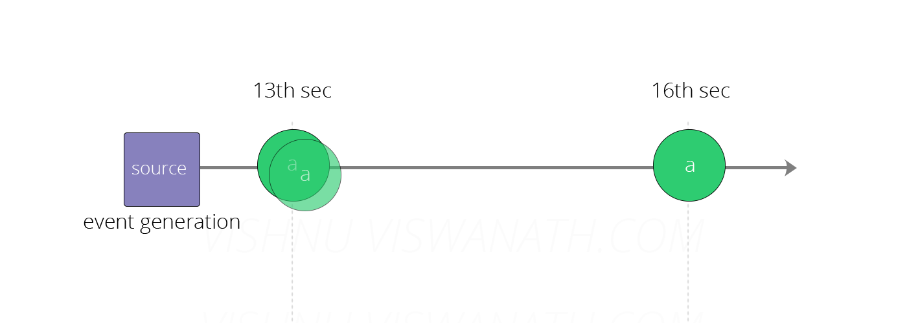
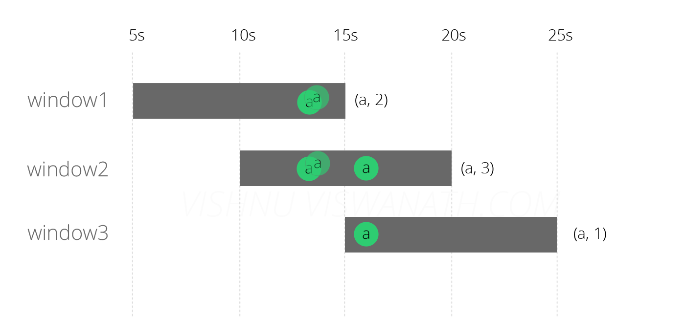
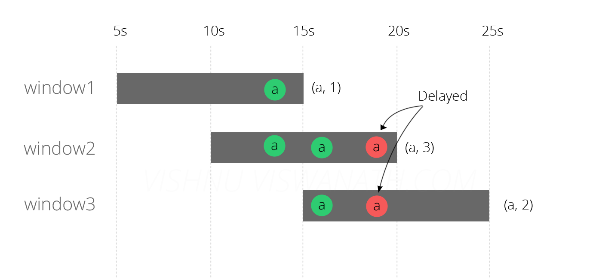
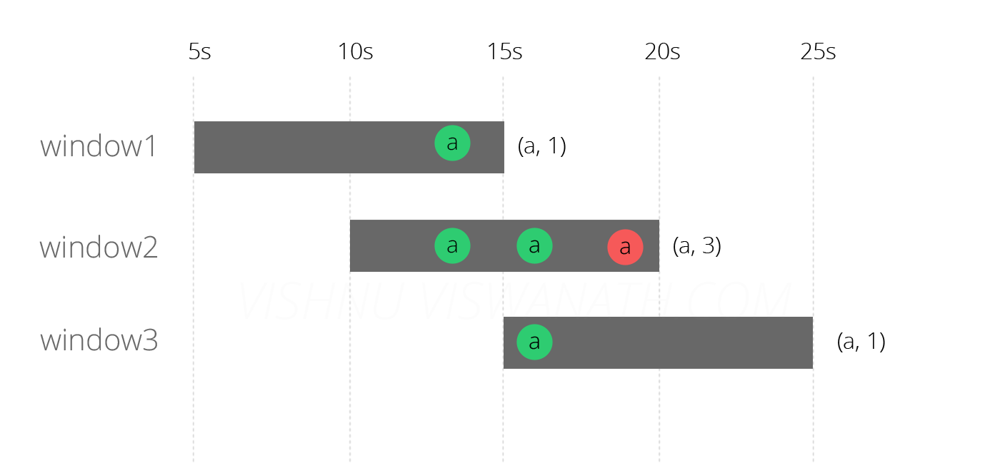
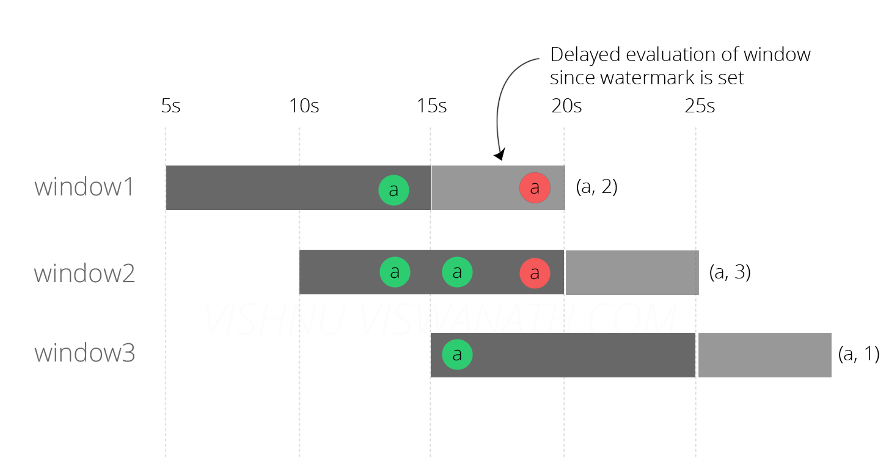

# watermark


## summary
1. watermark will go up with the system_time going up with the event streaming in.
2. in window point of view,window_length(end_time-start_time) = window_original_length +  the delay(comes from watermark setting) + allowed_lateness


## Messages arrive without delay
Suppose the source generated three messages of the type a at times 13th second, 13th second and 16th second respectively. 

We will create a SlidingWindow of size 10 seconds which slides every 5 seconds and at the end of the window.
These messages will fall into the windows as follows. The first two messages that were generated at 13th sec will fall into both window1(5s-15s) and window2(10s-20s) and the third message generated at 16th second will fall into window2(10s-20s) and window3(15s-25s). The final counts emitted by each window will be (a,2), (a,3) and (a,1) respectively.


## Messages arrive in delay
Now suppose one of the messages (generated at 13th second) arrived at a delay of 6 seconds(at 19th second), may be due to some network congestion.

The delayed message fell into window 2 and 3, since 19 is within the range 10-20 and 15-25. It did not cause any problem to the calculation in window2 (because the message was anyways supposed to fall into that window) but it affected the result of window1 and window3. We will now try to fix this problem by using EventTime processing.


## EventTime based system
To enable EventTime processing, we need a timestamp extractor that extracts the event time information from the message. 

```java
class TimestampExtractor extends AssignerWithPeriodicWatermarks[String] with Serializable {
  override def extractTimestamp(e: String, prevElementTimestamp: Long) = {
    e.split(",")(1).toLong 
  }
  override def getCurrentWatermark(): Watermark = { 
      new Watermark(System.currentTimeMillis)
  }
}
```
The result of running the above code is shown in the diagram below.


The results look better, the windows 2 and 3 now emitted correct result, but window1 is still wrong. Flink did not assign the delayed message to window 3 because it now checked the message’s event time and understood that it did not fall in that window. But why didn’t it assign the message to window 1?. The reason is that by the time the delayed message reached the system(at 19th second), the evaluation of window 1 has already finished (at 15th second). Let us now try to fix this issue by using the Watermark.

## Watermarks
```java
class TimestampExtractor extends AssignerWithPeriodicWatermarks[String] with Serializable {
  override def extractTimestamp(e: String, prevElementTimestamp: Long) = {
    e.split(",")(1).toLong 
  }
override def getCurrentWatermark(): Watermark = { 
      new Watermark(System.currentTimeMillis - 5000)
  }
}
```

Finally we have the correct result, all the three windows now emit counts as expected - which is (a,2), (a,3) and (a,1).


Watermark is a timestamp.There are three time:
1. window_start_time: when the first event(event_time > window_start_time) arrive, it created.
2. window_end_time: when the first event(wvent_time > window_end_time) arrive, it destroyed.
3. water_mark: the system_current_time(defined by the streaming_event time) minus delay.

as the code before, the delay is 5 seconds. for example:
as showed before, we have three event: `a` at times 13th second, 13th second and 16th second respectively and one of the messages (generated at 13th second) arrived at a delay of 6 seconds(at 19th second).

event|event_time|process_time
--|--|--
a_1|13s|13s
a_2|13s|19s
a_3|16s|16s


When a_1 arrive, the system_time update to 13s(equal to a1's event_time). Because the system_time > window1_start_time, window1 create, and so a1 run into window1.
When a_3 arrive, the system_time update to 16s(equal to a2's event_time). a_3 event_time > window1_end_time, so a2 don't run into window2.Although now the system_time > window1_end_time(16s > 15s), but we also have the delay 5s, hints system_time - delay < window1_end_time, so window1 is not destroyed.
when a_2 arrive, the system_time is still 16s, because a2's event_time is 13s, < system_time. so a_2 run into a1.
suppose, there is an event a4(event_time=21s), when it arrived, the system_time update to 21s. Because system_time - delay > window1_end_time, so window1 is destroyed.

the window would not be destroyed until the watermark(system_time - delay) past the window_end_time. this is why it is called `watermark`, image that the system_time is continuos go up with the event streaming in.it would paste the window at the some time.

## Lateness
为了避免在设置了WaterMaker后，仍有些迟到的数据被删除，因此产生了allowedLateness，通过使用allowedLateness来延迟销毁窗口，允许有一段时间（也是以event time来衡量）来等待之前的数据到达，以便再次处理这些数据!


## flink time
- **Event Time** 是事件在现实世界中发生的时间，它通常由事件中的时间戳描述。
- **Ingestion Time** 是数据进入Apache Flink流处理系统的时间，也就是Flink读取数据源时间。
- **Processing Time** 是数据流入到具体某个算子 (消息被计算处理) 时候相应的系统时间。

有1~10个事件。乱序到达的序列(Processing Time)是：1,2,4,5,6,3,8,9,10,7经过按Event Time处理后的序列是：1,2,3,4,5,6,7,8,9,10

## 窗口生命周期
一旦应属于该窗口的第一个元素到达，就会创建一个窗口，并且当时间（事件时间、处理时间、摄入时间）超过其结束时间戳（end-of-time）（如果设置了WaterMaker，WaterMaker触发窗口执行后）且计算逻辑执行后 ，该窗口将被完全删除，Flink只会删除基于时间的窗口。

## 迟到事件
迟到事件出现时窗口已经关闭并产出了计算结果，因此处理的方法有3种：
- Allowed Lateness: Flink 会在窗口关闭后一直保存窗口的状态直至超过允许迟到时长，这期间的迟到事件不会被丢弃，而是默认会触发窗口重新计算。
- Side Output: 机制可以将迟到事件单独放入一个数据流分支，这会作为 window 计算结果的副产品，以便用户获取并对其进行特殊处理。
- 将迟到事件视为错误消息并丢弃。


refs:
http://vishnuviswanath.com/flink_eventtime.html
https://nightlies.apache.org/flink/flink-docs-release-1.15/docs/concepts/time/
https://www.cnblogs.com/rossiXYZ/p/12286407.html
https://nightlies.apache.org/flink/flink-docs-release-1.15/docs/concepts/time/
https://stackoverflow.com/questions/51512618/why-does-apache-flink-need-watermarks-for-event-time-processing/51516225#51516225
https://blog.csdn.net/leilei1366615/article/details/117382112