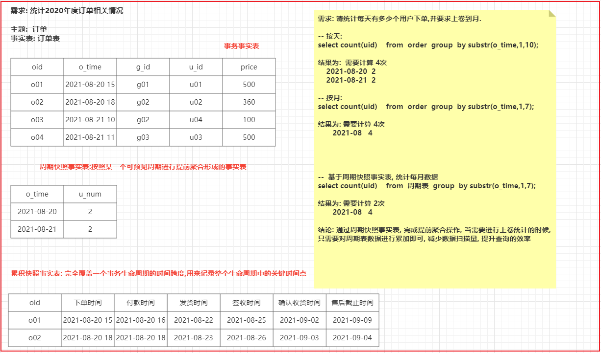
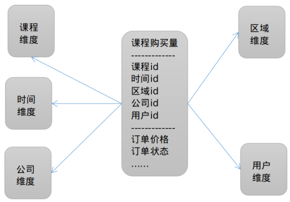
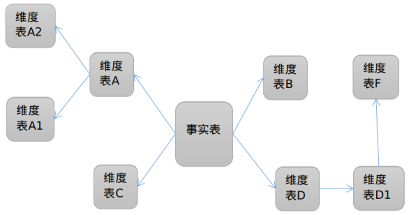
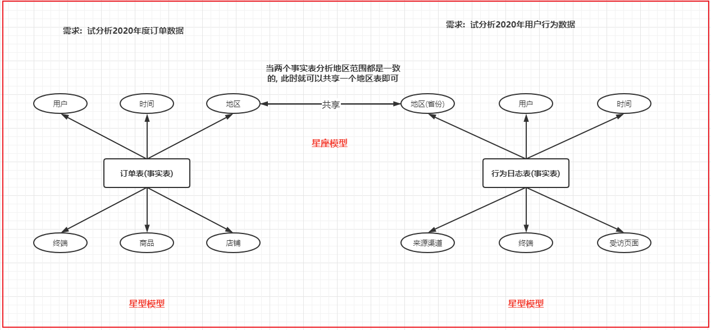
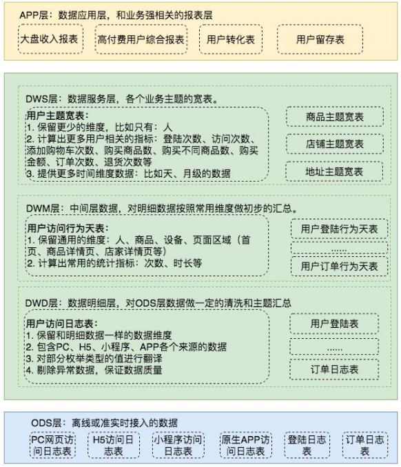

# 数仓的概念

数据仓库（Data Warehouse）是一个面向主题的（Subject Oriented）、数据集成的（Integrated）、相对稳定(非易失)的（Non-Volatile）、反映历史变化(时变)（Time Variant）的数据集合，用于支持管理决策(Decision Making Support)。

## OLTP和OLAP区别

OLTP（On-Line Transaction Processing）即联机事务处理，也称为面向交易的处理过程，其基本特征是前台接收的用户数据可以立即传送到计算中心进行处理，并在很短的时间内给出处理结果，是对用户操作快速响应的方式之一，比如ERP系统，CRM系统，互联网电商系统等，这类系统的特点是事务操作频繁，数据量小。

OLAP（On-Line Analytical Processing）即联机分析处理，有时也称为决策支持系统（DSS），支持复杂的分析操作，侧重决策支持，并且提供直观易懂的查询结果。这类系统的特点是没有事务性操作，主要是查询操作，数据量大。

| 对比项目       | OLTP（联机事务处理）       | OLAP（联机分析处理）         |
|----------------|----------------------------|------------------------------|
| 功能           | 面向交易的事务处理         | 面向分析查询                 |
| 设计           | 面向业务                   | 面向主题                     |
| 数据           | 最新数据，二维数据         | 历史数据，多维数据           |
| 存储（单位）   | M、G                       | T、P、E                       |
| 响应时间       | 快                         | 慢                           |
| 用户           | 业务操作人员               | 管理决策人员                 |

## 数仓特点

1. 面相主题

    数据库应用是以业务流程来划分应用程序和数据库，比如ERP（Ent*erp*rise Resource Planning）包括：进销存系统、人力资源管理系统、财务管理系统、仓库管理系统等，进销存系统管理了进货、销售、存储等业务流程，人力资源系统管理了员工的信息、待遇等相关信息。

    数据仓库是以数据分析需求来对数据进行组织划分若干主题，比如销售主题、员工主题、产品主题，主题是一个抽象的概念，可以理解为相关数据的分类、目录等，通过销售主题可以进行销售相关的分析，如年度销量排行、月度订单量统计等。

2. 数据集成

    主题中的数据是跨应用系统的，也就是说数据是分散在各各应用系统，比如销售数据在进销存系统中有，财务系统中也有，为了进行销售分析需要将销售数据进行集成，集成在销售主题中，就可以从销售主题来进行数据分析。

3. 非易失

    数据库应用系统是根据业务需求进行数据处理和存储，而数据仓库是根据数据分析需求来进行数据存储，数据仓库中的数据用于查询和分析，为了保证数据分析的准确性和稳定性，数据仓库中的数据一般是很少更新的，会将历史快照保存下来。

4. 时变

    使数据仓库中的数据很少更新，但也不能保证没有变化，如下需求：
    1）会不断添加新数据
    每年的销售数据会逐渐添加到数据仓库。
    2）删除过期数据
    数据仓库中的数据会保存很长的时间（5--10年），但也有过期时间，到过期 时间会删除过期 数据。
    3）对历史明细数据进行聚合
    为了方便数据分析，根据分析需求会将比较细粒度的数据进行数据聚合存储，这也是时变的一种表现，比如：为了方便统计年度销售额会将销售记录按月进行统计，统计年度销售额时只需要针对月度销售结果进行统计即可。

## 指标与维度

指标是衡量事务发展的标准，也叫度量，如价格，销量等；指标可以求和、求平均值等计算。

维度是事务的特征，如颜色、区域、时间等，可以根据不同的维度来对指标进行分析对比。比如根据区域维度来分析不同区域的产品销量，根据时间来分析每个月产品的销量，同一个产品销量指标从不同的维度分析会得出不同的结果。

维度是数据仓库建模的基础，维度是在分析时从多个方面来进行分析，根据上边的例子，将课程访问量作为度量，识别的维度主要是时间。
在真实的统计需求中，识别的维度除了时间外，还可能包括：课程、机构（校区）、学科（课程分类）等，如下图：

- 课程访问量度量
    - 课程维度
    - 时间味道
    - 地区维度
    - 教育机构维度
- 课程购买量
    - 课程维度
    - 时间维度
    - 客户维度
    - 教育机构维度
    - 地区维度
    - 支付方式

## 4.5 维度分层与分级

通常在分析结果中首先看到的是一个总数，比如全年课程购买量，然后会详细去看每个季度、每个月的课程购买量，全年、季度、月这些属于时间维度的一个层次，年、季度、月是这个层次的三个级别；再比如按地区分析课程购买量，全国、省、市、县属于地区维度的一个层次，层次中共有四个级别。

- 时间维度：
    - 一个层次四个级别：年、月、天、小时
- 课程维度：
    - 课程名称：只有一个级别，每门课程的名称
    - 课程分类：两个级别，大类和小类
    - 课程难度：只有三个级别，简单、一般、难
    - 课程等级：只有三个级别，初、中、高
- 地区维度：
    - 一个层次三个级别：省、市、县

把获取高级别的汇总信息的过程叫上卷，把获取低级别的明细信息的过程叫下钻，比如：课程访问量分析，时间维度有四个级别，分别是年、月、天、小时，现在我们某个级别分析每天的课程访问量，比如按天分析课程访问量，此时我们可以按小时下钻分析，得出一天内每小时的课程访问量，也可以按月上卷，得到月度的课程访问量。

## 数仓建模

数据仓库建模的方法常用的有两种：三范式建模法、维度建模法，三范式建模法主要是应用于传统的企业级数据仓库，这类数据仓库通常使用关系型数据库实现，是由Inmon提出的，应用于自顶向下的数据仓库架构; 维度数据模型就是基于维度分析来创建模型，是由Kimball提出，应用于自下向上的数据仓库架构。本课程采用维度建模的方法。

维度建模，简称DM（Dimensional modeling），数据仓库大师Kimball的观点：维度数据模型是一种趋向于支持最终用户对数据仓库进行查询的设计技术，是围绕性能和易理解性构建的。维度模型是按照用户看待或分析数据的角度来组织数据。

维度建模的两个核心概念：事实表和维度表。

### 5.2 事实表

1. 事务事实表(Transaction fact table): 事务事实表中的数据在事务事件发生后产生，数据的粒度通常是每个事务一条记录。保存的是最原子的数据, 沟通中常说的事实表，大多指的是事务事实表。
2. 周期快照事实表(Periodicsnapshot fact table): 周期快照事实表的粒度是每个时间段一条记录，通常比事务事实表的粒度要粗，是在事务事实表之上建立的聚集表。比如说时间周期是1周，那么这个周期快照事实表的一条记录就是这一周的对于某个度量的统计值。
3. 累积快照事实表(Accumulatingsnapshot fact table): 累积快照事实表代表的是完全覆盖一个事务或产品的生命周期的时间跨度，它通常具有多个日期字段，用来记录整个生命周期中的关键时间点。例如订单累计快照事实表会有付款日期，发货日期，收货日期等时间点。

    ✨累积快照事实表和周期快照事实表有些相似之处，它们存储的都是事务数据的快照信息。但是它们之间也有着很大的不同，周期快照事实表记录的确定的周期的数据，而累积快照事实表记录的不确定的周期的数据。 

### 5.3 维度表

维度是指观察数据的角度，一般是一个名词，比如对于销售金额这个事实，我们可以从销售时间、销售产品、销售店铺、购买顾客等多个维度来观察分析。

✨维度表并不一定存在, 但是维度是一定存在:
- 比如: 根据用户维度进行统计, 如果在事实表只存储了用户id, 此时需要关联用户表, 这个时候就是维度表
- 比如: 根据用户维度进行统计, 如果在事实表不仅仅存储了用户id,还存储用户名称, 这个时候有用户维度, 但是不需要用户表的参与, 意味着没有这个维度表

## 5.4 常见的建模方法

星型模型: 一个事实表为中心，多个维度表环绕周围。

雪花模型

当有一个或多个维表没有直接连接到事实表上，而是通过其他维表连接到事实表上时，就像多个雪花连接在一起，故称雪花模型。雪花模型是对星型模型的扩展

星座模型: 有多个事实表, 那么也就意味着有了多个分析的主题, 在事实表的周围围绕了多个维度表, 多个事实表在条件符合的情况下, 可以共享维度表

## 数据仓库分层

1. 源数据层（ODS）: 此层数据无任何更改，直接沿用外围系统数据结构和数据，为临时存储层，是接口数据的临时存储区域
2. 数据仓库层（DW）:
    1. 明细层DWD（Data Warehouse Detail）：存储明细数据，此数据是最细粒度的事实数据。该层一般保持和ODS层一样的数据粒度，并且提供一定的数据质量保证。
    2. 中间层DWM（Data WareHouse Middle）：存储中间数据，为数据统计需要创建的中间表数据，此数据一般是对多个维度的聚合数据。
    3. 业务层DWS（Data WareHouse Service）：存储宽表数据，此层数据是针对某个业务领域的聚合数据，应用层的数据通常来源与此层，为什么叫宽表，主要是为了应用层的需要在这一层将业务相关的所有数据统一汇集起来进行存储，方便业务层获取。

    ✨在实际计算中，如果直接从DWD或者ODS计算出宽表的统计指标，会存在计算量太大并且维度太少的问题，因此一般的做法是，在DWM层先计算出多个小的中间表，然后再拼接成一张DWS的宽表。由于宽和窄的界限不易界定，也可以去掉DWM这一层，只留DWS层，将所有的数据在放在DWS亦可。

3. 数据应用层（DA 或 APP）: 前端应用直接读取的数据源；根据报表、专题分析的需求而计算生成的数据。
4. 维度层(Dimension)
    1. 高基数维度数据：一般是用户资料表、商品资料表类似的资料表。数据量可能是千万级或者上亿级别。
    2. 低基数维度数据：一般是配置表，比如枚举值对应的中文含义，或者日期维表。数据量可能是个位数或者几千几万。

数据仓库设计案例:

项目架构中: 数据流转的流程

首先业务是存储在MySQL数据库中, 通过sqoop对MySQL的数据进行数据的导入操作, 将数据导入到HIVE的ODS层中, 对数据进行清洗转换成处理工作, 处理之后对数据进行统计分析, 将统计分析的结果基于sqoop在导出到MySQL中, 最后使用finebi实现图表展示操作, 由于分析工作是需要周期性干活, 采用ooize进行自动化的调度工作, 整个项目是基于cloudera manager进行统一监控管理

## 2. cloudera manager基本介绍

​大数据的发行版本, 主要有三个发行版本: Apache 官方社区版本, cloudera 推出CDH商业版本, Hortworks推出的HDP商业免费版本, 目前HDP版本已经被cloudera 收购了

CDH是Apache Hadoop和相关项目中最完整、最稳定的、经过测试和最流行的发行版。 CDH出现帮助解决了各个软件之间的兼容问题, 同时内置大量的常规企业优化方案, 为了提供用户体验, 专门推出一款用于监控管理自家产品的大数据软件: cloudera manager

Cloudera Manager是用于管理CDH群集的B/S应用程序

使用Cloudera Manager，可以轻松部署和集中操作完整的CDH堆栈和其他托管服务（Hadoop、Hive、Spark、Kudu）。其特点：应用程序的**安装过程自动化**，将部署时间从几周缩短到几分钟; 并提供运行主机和服务的集群范围的**实时监控视图**; 提供单个中央控制台，以在整个群集中实施配置更改; 并集成了全套的报告和诊断工具，可帮助**优化性能**和利用率。

## 分桶表优化方案

什么是分桶表?

主要是用于分文件的, 在建表的时候, 指定按照那些字段执行分桶操作, 并可以设置需要分多少个桶, 当插入数据的时候, 执行MR的分区的操作, 将数据分散各个分区(hive分桶)中, 默认分发方案: hash 取模

如何向分桶表添加数据呢?
标准格式: 
1) 创建一张与分桶表一样的临时表,唯一区别这个表不是一个分桶表
2) 将数据加载到这个临时表中
3) 通过 insert into + select 语句将数据导入到分桶表中

说明: sqoop不支持直接对分桶表导入数据

分桶表有什么作用呢?

1) 进行数据采样
	- 案例1: 数据质量校验工作(一般会先判断各个字段数据的结构信息是否完整)
	- 案例2:  在进行数据分析的时候, 一天需要编写N多条SQL, 但是每编写一条SQL后, 都需要对SQL做一个校验, 如果直接面对完整的数据集做校验, 会导致校验时间过长, 影响开发进度, 此时可以先采样出一部分数据
	- 案例3:  在计算一些比率值,或者 在计算相对指标的时候, 也会基于采样数据来计算相对指标
		比如: 计算当前月的销售额相对上个月 环比增长了百分之多少? 
			可以选择当前月和上个月抽取出百分之30的数据, 基于这个数据来计算
2) 提升查询的效率(单表|多表)

## 如何提升查询的效率

单表进行分表
多表呢?

思考: 当多表进行join的时候, 如何提升join效率呢?

可能出现的问题:
1) 可能出现数据倾斜的问题
2) 导致reduce压力较大

### 小表和大表:

采用 map join的方案

在进行join的时候, 将小表的数据放置到每一个读取大表的mapTask的内存中, 让mapTask每读取一次大表的数据都和内存中小表的数据进行join操作, 将join上的结果输出到reduce端即可, 从而实现在map端完成join的操作

### 中型表和大表:

中型表: 与小表相比 大约是小表3~10倍左右

解决方案: 

1) 能提前过滤就提前过滤掉(一旦提前过滤后, 会导致中型表的数据量会下降, 有可能达到小表阈值)
2) 如果join的字段值有大量的null, 可以尝试添加随机数(保证各个reduce接收数据量差不多的, 减少数据倾斜问题)
3) 基于分桶表的: bucket map join

## 大表和大表:

解决方案:

1. 能提前过滤就提前过滤掉(减少join之间的数量, 提升reduce执行效率)
2. 如果join的字段值有大量的null, 可以尝试添加随机数(保证各个reduce接收数据量差不多的, 减少数据倾斜问题)
3. SMB Map join (sort merge bucket map join)

