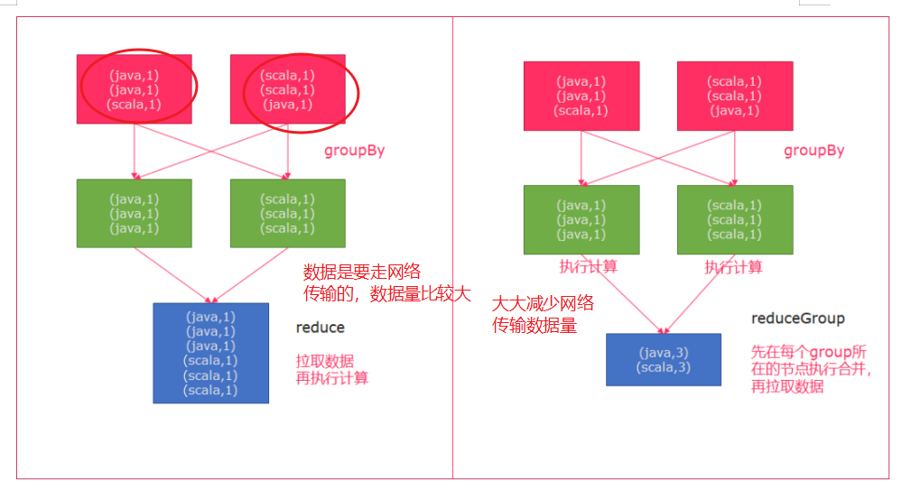
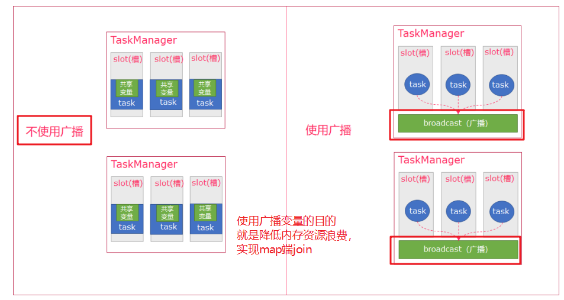

## transform


|Transformation|Description|
|---------------------|----------------------------------------------------------------------------------------------------------------------------------------------------------------------------------------------------------------------------------------|
|Map|在算子中得到一个元素并生成一个新元素<br>`data.map { x => x.toInt }`|
|FlatMap|在算子中获取一个元素，并生成任意个数的元素<br>`data.flatMap { str => str.split(" ") }`|
|MapPartition|类似Map，但是一次Map一整个并行分区<br>`data.mapPartition { in => in map { (_, 1) }`|
|Filter|如果算子返回true则包含进数据集，如果不是则被过滤掉<br>`data.filter { _ > 100 }`|
|Reduce|通过将两个元素合并为一个元素，从而将一组元素合并为一个元素<br>`data.reduce { _ + _ }`|
|ReduceGroup|将一组元素合并为一个或者多个元素<br>`data.reduceGroup { elements => elements.sum }`|
|Aggregate|将一组值聚合为一个值，聚合函数可以看作是内置的Reduce函数<br>`data.aggregate(SUM, 0).aggregate(MIN, 2)`<br>`data.sum(0).min(2)`|
|Distinct|去重|
|Join|按照相同的Key合并两个数据集<br>`input1.join(input2).where(0).equalTo(1)`<br>同时也可以选择进行合并的时候的策略，是分区还是广播，是基于排序的算法还是基于哈希的算法<br>`input1.join(input2, JoinHint.BROADCAST_HASH_FIRST).where(0).equalTo(1)`|
|OuterJoin|外连接，包括左外，右外，完全外连接等<br>`left.leftOuterJoin(right).where(0).equalTo(1) { (left, right) => ... }`|
|CoGroup|二维变量的Reduce运算，对每个输入数据集中的字段进行分组，然后join这些组<br>`input1.coGroup(input2).where(0).equalTo(1)`|
|Cross|笛卡尔积<br>`input1.cross(input2)`|
|Union|并集<br>`input1.union(input2)`|
|Rebalance|分区重新平衡，以消除数据倾斜<br>`input.rebalance()`|
|Hash-Partition|按照Hash分区<br>`input.partitionByHash(0)`|
|Range-Partition|按照Range分区<br>`input.partitionByRange(0)`|
|CustomParititioning|自定义分区<br>`input.partitionCustom(partitioner: Partitioner[K], key)`|
|First-n|返回数据集中的前n个元素<br>`input.first(3)`|
|partitionByHash|按照指定的key进行hash分区|
|sortPartition|指定字段对分区中的数据进行排序|


1. map&mappartition

    map与mappartition最终效果实际是一样的，但是对于mappartition可以让我们有机会对整个分区的数据看做一个整体进行处理，此外还给我们创建了针对当前分区只需做一次的昂贵动作的机会。


    1. map

        ```scala
        val stuDs: DataSet[Student] = sourceDs.map(
            line => {
            val arr: Array[String] = line.split(",")
            Student(arr(0).toInt, arr(1))
            }
        )
        ```

    2. mappartition

        ```scala
        val stuDs2: DataSet[Student] = sourceDs.mapPartition(
            iter => { //迭代器
            //todo 做一些昂贵的动作，比如开启连接
            iter.map(//遍历迭代器数据转为case class类型然后返回
                it => {
                val arr: Array[String] = it.split(",")
                Student(arr(0).toInt, arr(1))
                }
            )
            //todo 做一些昂贵的动作，关闭连接
            }
        )
        ```

2. flatMap


    ```scala
    /*
    需求：
    示例
    分别将以下数据，转换成国家、省份、城市三个维度的数据。
    将以下数据
        张三,中国,江西省,南昌市
        李四,中国,河北省,石家庄市
    转换为
        (张三,中国)
        (张三,中国,江西省)
        (张三,中国,江西省,南昌市)
        (李四,中国)
        (李四,中国,河北省)
        (李四,中国,河北省,石家庄市)
    */

    val faltMapDs: DataSet[Product with Serializable] = sourceDs.flatMap(
        line => {
            // 3.1对数据进行切分操作
            val arr: Array[String] = line.split(",")
            // 3.2 组装数据装入list中
            List(
                //(张三,中国)
                (arr(0), arr(1)),
                // (张三,中国,江西省)
                (arr(0), arr(1), arr(2)),
                // (张三,中国,江西省,南昌市)
                (arr(0), arr(1), arr(2), arr(3))
            )
        }
    )
    ```


1. filter

    对数据进行过滤操作，保留下来结果为true的数据

    ```scala
    // 3 转换操作 使用filter过滤单词长度大于4的单词
    val moreThan4Words: DataSet[String] = wordsDs.filter(_.length > 4)
    ```

1. reduce

    reduce聚合操作的算子，

    ```scala

    请将以下元组数据，下按照单词使用groupBy进行分组，再使用reduce操作聚合成一个最终结果("java" , 1) , ("java", 1) ,("scala" , 1)
    转换为("java", 2), ("scala", 1)


    val wordsDs = env.fromCollection(List(("java", 1), ("java", 1), ("scala", 1)))
    val groupDs: GroupedDataSet[(String, Int)] = wordsDs.groupBy(_._1)
    val resultDs: DataSet[(String, Int)] = groupDs.reduce(
    (w1, w2) => { // w1是一个初始值，第一次的时候是：（单词，0），之后都是之前的累加结果
        //3.1 进行次数累加
        (w1._1, w1._2 + w2._2)
    }
    )
    ```

1. reduceGroup

    

    ```scala

    请将以下元组数据，下按照单词使用groupBy进行分组，再使用reduce操作聚合成一个最终结果("java" , 1) , ("java", 1) ,("scala" , 1)
    转换为("java", 2), ("scala", 1)

    val wordsDs = env.fromCollection(List(("java", 1), ("java", 1), ("scala", 1)))
    val groupDs: GroupedDataSet[(String, Int)] = wordsDs.groupBy(_._1)

    val resultDs: DataSet[(String, Int)] = groupDs.reduceGroup(
    iter => {
        //参数是一个迭代器
        iter.reduce(//再对迭代器进行reduce聚合操作
        (w1, w2) => (w1._1, w1._2 + w2._2)
        )
    }
    )
    ```


1. aggregate

    aggregate只能作用于元组类型的数据，并且对分组方式有要求只能是按照索引或者字段名称方式分组的聚合计算。


    ```scala
    请将以下元组数据，下按照单词使用groupBy进行分组，再使用reduce操作聚合成一个最终结果("java" , 1) , ("java", 1) ,("scala" , 1)
    转换为("java", 2), ("scala", 1)

    val wordsDs = env.fromCollection(List(("java", 1), ("java", 1), ("scala", 1)))
    val groupDs: GroupedDataSet[(String, Int)] = wordsDs.groupBy(0)
    val resultDs: AggregateDataSet[(String, Int)] = groupDs.aggregate(Aggregations.SUM,1)
    ```

1. distinct

    对数据进行去重操作，可以指定对某个字段进行去重


    ```scala
    /*
    需求：

    示例
    请将以下元组数据，对数据进行去重操作
    ("java" , 2) , ("java", 1) ,("scala" , 1)
    转换为
    ("java", 2), ("scala", 1)
    */
    val wordsDs = env.fromCollection(List(("java", 1), ("java", 2), ("scala", 1)))
    wordsDs.distinct(0).print()  //指定按照某个字段进行去重操作
    ```

1. join操作

    类似于sql中的inner join，只展示join成功的数据。


    ```scala
    
    /*
    需求：
    示例
    有两个csv文件，有一个为score.csv，一个为subject.csv，分别保存了成绩数据以及学科数据。
    需要将这两个数据连接到一起，然后打印出来。
    */
    
    val scoreDs: DataSet[Score] = env.readCsvFile[Score]("E:\\data\\score.csv")
    val sbujectDs: DataSet[Subject] = env.readCsvFile[Subject]("E:\\data\\subject.csv")
    val joinDs: JoinDataSet[Score, Subject] = scoreDs.join(sbujectDs).where(2).equalTo(0)

    ```

2. leftouterjoin, rightouterjoin, fullOuterJoin


    类似表的左外关联


    ```scala
    /*
    需求：用户dataset左关联城市数据
    示例
    请将以下元组数据(用户id,用户姓名)
    (1, "zhangsan") , (2, "lisi") ,(3 , "wangwu")
    元组数据(用户id,所在城市)
    (1, "beijing"), (2, "shanghai"), (4, "guangzhou")
    返回如下数据：
    (3,wangwu,null)
    (1,zhangsan,beijing)
    (2,lisi,shanghai)
    */


    val userDs: DataSet[(Int, String)] = env.fromCollection(List((1, "zhangsan"), (2, "lisi"), (3, "wangwu")))
    val cityDs: DataSet[(Int, String)] = env.fromCollection(List((1, "beijing"), (2, "shanghai"), (4, "guangzhou")))
    /*
    OPTIMIZER_CHOOSES：将选择权交予Flink优化器；
    BROADCAST_HASH_FIRST：广播第一个输入端，同时基于它构建一个哈希表，而第二个输入端作为探索端，选择这种策略的场景是第一个输入端规模很小；
    BROADCAST_HASH_SECOND：广播第二个输入端并基于它构建哈希表，第一个输入端作为探索端，选择这种策略的场景是第二个输入端的规模很小；
    REPARTITION_HASH_FIRST：该策略会导致两个输入端都会被重分区，但会基于第一个输入端构建哈希表。该策略适用于第一个输入端数据量小于
    第二个输入端的数据量，但这两个输入端的规模仍然很大，优化器也是当没有办法估算大小，没有已存在的分区以及排序顺序可被使用时系统默认采用的策略；
    REPARTITION_HASH_SECOND：该策略会导致两个输入端都会被重分区，但会基于第二个输入端构建哈希表。
    该策略适用于两个输入端的规模都很大，但第二个输入端的数据量小于第一个输入端的情况；
    REPARTITION_SORT_MERGE：输入端被以流的形式进行连接并合并成排过序的输入。该策略适用于一个或两个输入端都已排过序的情况；
    */

    //我们一般如果不明确数据集情况，就使用OPTIMIZER_CHOOSES
    val leftJoinAssigner: JoinFunctionAssigner[(Int, String), (Int, String)] = userDs.leftOuterJoin(cityDs,
        JoinHint.OPTIMIZER_CHOOSES).where(0).equalTo(0)
    //3.1 使用apply方法解析JoinFunctionAssigner中的数据处理逻辑
    val resultDs: DataSet[(Int, String, String)] = leftJoinAssigner.apply(
        (left, right) => {
        if (right == null) { //cityds中结果为null
            //返回的数据
            (left._1, left._2, "null")
        } else {
            //返回的数据
            (left._1, left._2, right._2)
        }
        }
    )
    ```


1. union


    针对两个dataset去并集，注意结果不去重，并且要求两个数据集的数据类型必须一致。


    ```scala
    /*
    需求：
    示例
    将以下数据进行取并集操作
    数据集1
    "hadoop", "hive", "flume"
    数据集2
    "hadoop", "hive", "spark"
    */

    val ds1: DataSet[String] = env.fromCollection(List("hadoop",
        "hive",
        "flume"))
    val ds2: DataSet[String] = env.fromCollection(List("hadoop",
        "hive",
        "azkaban"))
    val unionDs: DataSet[String] = ds1.union(ds2)
    ```


- rebalance

    rabalance可以对数据集进行数据的均匀分布，内部使用round robin(轮询策略)进行数据分发。


- partitionByHash和partitionByRange

    - hash分区：根据key的hash值进行分区
    - range分区：根据key的范围进行分区的划分


- minby/maxby

    求取最小或者最大值

- cross 笛卡尔积


## sink


## flink 广播变量

1. 就是把之前不使用广播变量会导致的内存消耗增大，使用广播变量会降低tm的内存压力，
2. 减轻shuffle，因为数据存在tm的内存中，进行join操作不需要跨节点通过网络传输，直接从内存中获取即可。





## 累加器

累加器：是进行全局计数操作，

flink中累加器的用法：

1. 创建一个累加器 new IntCounter,longCounter
2. 使用运行上下文件进行注册该累加器
3. 累加器.add方法
4. 获取累加器的值，需要通过env.execute的返回结果resut获取


## flink分布式缓存

广播变量是将变量分发到各个TaskManager节点的内存上，分布式缓存是将文件缓存到各个TaskManager节点上；


广播变量和分布式缓存：

广播变量适合的是：小数据量，更新不频繁的数据，

分布式缓存：适合你需要分发的数据是存储在文件中的；


## flink程序并行度的设置

flink程序有四种设置并行度的方式

优先级：

算子级别  >env级别>client 级别（flink run -p n）>系统默认（flink-conf.yaml配置）

建议：

1. 建议不设置算子并行度，如果算子并行度发生变化，造成数据的shuffle;
2. 不建议使用系统默认配置，配置太过于死板了，修改起来比较麻烦；
3. 可以设置env级别或者client级别。


## keyby 


类似批处理中的group by算子，对数据流按照指定规则进行分区。


## connect 

两个可以合并为一个流，数据类型可以不同，union必须要求数据类型一致才能union.


## split+select

可以实现对数据流的切分，使用split切分流，通过select获取到切分之后的流：


