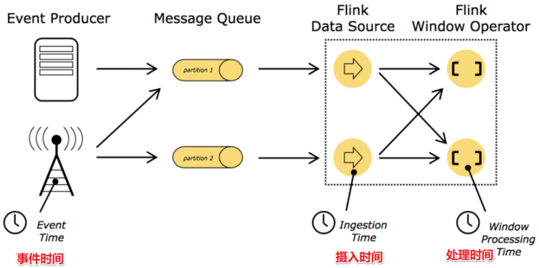
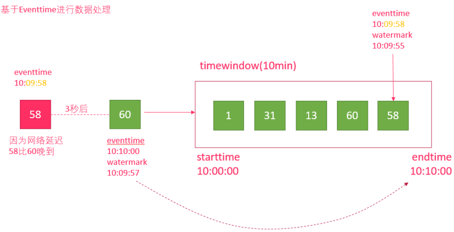

# flink_水位线

## 时间分类

- EventTime[事件时间]
  事件发生的时间，例如：点击网站上的某个链接的时间，每一条日志都会记录自己的生成时间. 如果以EventTime为基准来定义时间窗口那将形成EventTimeWindow,要求消息本身就应该携带EventTime
- IngestionTime[摄入时间]
  数据进入Flink的时间，如某个Flink节点的source operator接收到数据的时间，例如：某个source消费到kafka中的数据. 如果以IngesingtTime为基准来定义时间窗口那将形成IngestingTimeWindow,以source的systemTime为准
- ProcessingTime[处理时间]
  某个Flink节点执行某个operation的时间，例如：timeWindow处理数据时的系统时间，默认的时间属性就是Processing Time. 如果以ProcessingTime基准来定义时间窗口那将形成ProcessingTimeWindow，以operator的systemTime为准

在Flink的流式处理中，绝大部分的业务都会使用EventTime，一般只在EventTime无法使用时，才会被迫使用ProcessingTime或者IngestionTime。

## Watermark

在进行数据处理的时候应该按照事件时间进行处理,也就是窗口应该要考虑到事件时间. 但是窗口不能无限的一直等到延迟数据的到来,需要有一个触发窗口计算的机制也就是我们接下来要学的watermaker水位线/水印机制.

可以理解为：收到一条消息后，额外给这个消息添加了一个时间字段，这就是添加水印(watermark)时间戳。

- 水印并不会影响原有Eventtime事件时间
- 当数据流添加水印后，会按照水印时间来触发窗口计算, 也就是说watermark水印是用来触发窗口计算的.
- 一般会设置水印时间，比事件时间小几秒钟,表示最大允许数据延迟达到多久(即水印时间 = 事件时间 - 允许延迟时间)10:09:57 =  10:10:00  - 3s  
- 当接收到的 水印时间 >= 窗口结束时间，则触发计算 如等到一条数据的水印时间为10:10:00 >= 10:10:00 才触发计算, 也就是要等到事件时间为10:10:03的数据到来才触发计算(即事件时间 - 允许延迟时间 >= 窗口结束时间 或 事件时间 >= 窗口结束时间 + 允许延迟时间)

总结:watermaker是用来解决延迟数据的问题
如窗口10:00:00~10:10:00
而数据到达的顺序是: A 10:10:00  ,B 10:09:58
如果没有watermaker,那么A数据将会触发窗口计算,B数据来了窗口已经关闭,则该数据丢失
那么如果有了watermaker,设置允许数据迟到的阈值为3s
那么该窗口的结束条件则为 水印时间>=窗口结束时间10:10:00,也就是需要有一条数据的水印时间= 10:10:00
而水印时间10:10:00= 事件时间- 延迟时间3s
也就是需要有一条事件时间为10:10:03的数据到来,才会真正的触发窗口计算
而上面的 A 10:10:00  ,B 10:09:58都不会触发计算,也就是会被窗口包含,直到10:10:03的数据到来才会计算窗口10:00:00~10:10:00的数据

## 侧道输出

Watermark只能解决一定时间范围内的乱序数据/延迟数据的计算问题,对于窗口已经触发过之后再到来的数据,会丢失

那么如果想要让一定时间范围的延迟数据不会被丢弃，可以使用Allowed Lateness(允许迟到机制/侧道输出机制)设定一个允许延迟的时间和侧道输出对象来解决

即根据我们自己的生产经验使用WaterMark + EventTimeWindow + Allowed Lateness方案（包含侧道输出），可以做到数据不丢失。

- allowedLateness(lateness: Time)---设置允许延迟的时间

    该方法传入一个Time值，设置允许数据迟到的时间，这个时间和watermark中的时间概念不同。再来回顾一下，
    watermark=数据的事件时间-允许乱序时间值
    随着新数据的到来，watermark的值会更新为最新数据事件时间-允许乱序时间值，但是如果这时候来了一条历史数据，watermark值则不会更新。
    总的来说，watermark永远不会倒退它是为了能接收到尽可能多的乱序数据。
    那这里的Time值呢？主要是为了等待迟到的数据，如果属于该窗口的数据到来，仍会进行计算，后面会对计算方式仔细说明
    注意：该方法只针对于基于event-time的窗口

- sideOutputLateData(outputTag: OutputTag[T])--保存延迟数据

    该方法是将迟来的数据保存至给定的outputTag参数，而OutputTag则是用来标记延迟数据的一个对象。

- DataStream.getSideOutput(tag: OutputTag[X])--获取延迟数据
    
    通过window等操作返回的DataStream调用该方法，传入标记延迟数据的对象来获取延迟的数据

