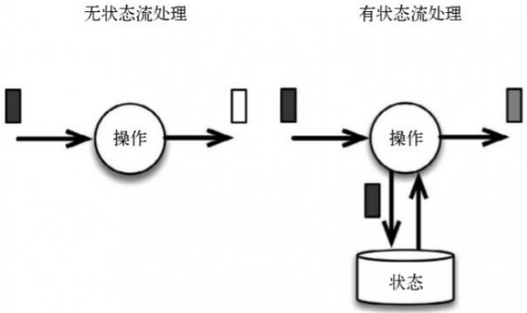
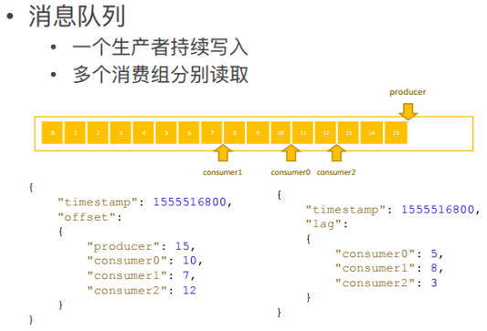
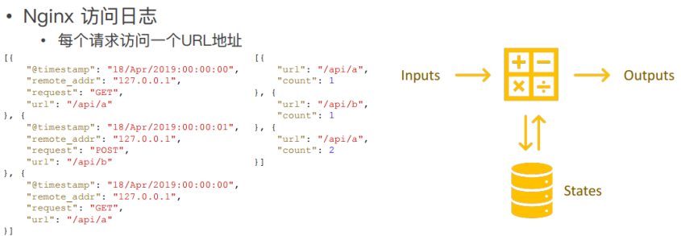
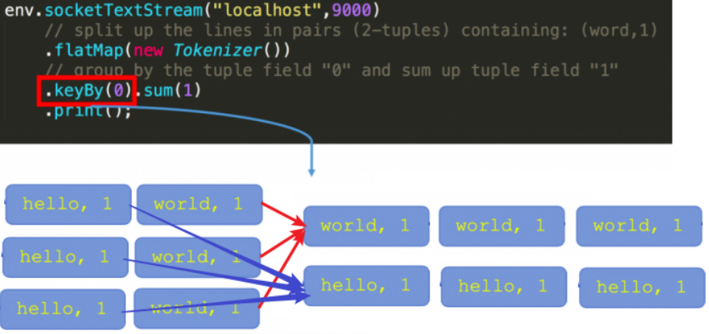
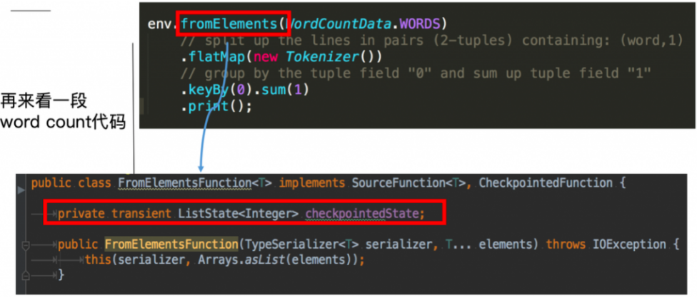

# flink_状态管理

很多时候计算任务的结果不仅仅依赖于输入，还依赖于它的当前状态，我们可以这样理解State：某task/operator在某时刻的一个中间结果

其实大多数的计算都是有状态的计算，比如wordcount，计算单词的count，这是一个很常见的业务场景。count做为输出，在计算的过程中要不断的把输入累加到count上去，那么count就是一个state。

我们前面写的例子中，如果没有包含状态管理。那么一个task在处理过程中挂掉了，那么它在内存中的状态都会丢失，所有的数据都需要重新计算。

从容错和消息处理的语义上(at least once, exactly once)，Flink引入了state和checkpoint，可以说flink因为引入了state和checkpoint所以才支持的exactly once(精准一次)

## 无状态计算

1. 单条输入包含所需的所有信息
2. 相同输入可以得到相同输出

先举一个无状态计算的例子：消费延迟计算。
假设现在有一个消息队列，消息队列中有一个生产者持续往消费队列写入消息，多个消费者分别从消息队列中读取消息。
从图上可以看出，生产者已经写入 16 条消息，Offset 停留在 15 ；有 3 个消费者，有的消费快，而有的消费慢。消费快的已经消费了 13 条数据，消费者慢的才消费了 7、8 条数据。
如何实时统计每个消费者落后多少条数据，如图给出了输入输出的示例。可以了解到输入的时间点有一个时间戳，生产者将消息写到了某个时间点的位置，每个消费者同一时间点分别读到了什么位置。刚才也提到了生产者写入了 15 条，消费者分别读取了 10、7、12 条。那么问题来了，怎么将生产者、消费者的进度转换为右侧示意图信息呢？
consumer 0 落后了 5 条，consumer 1 落后了 8 条，consumer 2 落后了 3 条，根据 Flink 的原理，此处需进行 Map 操作。Map 首先把消息读取进来，然后分别相减，即可知道每个 consumer 分别落后了几条。Map 一直往下发，则会得出最终结果。
大家会发现，在这种模式的计算中，无论这条输入进来多少次，输出的结果都是一样的，因为单条输入中已经包含了所需的所有信息。消费落后等于生产者减去消费者。生产者的消费在单条数据中可以得到，消费者的数据也可以在单条数据中得到，所以相同输入可以得到相同输出，这就是一个无状态的计算。

## 有状态计算

1. 单条输入仅包含所需的部分信息
2. 相同输入可能得到不同输出

以访问日志统计量的例子进行说明，比如当前拿到一个 Nginx 访问日志，一条日志表示一个请求，记录该请求从哪里来，访问的哪个地址，需要实时统计每个地址总共被访问了多少次，也即每个 API 被调用了多少次。可以看到下面简化的输入和输出，输入第一条是在某个时间点请求 GET 了 /api/a；第二条日志记录了某个时间点 Post /api/b ;第三条是在某个时间点 GET了一个 /api/a，总共有 3 个 Nginx 日志。
从这 3 条 Nginx 日志可以看出，第一条进来输出 /api/a 被访问了一次，第二条进来输出 /api/b 被访问了一次，紧接着又进来一条访问 api/a，所以 api/a 被访问了 2 次。不同的是，两条 /api/a 的 Nginx 日志进来的数据是一样的，但输出的时候结果可能不同，第一次输出 count=1 ，第二次输出 count=2，说明相同输入可能得到不同输出。输出的结果取决于当前请求的 API 地址之前累计被访问过多少次。第一条过来累计是 0 次，count = 1，第二条过来 API 的访问已经有一次了，所以 /api/a 访问累计次数 count=2。单条数据其实仅包含当前这次访问的信息，而不包含所有的信息。要得到这个结果，还需要依赖 API 累计访问的量，即状态。
这个计算模式是将数据输入算子中，用来进行各种复杂的计算并输出数据。这个过程中算子会去访问之前存储在里面的状态。另外一方面，它还会把现在的数据对状态的影响实时更新，如果输入 200 条数据，最后输出就是 200 条结果。

## 状态的类型

### 8.2.1.Managed State & Raw State

从Flink是否接管角度:可以分为
ManagedState(托管状态) 是Flink自动管理的State
RawState(原始状态)：是原生态 State需要用户自己管理
两者的区别如下：
1.从状态管理方式的方式来说，Managed State 由 Flink Runtime 管理，自动存储，自动恢复，在内存管理上有优化；而 Raw State 需要用户自己管理，需要自己序列化，Flink 不知道 State 中存入的数据是什么结构，只有用户自己知道，需要最终序列化为可存储的数据结构。
2.从状态数据结构来说，Managed State 支持已知的数据结构，如 Value、List、Map 等。而 Raw State只支持字节数组 ，所有状态都要转换为二进制字节数组才可以。
3.从推荐使用场景来说，Managed State 大多数情况下均可使用，而 Raw State 是当 Managed State 不够用时，比如需要自定义 Operator 时，才会使用 Raw State。
在实际生产中，都只推荐使用ManagedState，后续将围绕该话题进行讨论。

### 8.2.2.Keyed State & Operator State

Managed State 分为两种，Keyed State 和 Operator State 
(Raw State都是Operator State)

1. Keyed State

    

    在Flink Stream模型中，Datastream 经过 keyBy 的操作可以变为 KeyedStream。

    Keyed State是基于KeyedStream上的状态。这个状态是跟特定的key绑定的，对KeyedStream流上的每一个key，都对应一个state，如stream.keyBy(…)

    KeyBy之后的State,可以理解为分区过的State，每个并行keyed Operator的每个实例的每个key都有一个Keyed State，即`<parallel-operator-instance,key>`就是一个唯一的状态，由于每个key属于一个keyed Operator的并行实例，因此我们将其简单的理解为`<operator,key>`

    Keyed State 通过 RuntimeContext 访问，这需要 Operator 是一个RichFunction。
    保存state的数据结构:

    `ValueState<T>`:即类型为T的单值状态。这个状态与对应的key绑定，是最简单的状态了。它可以通过update方法更新状态值，通过value()方法获取状态值，如求按用户id统计用户交易总额

    `ListState<T>`:即key上的状态值为一个列表。可以通过add方法往列表中附加值；也可以通过get()方法返回一个`Iterable<T>`来遍历状态值，如统计按用户id统计用户经常登录的Ip

    `ReducingState<T>`:这种状态通过用户传入的reduceFunction，每次调用add方法添加值的时候，会调用reduceFunction，最后合并到一个单一的状态值

    `MapState<UK, UV>`:即状态值为一个map。用户通过put或putAll方法添加元素

    需要注意的是，以上所述的State对象，仅仅用于与状态进行交互(更新、删除、清空等)，而真正的状态值，有可能是存在内存、磁盘、或者其他分布式存储系统中。相当于我们只是持有了这个状态的句柄

2. Operator State

    

    这里的fromElements会调用FromElementsFunction的类，其中就使用了类型为 list state 的 operator state
    
    Operator State又称为 non-keyed state，与Key无关的State，每一个 operator state 都仅与一个 operator 的实例绑定。
    
    Operator State 可以用于所有算子，但一般常用于 Source
    
    Operator State 需要自己实现 CheckpointedFunction 或 ListCheckpointed 接口。
    保存state的数据结构:
   
    `ListState<T>`
    
    举例来说，Flink中的FlinkKafkaConsumer，就使用了operator state。它会在每个connector实例中，保存该实例中消费topic的所有(partition, offset)映射

## 状态API

### keyed state

几种 Keyed State 的差异具体体现在：

ValueState 存储单个值，比如 Wordcount，用 Word 当 Key，State 就是它的 Count。这里面的单个值可能是数值或者字符串，作为单个值，访问接口可能有两种，get 和 set。在 State 上体现的是 update(T) / T value()。

MapState 的状态数据类型是 Map，在 State 上有 put、remove等。需要注意的是在 MapState 中的 key 和 Keyed state 中的 key 不是同一个。

ListState 状态数据类型是 List，访问接口如 add、update 等。

ReducingState 和 AggregatingState 与 ListState 都是同一个父类，但状态数据类型上是单个值，原因在于其中的 add 方法不是把当前的元素追加到列表中，而是把当前元素直接更新进了 Reducing 的结果中。

AggregatingState 的区别是在访问接口，ReducingState 中 add（T）和 T get() 进去和出来的元素都是同一个类型，但在 AggregatingState 输入的 IN，输出的是 OUT。

### 8.2.4.State-Operator State

与Key无关的State，与Operator绑定的state，整个operator只对应一个state

保存state的数据结构

`ListState<T>`

举例来说，Flink中的Kafka Connector，就使用了operator state。它会在每个connector实例中，保存该实例中消费topic的所有(partition, offset)映射

### 8.2.5.Broadcast State

Broadcast State 是 Flink 1.5 引入的新特性。在开发过程中，如果遇到需要下发/广播配置、规则等低吞吐事件流到下游所有 task 时，就可以使用 Broadcast State 特性。下游的 task 接收这些配置、规则并保存为 BroadcastState, 将这些配置应用到另一个数据流的计算中 。

案例: 
1. 动态更新计算规则: 如事件流需要根据最新的规则进行计算，则可将规则作为广播状态广播到下游Task中。
2. 实时增加额外字段: 如事件流需要实时增加用户的基础信息，则可将用户的基础信息作为广播状态广播到下游Task中。

