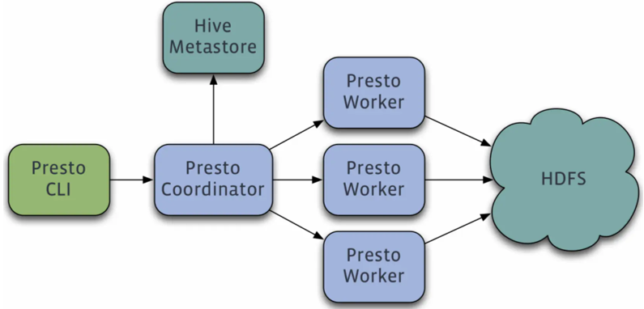
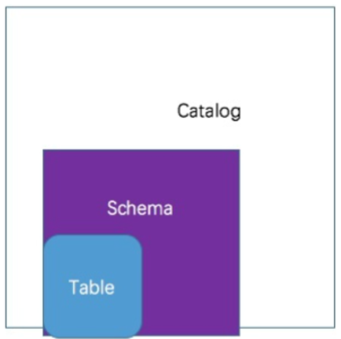

# presto

Presto是一款Facebook开源的MPP架构的OLAP查询引擎，可针对不同数据源执行大容量数据集的一款分布式SQL执行引擎。是一个能够独立运行的系统，不依赖于任何其他外部系统。例如调度，presto自身提供了对集群的监控，可以根据监控信息完成调度。

## 框架架构

Presto采用典型的master-slave模型，由一个Coordinator节点，一个Discovery Server节点，多个Worker节点组成，Discovery Server通常内嵌于Coordinator节点中。

1、coordinator(master)负责meta管理，worker管理，query的解析和调度
2、worker则负责计算和读写
3、discovery server， 通常内嵌于coordinator节点中，也可以单独部署，用于节点心跳。

## 数据模型

Presto 数据模型：采取三层表结构

1、catalog 对应某一类数据源，例如hive的数据，或mysql的数据
2、schema 对应mysql中的数据库
3、table 对应mysql中的表

