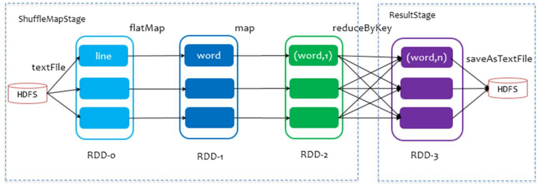
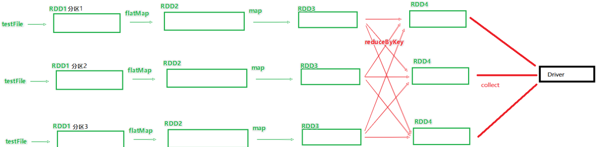
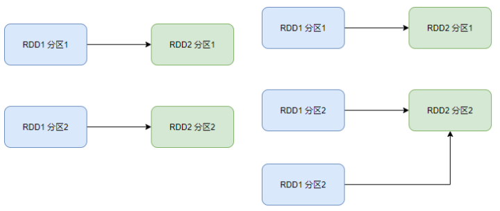
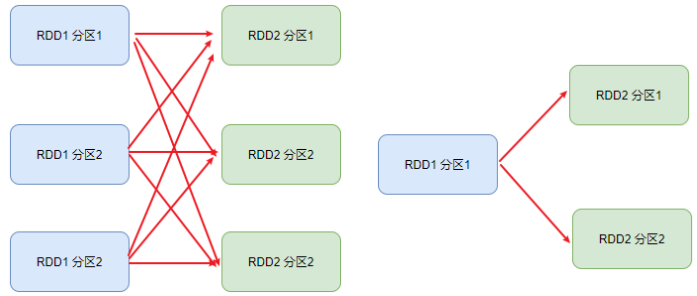
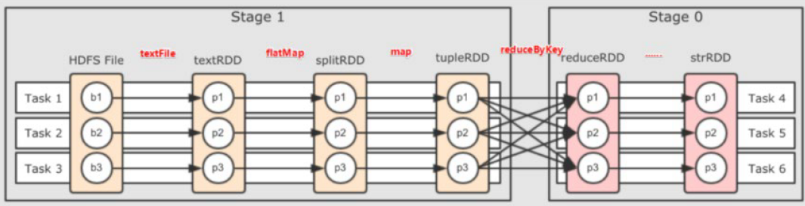
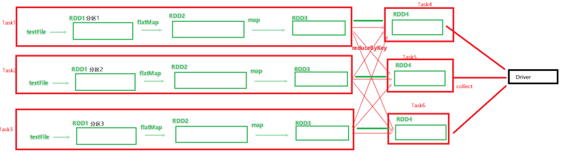

# RDD内核调度


以词频统计WordCount程序为例，DAG图：




1个Action会产生1个DAG，如果在代码中有3个Action就产生3个DAG
一个Action产生的一个DAG，会在程序运行中产生一个JOB
所以: 1个ACTION = 1个DAG = 1个JOB

如果一个代码中，写了3个Action，那么这个代码运行起来产生3个JOB，每个JOB有自己的DAG
一个代码运行起来，在Spark中称之为: Application

层级关系:
1个Application中，可以有多个JOB，每一个JOB内含一个DAG，同时每一个JOB都是由一个Action产生的.


## DAG和分区


```python
rdd1 = sc.textFile()
rdd2 = rdd1.flatMap()
rdd3 = rdd2.map()
rdd4 = rdd3.reduceByKey()
rdd4.action()
```



## DAG的宽窄依赖和阶段划分

窄依赖: 父RDD的一个分区，**全部** 将数据发给子RDD的 **一个** 分区




宽依赖: 父RDD的一个分区，将数据发给子RDD的 **多个** 分区
宽依赖还有一个别名: **shuffle**




## DAG的宽窄依赖和阶段划分

对于Spark来说，会根据DAG，按照宽依赖，划分不同的DAG阶段划分依据：从后向前，遇到宽依赖就划分出一个阶段.称之为stage





如图，可以看到，在DAG中，基于宽依赖.将DAG划分成了2个stage


在stage的内部，一定都是：窄依赖

Spark在DAG调度阶段会将一个Job划分为多个Stage，上游Stage做map工作，下游Stage做reduce工作，其本质上还是MapReduce计算框架。Shuffle是连接map和reduce之间的桥梁，它将map的输出对应到reduce输入中，涉及到序列化反序列化、跨节点网络IO以及磁盘读写IO等。


## 内存迭代计算



如图，基于**带有分区的DAG**以及阶段划分，可以从图中得到逻辑上最优的task分配。一个task是一个线程来具体执行。
那么如上图，task1中rdd1、rdd2、rdd3的迭代计算，都是由一个task（线程）完成，这一阶段的这一条线，是纯内存计算。
如上图，task1、task2、task3，就形成了三个并行的内存计算管道。


