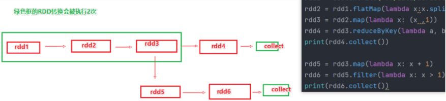

# RDD持久化

RDD之间进行相互迭代计算（Transformation的转换），当执行开启后，新RDD的生成，代表老RDD的消失。
RDD的数据是过程数据，只在处理的过程中存在，一旦处理完成，就不见了。

如上图，rdd3被2次使用，第一次使用之后，其实RDD3就不存在了。

第二次用的时候，只能基于RDD的血缘关系，从RDD1重新执行，构建出来RDD3，供RDD5使用。

## 缓存

通过调用 API(`RDD.persist`)，将指定的 RDD 数据保留在 内存或者硬盘上

- 缓存技术可以将过程RDD数据，持久化保存到内存或者硬盘上. 但是，这个保存在设定上是认为不安全的。

所以，缓存有一个特点就是：其保留RDD之间的血缘（依赖）关系. 一旦缓存丢失，可以基于血缘关系的记录，重新计算这个RDD的数据

## CheckPoint

CheckPoint技术，也是将RDD的数据，保存起来。但是它 **仅支持硬盘存储**
并且：
1. 它被设计认为是安全的
2. 不保留 **血缘关系**

## 缓存和CheckPoint的对比
- CheckPoint不管分区数量多少，风险是一样的，缓存分区越多，风险越高
- CheckPoint支持写入HDFS，缓存不行，HDFS是高可靠存储，CheckPoint被认为是安全的。
- CheckPoint不支持内存，缓存可以，缓存如果写内存性能比CheckPoint要好一些
- CheckPoint因为设计认为是安全的，所以**不保留血缘关系**，而缓存因为设计上认为不安全，所以**保留**

CheckPoint 是一种重量级的使用，也就是 RDD 的重新计算成本很高的时候，我们采用 CheckPoint 比较合适。
或者数据量很大，用 CheckPoint 比较合适。
如果数据量小，或者 RDD 重新计算是非常快的，用 CheckPoint 没啥必要，直接缓存即可。

