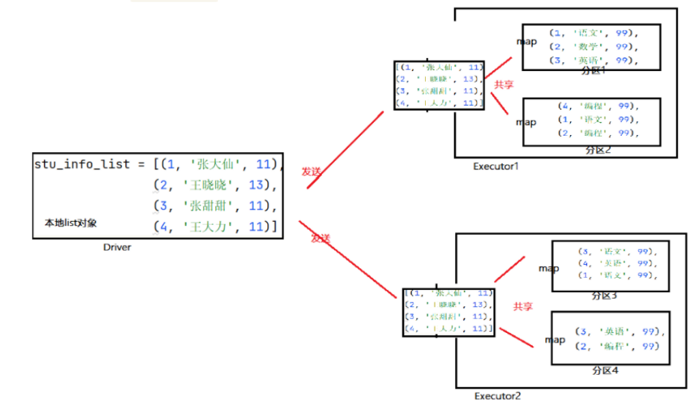

# broadcast


```python
## 将dirver端变量标记为广播变量，分发到executor
broadcast = sc.broadcast(stu_info)

broadcast.value

```




```python
## coding:utf8
import time
from pyspark import SparkConf, SparkContext
from pyspark.storagelevel import StorageLevel

conf = SparkConf().setAppName("test").setMaster("local[*]")
sc = SparkContext(conf=conf)
stu_info_list = [(1, 'wang', 11),
                (2, 'wei', 13),
                (3, 'li', 11)]

broadcast = sc.broadcast(stu_info_list)  # 1. 将本地Python List对象标记为广播变量

score_info_rdd = sc.parallelize([
    (1, '语文', 99),
    (2, '数学', 99),
    (3, '英语', 99),
    (1, '语文', 99),
    (2, '编程', 99),

])

def map_func(data):
    id = data[0]
    name = ""
    for stu_info in broadcast.value:
        stu_id = stu_info[0]
        if id == stu_id:
            name = stu_info[1]

    return (name, data[1], data[2])

print(score_info_rdd.map(map_func).collect())

```