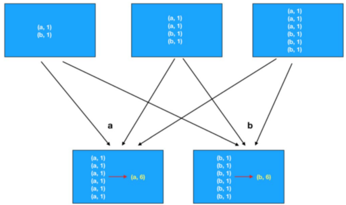
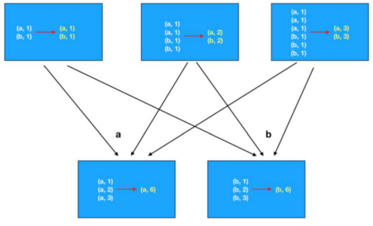

# transformationFunc


## map
`rdd.map(func)`

```python
rdd = sc.parallelize([1, 2, 3, 4, 5, 6], 3)

## 1. 定义方法, 作为算子的传入函数体
def add(data):
    return data * 10
rdd.map(add).collect()

## 2. 更简单的方式 是定义lambda表达式来写匿名函数
rdd.map(lambda data: data * 10).collect() 
```

## flatMap
`rdd.flatMap(func)`
先执行`map(func)`,然后解除嵌套(squeeze), 

```python
rdd = sc.parallelize(["hadoop spark hadoop", "spark hadoop hadoop", "hadoop flink spark"])
rdd2 = rdd.flatMap(lambda line: line.split(" "))
rdd2.collect() # ['hadoop', 'spark', 'hadoop', 'spark', 'hadoop', 'hadoop', 'hadoop', 'flink', 'spark']
```

## reduceByKey
`rdd.reduceByKey(func)`
reduceByKey 对相同key 的数据执行聚合相加
```python
rdd = sc.parallelize([('a', 1), ('a', 1), ('b', 1), ('b', 1), ('a', 1)])
rdd.reduceByKey(lambda a, b: a + b).collect() # [('a', 3), ('b', 2)]

```


## groupBy

通过groupBy对数据进行分组
groupBy传入的函数的 意思是: 通过这个函数, 确定按照谁来分组(返回谁即可)
分组规则 和SQL是一致的, 也就是相同的在一个组(Hash分组)
```python
rdd = sc.parallelize([('a', 1), ('a', 1), ('b', 1), ('b', 2), ('b', 3)])
result = rdd.groupBy(lambda t: t[0])
result.map(lambda t:(t[0], list(t[1]))).collect() # [('a', [('a', 1), ('a', 1)]), ('b', [('b', 1), ('b', 2), ('b', 3)])] 
```

## filter
```python
rdd = sc.parallelize([1, 2, 3, 4, 5, 6])
result = rdd.filter(lambda x: x % 2 == 1)# 通过Filter算子, 过滤奇数
result.collect()  # [1, 3, 5]

```

## distinct
对RDD数据进行去重
```python
rdd2 = sc.parallelize([('a', 1), ('a', 1), ('a', 3)])
rdd2.distinct().collect() # [('a', 1), ('a', 3)]
```

## union
将两个rdd合并成一个rdd

```python
rdd1 = sc.parallelize([1, 1, 3, 3])
rdd2 = sc.parallelize(["a", "b", "a"])

rdd3 = rdd1.union(rdd2)
rdd3.collect()  # [1, 1, 3, 3, 'a', 'b', 'a'] 
```

## join
对两个RDD执行JOIN操作，实现SQL的内连和外连
注意：只能用于二元元组
```python
rdd1 = sc.parallelize([ (1001, "zhangsan"), (1002, "lisi"), (1003, "wangwu"), (1004, "zhaoliu") ])
rdd2 = sc.parallelize([ (1001, "销售部"), (1002, "科技部")])
rdd1.join(rdd2).collect()  # [(1001, ('zhangsan', '...')), (1002, ('lisi', '...'))]

```

## intersection
通过intersection算子求RDD之间的交集, 将交集取出 返回新RDD


```python
rdd1 = sc.parallelize([('a', 1), ('a', 3)])
rdd2 = sc.parallelize([('a', 1), ('b', 3)])

rdd3 = rdd1.intersection(rdd2)
rdd3.collect()  # [('a', 1)]
```

## glom
将RDD的数据加上嵌套，嵌套按分区来进行
```python
rdd = sc.parallelize([1, 2, 3, 4, 5, 6, 7, 8, 9], 2)
rdd.glom().collect()  # [[1, 2, 3, 4], [5, 6, 7, 8, 9]]
```

## groupByKey

```python
rdd = sc.parallelize([('a', 1), ('a', 1), ('b', 1), ('b', 1), ('b', 1)])

rdd2 = rdd.groupByKey()
## rdd2.collect() [('a', <pyspark.resultiterable.ResultIterable object.), ('b', <pyspark.resultiterable.ResultIterable object>)]
rdd2.map(lambda x: (x[0], list(x[1]))).collect() # [('a', [1, 1]), ('b', [1, 1, 1])]
```


## sortBy
按照指定位子元素进行排序

- 参数1函数, 表示的是 ,  告知Spark 按照数据的哪个列进行排序
- 参数2: True表示升序 False表示降序
- 参数3: 排序的分区数

```python
rdd = sc.parallelize([('c', 3), ('f', 1), ('b', 11), ('c', 3), ('a', 1), ('c', 5), ('e', 1), ('n', 9), ('a', 1)], 3)
"""注意: 如果要全局有序, 排序分区数请设置为1"""
rdd.sortBy(lambda x: x[1], ascending=True, numPartitions=1).collect()  # [('f', 1), ('a', 1), ('e', 1), ('a', 1), ('c', 3), ('c', 3), ('c', 5), ('n', 9), ('b', 11)]
```


## sortByKey

```python
rdd = sc.parallelize([('a', 1), ('E', 1), ('C', 1), ('D', 1), ('b', 1), ('g', 1), ('f', 1),
                        ('y', 1), ('u', 1), ('i', 1), ('o', 1), ('p', 1),
                        ('m', 1), ('n', 1), ('j', 1), ('k', 1), ('l', 1)], 3)
rdd.sortByKey(ascending=True, numPartitions=1, keyfunc=lambda key: str(key).lower()).collect()
```


## groupByKey vs reduceByKey
`groupByKey+reduce`逻辑流程，执行的是先分组(shuffle)后聚合

`reduceByKey`先在分区内预聚合，然后分组(shuffle)，最后再聚合



refs:
