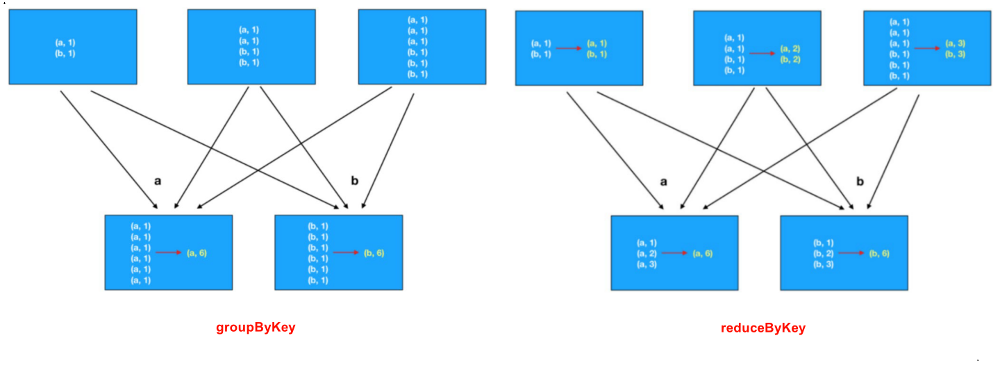

分布式计算需要:
- 分区控制
- Shuffle控制
- 数据存储\序列化\发送
- 数据计算API
- 等一系列功能


这些功能, 不能简单的通过Python内置的本地集合对象(如 List\ 字典等)去完成. 我们在分布式框架中, 需要有一个统一的数据抽象对象, 来实现上述分布式计算所需功能.这个抽象对象, 就是RDD

RDD（Resilient Distributed Dataset）叫做弹性分布式数据集，是Spark中最基本的数据抽象，代表一个不可变、可分区、里面的元素可并行计算的集合。可以认为RDD是分布式的列表List或数组Array.

- Dataset：一个数据集合，用于存放数据的。
- Distributed：RDD中的数据是分布式存储的，可用于分布式计算。
- Resilient：RDD中的数据可以存储在内存中或者磁盘中。


## RDD的五大特性

1. RDD的分区是数据存储的最小单位

    ```python
    >>> sc.parallelize([1,2,3,4,5,6,7,8,9], 3).glom().collect()
    [[1, 2, 3], [4, 5, 6], [7, 8, 9]]
    >>> sc.parallelize([1,2,3,4,5,6,7,8,9], 6).glom().collect()
    [[1], [2, 3], [4], [5, 6], [7], [8, 9]]

    # 从上可以看到 设置3个分区，数据就分成3部分
    # 设置6个分区，数据就分成了6部分
    ```

2. RDD的方法会作用在所有分区上

    ```python
    >>> sc.parallelize([1,2,3,4,5,6,7,8,9], 3).glom().collect()
    [[1, 2, 3], [4, 5, 6], [7, 8, 9]]
    >>> sc.parallelize([1,2,3,4,5,6,7,8,9], 3).map(lambda x: x * 10).glom().collect()
    [[10, 20, 30], [40, 50, 60], [70, 80, 90]]
    ```

    

3. RDD之间有血缘关系

    如上代码，RDD之间是有依赖的。
    比如，RDD2会产生RDD3，但是RDD2 依赖RDD1
    同样，RDD3会产生RDD4，但是RDD3 依赖RDD2
    ……
    会形成一个依赖链条。
    这个链条称之为RDD的血缘关系。


    ```python
    sc = SparkContext(conf = conf)
    rdd1 = sc.textFile("../tt.txt")
    rdd2 = rdd1.flatMap(lambda x: x.split(' '))
    rdd3 = rdd2.map(lambda x: (x, 1))
    rdd4 = rdd3.reduceByKey(lambda a, b: a + b)
    print(rdd4.collect())
    ```


4. 特性4: Key-Value型的RDD可以有分区器
    
    默认分区器: Hash分区规则,可以手动设置一个分区器(rdd.partitionBy的方法来设置)
    这个特性是可能的,因为不是所有RDD都是Key-Value型.
    Key-Value RDD: RDD中存储的是二元元组,这就是Key-Value型RDD
    二元元组: 只有2个元素的元组,比如: ("hadoop", 6)

5. 特性5: RDD的分区规划，会尽量靠近数据所在的服务器

    在初始RDD(读取数据的时候)规划的时候，分区会尽量规划到存储数据所在的服务器上。
    因为这样可以走本地读取，避免网络读取


## wordcountRDD


## RDD算子

- 方法\函数: 本地对象的API, 叫做方法\函数
- 算子: 分布式对象的API, 叫做算子


RDD的算子 分成2类
- Transformation:转换算子
- Action:动作(行动)算子


### Transformation算子
定义: RDD的算子,返回值仍旧是一个RDD的,称之为转换算子, 如map, filter
特性: 这类算子是 **lazy（懒加载）** 的. 如果没有action算子, Transformation算子是不工作的.

### Action算子
定义: 返回值 **不是rdd** 的就是action算子, 如save, display


### groupByKey和reduceByKey

相较于goupByKey, reduceByKey最大的提升在于, 分组前进行了预聚合, 那么在shuffle分组节点, 被shuffle的数据可以极大的减少.




