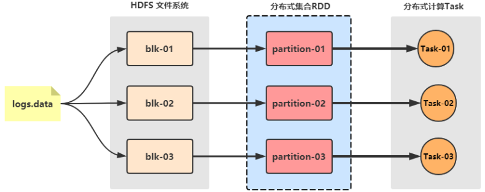
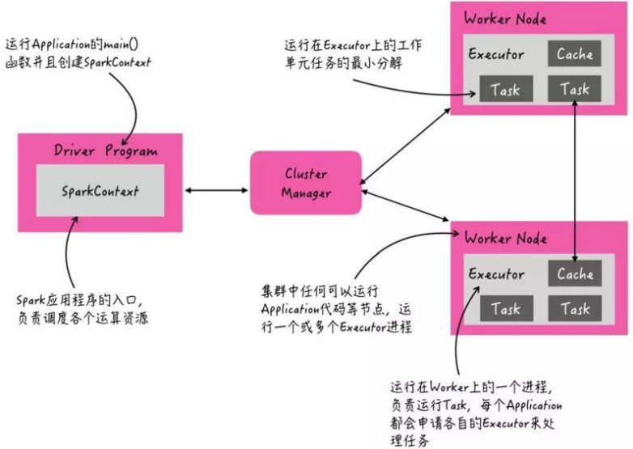
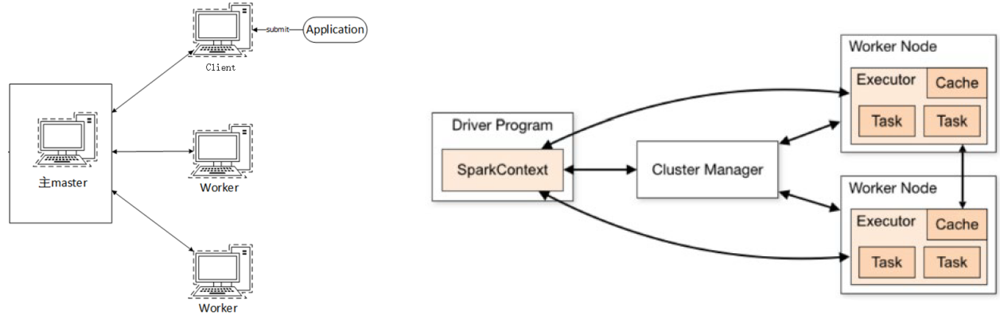
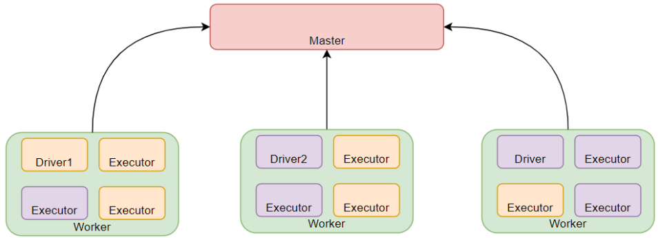
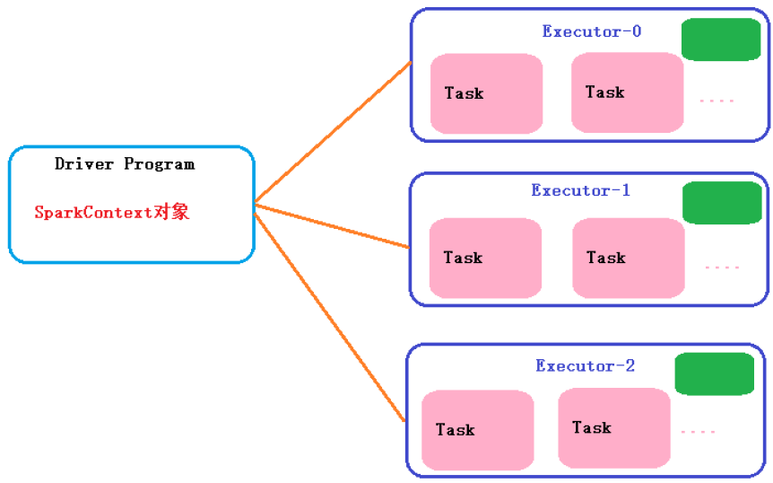
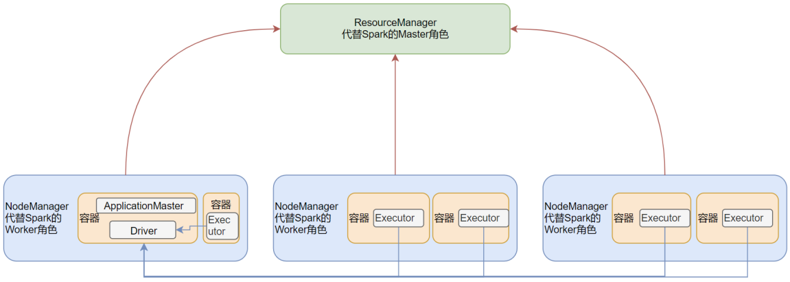
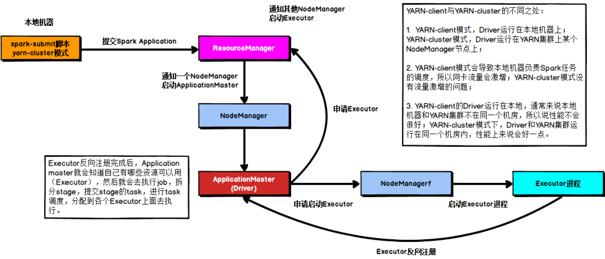
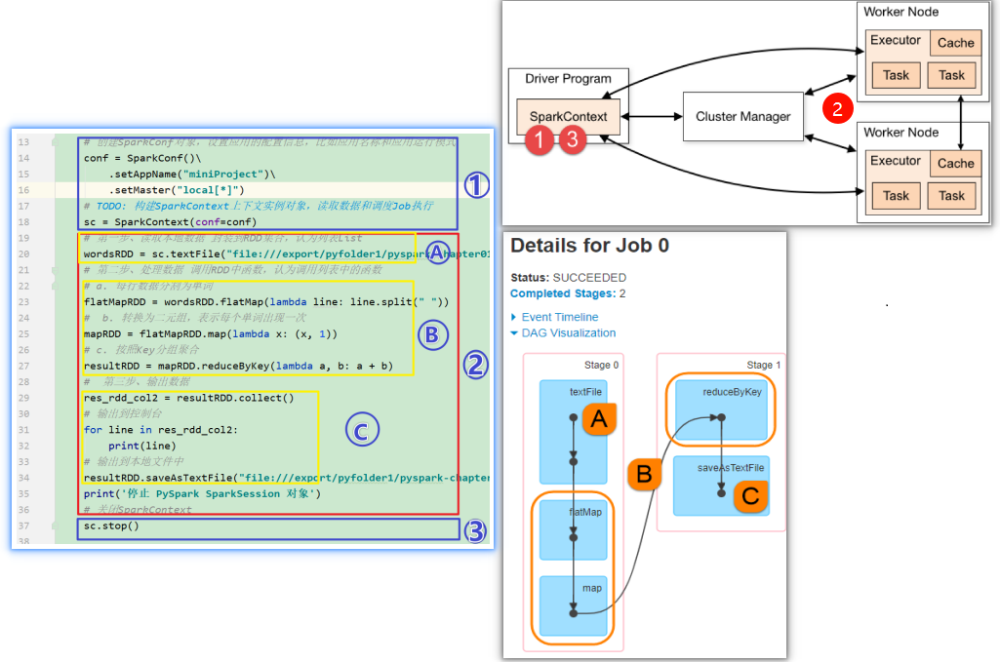

# spark基础概念

Apache Spark是用于大规模数据（large-scala data）处理的统一（unified）分析引擎。

## Spark模块

整个Spark 框架模块包含：Spark Core、 Spark SQL、 Spark Streaming、 Spark GraphX、 Spark MLlib，而后四项的能力都是建立在核心引擎之上

Spark Core：Spark的核心，Spark核心功能均由Spark Core模块提供，是Spark运行的基础。Spark Core以RDD为数据抽象，提供Python、Java、Scala、R语言的API，可以编程进行海量离线数据批处理计算。

SparkSQL：基于SparkCore之上，提供结构化数据的处理模块。SparkSQL支持以SQL语言对数据进行处理，SparkSQL本身针对离线计算场景。同时基于SparkSQL，Spark提供了StructuredStreaming模块，可以以SparkSQL为基础，进行数据的流式计算。

SparkStreaming：以SparkCore为基础，提供数据的流式计算功能。

MLlib：以SparkCore为基础，进行机器学习计算，内置了大量的机器学习库和API算法等。方便用户以分布式计算的模式进行机器学习计算。

GraphX：以SparkCore为基础，进行图计算，提供了大量的图计算API，方便用于以分布式计算模式进行图计算。

## Spark的架构角色

YARN主要有4类角色，从2个层面去看：
- 资源管理层面
    - 集群资源管理者（Master）：ResourceManager
    - 单机资源管理者（Worker）：NodeManager
- 任务计算层面
    - 单任务管理者（Master）：ApplicationMaster
    - 单任务执行者（Worker）：Task（容器内计算框架的工作角色）

Spark中由4类角色组成整个Spark的运行时环境

- Master(ResourceManager)：集群大管家, 整个集群的资源管理和分配
- Worker(NodeManager)：单个机器的管家,负责在单个服务器上提供运行容器,管理当前机器的资源.
- Driver：单个Spark任务的管理者,管理Executor的任务执行和任务分解分配, 类似YARN的ApplicationMaster；
- Executor：具体干活的进程, Spark的工作任务(Task)都由Executor来负责执行.

StandAlone 是完整的Spark运行环境,其中:
Master角色以Master进程存在, Worker角色以Worker进程存在
Driver和Executor运行于Worker进程内, 由Worker提供资源供给它们运行

StandAlone集群在进程上主要有3类进程:

- 主节点Master进程：Master角色, 管理整个集群资源，并托管运行各个任务的Driver
- 从节点Workers：Worker角色, 管理每个机器的资源，分配对应的资源来运行Executor(Task)；每个从节点分配资源信息给Worker管理，资源信息包含内存Memory和CPU Cores核数
- 历史服务器HistoryServer(可选)：Spark Application运行完成以后，保存事件日志数据至HDFS，启动HistoryServer可以查看应用运行相关信息。

spark应用架构

用户程序从最开始的提交到最终的计算执行，需要经历以下几个阶段：
1. 用户程序创建 SparkContext 时，新创建的 SparkContext 实例会连接到 ClusterManager。 Cluster Manager 会根据用户提交时设置的 CPU 和内存等信息为本次提交分配计算资源，启动 Executor。
2. Driver会将用户程序划分为不同的执行阶段Stage，每个执行阶段Stage由一组完全相同Task组成，这些Task分别作用于待处理数据的不同分区。在阶段划分完成和Task创建后， Driver会向Executor发送 Task；
3. Executor在接收到Task后，会下载Task的运行时依赖，在准备好Task的执行环境后，会开始执行Task，并且将Task的运行状态汇报给Driver；
4. Driver会根据收到的Task的运行状态来处理不同的状态更新。 Task分为两种：一种是Shuffle Map Task，它实现数据的重新洗牌，洗牌的结果保存到Executor 所在节点的文件系统中；另外一种是Result Task，它负责生成结果数据；
5. Driver 会不断地调用Task，将Task发送到Executor执行，在所有的Task 都正确执行或者超过执行次数的限制仍然没有执行成功时停止；

## Spark程序运行层次结构

Spark Application程序运行时三个核心概念：Job、Stage、Task，说明如下：

1. Job：由多个 Task 的并行计算部分，一般 Spark 中的action 操作（如 save、collect，后面进一步说明），会生成一个 Job。
2. Stage：Job 的组成单位，一个 Job 会切分成多个 Stage，Stage 彼此之间相互依赖顺序执行，而每个 Stage 是多个 Task 的集合，类似 map 和 reduce stage。
3. Task：被分配到各个 Executor 的单位工作内容，它是Spark 中的最小执行单位，一般来说有多少个 Paritition），就会有多少个 Task，每个 Task 只会处理单一分支上的数据。

## SparkOnYarn本质

- Master角色由YARN的ResourceManager担任.
- Worker角色由YARN的NodeManager担任.
- Driver角色运行在YARN容器内 或 提交任务的客户端进程中
- 真正干活的Executor运行在YARN提供的容器内

YARN Cluster执行流程

具体流程步骤如下：
1. 任务提交后会和ResourceManager通讯申请启动ApplicationMaster;
2. 随后ResourceManager分配Container，在合适的NodeManager上启动ApplicationMaster，此时的ApplicationMaster就是Driver；
3. Driver启动后向ResourceManager申请Executor内存，ResourceManager接到ApplicationMaster的资源申请后会分配Container,然后在合适的NodeManager上启动Executor进程;
4. Executor进程启动后会向Driver反向注册;
5. Executor全部注册完成后Driver开始执行main函数，之后执行到Action算子时，触发一个job，并根据宽依赖开始划分stage，每个stage生成对应的taskSet，之后将task分发到各个Executor上执行;

