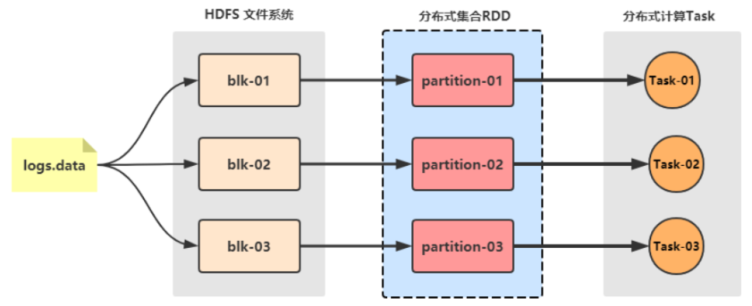
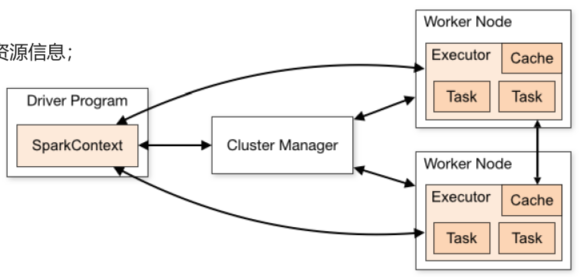
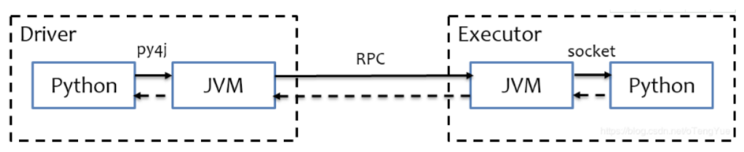

# intro

Spark Apache Spark是用于大规模数据（large-scala data）处理的统一（unified）分析引擎。最早源于一篇论文: Resilient Distributed Datasets: A Fault-Tolerant Abstraction for In-Memory Cluster Computing.

## spark vs hadoop

xxx|hadoop|spark
--|--|--
类型|平台:包含计算,存储,调度|计算
场景|磁盘批处理|内存批处理和流处理
存储|MapReduce中间结果存储在HDFS,延迟大|RDD中间结果存储在内存,延迟小
运行方式|Task以进程方式维护，启动慢|Task以线程方式维护，启动快

尽管Spark相对于Hadoop而言具有较大优势，但Spark并不能完全替代Hadoop：

- 在计算层面，Spark相比较MR（MapReduce）有巨大的性能优势，但至今仍有许多计算工具基于MR构架，比如非常成熟的Hive
- Spark仅做计算，而Hadoop生态圈不仅有计算（MR）也有存储（HDFS）和资源管理调度（YARN），HDFS和YARN仍是许多大数据
体系的核心架构。

## spark role

- **Master** 管理集群存储资源。 类比：YARN的ResouceManager
- **Worker** 管理单个节点存储资源。 类比：YARN的NodeManager
- **Driver** 管理集群计算资源。 类比：YARN的ApplicationMaster
- **Executor** 管理单个节点计算资源。 类比：YARN的TASK

执行过程：
1. 创建的 SparkContext 实例会连接到 ClusterManager，根据设置的 CPU 和内存等信息为本次提交分配计算资源，启动 Executor。
2. Driver会将用户程序划分为不同的执行阶段Stage，每个执行阶段Stage由一组完全相同Task组成
3. Executor在接收到Task后，执行Task，并且将Task的运行状态汇报给Driver，Task分为两种：
    - 一种是Shuffle Map Task，它实现数据的重新洗牌，洗牌的结果保存到Executor 所在节点的文件系统中；
    - 另外一种是Result Task，它负责生成结果数据；

## 集群模式

- **local** 一个独立进程配合其内部线程来提供完成Spark运行时环境.
- **standalone** Standalone模式是Spark自带的一种集群模式，是真实地在多个机器之间搭建Spark集群的环境
- **sparkOnYarn** Spark On Yarn的本质
    - Master角色由YARN的ResourceManager担任.
    - Worker角色由YARN的NodeManager担任.
    - Driver角色运行在YARN容器内 或 提交任务的客户端进程中
    - 真正干活的Executor运行在YARN提供的容器内

## python on spark 原理
PySpark宗旨是在不破坏Spark已有的运行时架构，在Spark架构外层包装一层Python API，借助Py4j实现Python和Java的交互，进而实现通过Python编写Spark应用程序：

refs:
