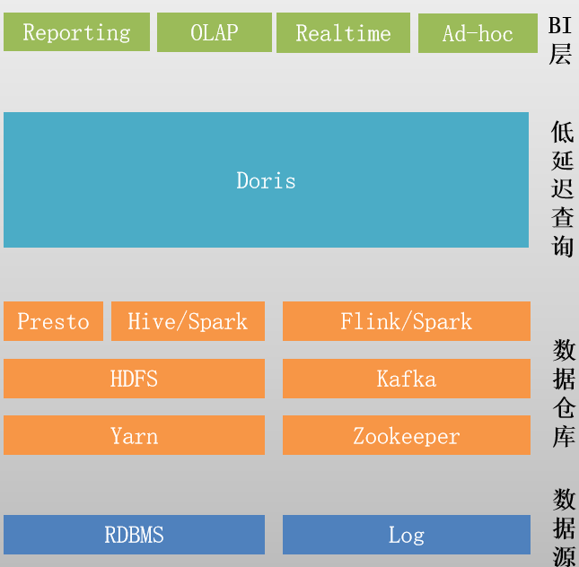

## 1.2 Doris简介

Apache Doris是一个现代化的基于MPP（大规模并行处理, Massively Parallel Processing）技术的分析型数据库产品。简单来说，MPP是将任务并行的分散到多个服务器和节点上，在每个节点上计算完成后，将各自部分的结果汇总在一起得到最终的结果(与Hadoop相似)。仅需亚秒级响应时间即可获得查询结果，有效地支持实时数据分析。

## OLTP、OLAP

- 联机事务处理 OLTP（On-Line Transaction Processing）。

    操作型处理，叫联机事务处理OLTP（On-Line Transaction Processing），主要目标是做数据处理，它是针对具体业务在数据库联机的日常操作，通常对少数记录进行查询、修改。

    传统的关系型数据库系统（RDBMS）作为数据管理的主要手段，主要用于操作型处理。

- 联机分析处理 OLAP（On-Line Analytical Processing）。

    分析型处理，叫联机分析处理OLAP（On-Line Analytical Processing），主要目标是做数据分析。
    一般针对某些主题的历史数据进行复杂的多维分析，支持管理决策。
    数据仓库是OLAP系统的一个典型示例，主要用于数据分析。

OLAP按存储器的数据存储格式分为MOLAP（Multi-dimensional OLAP） 、ROLAP（Relational OLAP）和 HOLAP（Hybrid OLAP）。

- MOLAP，基于多维数组的存储模型，也是OLAP最初的形态，特点是对数据进行预计算，以空间换效率，明细和聚合数据都保存在cube中。但生成cube需要大量时间和空间。MOLAP可选Kylin、Druid等开源产品。

- ROLAP，完全基于关系模型进行存储数据，不需要预计算，按需即时查询。明细和汇总数据都保存在关系型数据库事实表中。

- HOLAP，混合模型，细节数据以ROLAP存放，聚合数据以MOLAP存放。这种方式相对灵活，且更加高效。

# 主流开源OLAP引擎对比表

|开源OLAP引擎|优点|缺点|技术融合成本|易用性|使用场景|运维成本|引擎类型|
|--------------|------|------|--------------|--------|----------|----------|----------|
|ClickHouse|-列式存储 -单机性能彪悍 -保留明细数据 -向量化引擎|-分布式集群在线扩展支持不佳 -运维成本极高|高|非标协议接口|全面|高|纯列存OLAP|
|Druid|-实时数据摄入 -列式存储和位图索引 -多租户和高并发|-OLAP性能分场景表现差异大 -使用门槛高 -仅支持聚合查询|高|非标协议接口|局限|高|MOLAP|
|TiDB|-HTAP混合数据库 -同时支持明细和聚合查询 -高度兼容MySQL|-非列存储 -OLAP能力不足|低|SQL标准|全面|低|纯列存OLAP|
|Kylin|-预计算引擎，可以对数据一次聚合多次查询 -支持数据规模超大 -易用性强，支持标准SQL -性能强，查询数据快（预聚合结果）|-需要依赖Hadoop生态 -仅支持聚合查询 -不支持Ad-hoc查询 -不支持Join以及对数据的更新|高|SQL标准|局限|高|MOLAP|
|Doris|-融合Goole Mesa、Apache Impala、ORCFile/Parquet技术 -主键更新 -支持Rollup Table -高并发和高吞吐的Ad-hoc查询 -支持聚合+明细数据查询 -无外部系统依赖|成熟度不足|低|兼容MySQL访问协议|全面|低|ROLAP|

- 综上所述，在变化维、非预设维、细粒度统计的应用场景下，使用MPP引擎驱动的ROLAP模式，可以简化模型设计，减少预计算的代价，并通过强大的实时计算能力，可以支撑良好的实时交互体验。
- doris是一个ROLAP引擎, 可以满足：灵活多维分析、明细+聚合、主键更新

