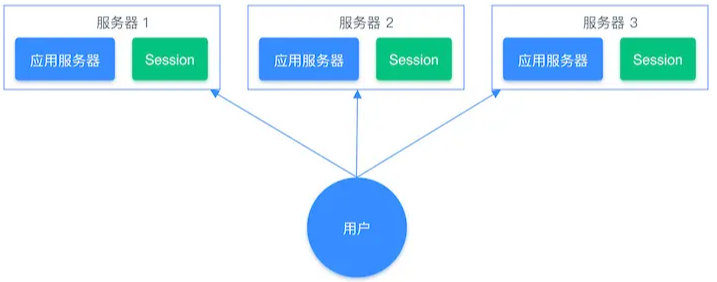
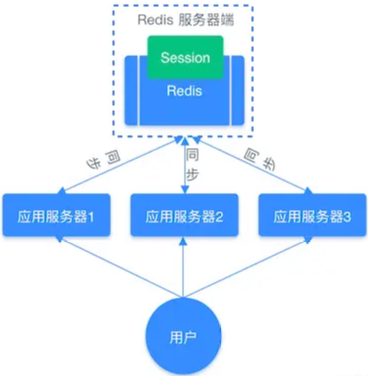

# String

## 最佳实践

## 考察问

- 使用String来缓存对象:
    - json方法: `()`
    - 拆分key方法: `()`

- 常规计数

    1. 初始化id为10086文章的阅读量: `()`
    2. 文章阅读量加1: `()`
    3. 获取对应文章的阅读量: `()`

- 分布式系统session
- 分布式锁
    - 加锁: `()`
    - 解锁:
        1. 先判断`()`
        2. 删除锁`()`

### 考察点

- 使用String来缓存对象:
    - json方法: `SET user:1 '{"name":"wang", "age":18}'`
    - 拆分key方法: `SET user:1:name wang`

- 常规计数

    1. 初始化id为10086文章的阅读量: `SET article:count:10086 0`
    2. 文章阅读量加1: `INCR article:count:10086`
    3. 获取对应文章的阅读量: `GET article:count:10086`

- 分布式系统session
- 分布式锁
    - 加锁: `SET lockid uuid NX EX 10`
    - 解锁:
        1. 先判断`uuid`
        2. 删除锁`DEL lookid`

## 基本概念

value是字符串, 数据长度是 512M, 可以分为3类：

- `"string"`：普通字符串
- `"int"`：整数类型，可以做自增、自减操作
- `"float"`：浮点类型，可以做自增、自减操作

## 原理

String 类型的底层的数据结构实现主要是 int 和 SDS（简单动态字符串）。

## 常用命令

- 创建key及值: `SET name wang`
- 获得key及值: `GET name`
- 数值加1:`INCR num`
- 数值减1:`DECR num`

## 常用场景

缓存对象、常规计数、分布式锁、共享 session 信息等。

### 缓存对象

使用String来缓存对象有两种方式：

- 直接缓存整个对象的JSON： `SET user:1 '{"name":"wang", "age":18}'`
- 采用将key进行分离为 `SET user:1:name wang`

### 常规计数

比如计算访问次数、点赞、转发、库存数量等等。

1. 初始化文章阅读量: `SET article:count:10086 0`
2. 文章阅读量加1: `INCR article:count:10086`
3. 获取对应文章的阅读量: `GET article:count:10086`

### 分布式系统Session

开发后台管理系统时，会使用Session来保存用户的会话(登录)状态，这些Session信息会被保存在服务器端，但这只适用于单系统应用，如果是分布式系统此模式将不再适用。

我们需要借助Redis对这些 Session 信息进行统一的存储和管理，这样无论请求发送到那台服务器，服务器都会去同一个 Redis 获取相关的 Session 信息，这样就解决了分布式系统下 Session 存储的问题。

分布式系统使用同一个 Redis 存储 Session 流程图：

### 分布式锁

`SET`命令有个`NX`参数可以实现`key不存在才插入`，可以用它来实现分布式锁：

- 如果key不存在，则显示插入成功，可以用来表示`加锁成功`
- 如果key存在，则会显示插入失败，可以用来表示`加锁失败`

一般而言，还会对分布式锁加上过期时间，分布式锁的命令如下：

1. 加锁:`SET lockid uuid NX EX 10`

    - lock: `key键`
    - uuid: `客户端生成的唯一的标识`
    - NX: 只在lock`不存在`时，才对lock进行设置操作
    - EX 10: 设置lock的`过期`时间为10s，这是为了避免客户端发生异常而无法释放锁

2. 解锁: 解锁的过程就是将lock键删除，但不能乱删，要保证执行该操作的客户端就是加锁的客户端。所以，解锁的时候，我们要先判断锁的uuid是否为加锁客户端，是的话，才将 lock 键删除。

## 参考

- [String常见命令](https://www.runoob.com/redis/redis-strings.html)
- [Set](https://redis.io/docs/latest/commands/set/)
- <https://cloud.tencent.com/developer/article/2320406>
