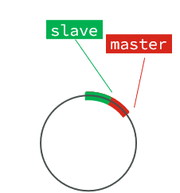

# Redis主从

## 2.1.搭建主从架构

单节点Redis的并发能力是有上限的，要进一步提高Redis的并发能力，就需要搭建主从集群，实现读写分离。

## 2.2.主从数据同步原理

### 2.2.1.全量同步

主从第一次建立连接时，会执行**全量同步**，将master节点的所有数据都拷贝给slave节点，流程：

这里有一个问题，master如何得知salve是第一次来连接呢？？

有几个概念，可以作为判断依据：

- **Replication Id**：简称replid，是数据集的标记，id一致则说明是同一数据集。每一个master都有唯一的replid，slave则会继承master节点的replid
- **offset**：偏移量，随着记录在repl_baklog中的数据增多而逐渐增大。slave完成同步时也会记录当前同步的offset。如果slave的offset小于master的offset，说明slave数据落后于master，需要更新。

因此slave做数据同步，必须向master声明自己的replication id 和offset，master才可以判断到底需要同步哪些数据。

因为slave原本也是一个master，有自己的replid和offset，当第一次变成slave，与master建立连接时，发送的replid和offset是自己的replid和offset。

master判断发现slave发送来的replid与自己的不一致，说明这是一个全新的slave，就知道要做全量同步了。

master会将自己的replid和offset都发送给这个slave，slave保存这些信息。以后slave的replid就与master一致了。

因此，**master判断一个节点是否是第一次同步的依据，就是看replid是否一致**。

如图：

完整流程描述：

- slave节点请求增量同步
- master节点判断replid，发现不一致，拒绝增量同步
- master将完整内存数据生成RDB，发送RDB到slave
- slave清空本地数据，加载master的RDB
- master将RDB期间的命令记录在repl_baklog，并持续将log中的命令发送给slave
- slave执行接收到的命令，保持与master之间的同步

### 2.2.2.增量同步

全量同步需要先做RDB，然后将RDB文件通过网络传输个slave，成本太高了。因此除了第一次做全量同步，其它大多数时候slave与master都是做**增量同步**。

什么是增量同步？就是只更新slave与master存在差异的部分数据。如图：

那么master怎么知道slave与自己的数据差异在哪里呢?

### 2.2.3.repl_backlog原理

master怎么知道slave与自己的数据差异在哪里呢?

这就要说到全量同步时的repl_baklog文件了。

这个文件是一个固定大小的数组，只不过数组是环形，也就是说**角标到达数组末尾后，会再次从0开始读写**，这样数组头部的数据就会被覆盖。

repl_baklog中会记录Redis处理过的命令日志及offset，包括master当前的offset，和slave已经拷贝到的offset：

slave与master的offset之间的差异，就是salve需要增量拷贝的数据了。

随着不断有数据写入，master的offset逐渐变大，slave也不断的拷贝，追赶master的offset：

直到数组被填满：

此时，如果有新的数据写入，就会覆盖数组中的旧数据。不过，旧的数据只要是绿色的，说明是已经被同步到slave的数据，即便被覆盖了也没什么影响。因为未同步的仅仅是红色部分。

但是，如果slave出现网络阻塞，导致master的offset远远超过了slave的offset： 

如果master继续写入新数据，其offset就会覆盖旧的数据，直到将slave现在的offset也覆盖：

棕色框中的红色部分，就是尚未同步，但是却已经被覆盖的数据。此时如果slave恢复，需要同步，却发现自己的offset都没有了，无法完成增量同步了。只能做全量同步。

## 2.3.主从同步优化

主从同步可以保证主从数据的一致性，非常重要。

可以从以下几个方面来优化Redis主从就集群：

- 在master中配置repl-diskless-sync yes启用无磁盘复制，避免全量同步时的磁盘IO。
- Redis单节点上的内存占用不要太大，减少RDB导致的过多磁盘IO
- 适当提高repl_baklog的大小，发现slave宕机时尽快实现故障恢复，尽可能避免全量同步
- 限制一个master上的slave节点数量，如果实在是太多slave，则可以采用主-从-从链式结构，减少master压力

主从从架构图：

## 2.4.小结

简述全量同步和增量同步区别？

- 全量同步：master将完整内存数据生成RDB，发送RDB到slave。后续命令则记录在repl_baklog，逐个发送给slave。
- 增量同步：slave提交自己的offset到master，master获取repl_baklog中从offset之后的命令给slave

什么时候执行全量同步？

- slave节点第一次连接master节点时
- slave节点断开时间太久，repl_baklog中的offset已经被覆盖时

什么时候执行增量同步？

- slave节点断开又恢复，并且在repl_baklog中能找到offset时

