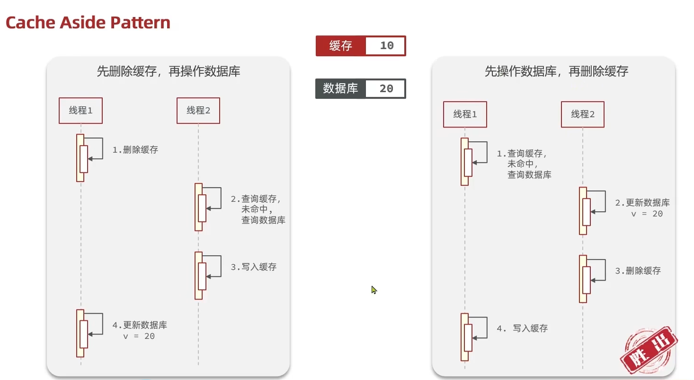

## 商户查询缓存

缓存数据存储于代码中,而代码运行在内存中,内存的读写性能远高于磁盘,缓存可以大大降低用户访问并发量带来的服务器读写压力

实际开发中,会构筑多级缓存来使系统运行速度进一步提升,例如:本地缓存与redis中的缓存并发使用

**浏览器缓存**：主要是存在于浏览器端的缓存
**应用层缓存：**可以分为tomcat本地缓存，比如之前提到的map，或者是使用redis作为缓存
**数据库缓存：**在数据库中有一片空间是 buffer pool，增改查数据都会先加载到mysql的缓存中
**CPU缓存：**当代计算机最大的问题是 cpu性能提升了，但内存读写速度没有跟上，所以为了适应当下的情况，增加了cpu的L1，L2，L3级的缓存

## 缓存模型和思路

标准的操作方式就是查询数据库之前先查询缓存，如果缓存数据存在，则直接从缓存中返回，如果缓存数据不存在，再查询数据库，然后将数据存入redis。

## 缓存更新策略

当我们向redis插入太多数据，此时就可能会导致缓存中的数据过多，所以redis会对部分数据进行更新，或者把他叫为淘汰更合适。

|策略 | 内存淘汰 | 超时剔除 | 主动更新 |
| ---- | ---- | ---- | ---- |
| 说明 | 不用自己维护，利用Redis的内存淘汰机制，当内存不足时自动淘汰部分数据，下次查询时更新缓存。 | 给缓存数据添加TTL时间，到期后自动删除缓存。下次查询时更新缓存。 | 编写业务逻辑，在修改数据库的同时，更新缓存。 |
| 一致性 | 差 | 一般 | 好 |
| 维护成本 | 无 | 低 | 高 |

业务场景：
- 低一致性需求：使用内存淘汰机制。例如店铺类型的查询缓存
- 高一致性需求：主动更新，并以超时剔除作为兜底方案。例如店铺详情查询的缓存

### 数据库缓存不一致解决方案

缓存的数据源来自于数据库,而数据库的数据是会发生变化的,因此,如果当数据库中数据发生变化,而缓存却有同步,此时就会有一致性问题存在

有如下几种方案

1. Cache Aside Pattern 人工编码方式：缓存调用者在更新完数据库后再去更新缓存，也称之为双写方案
2. Read/Write Through Pattern : 由系统本身完成，数据库与缓存的问题交由系统本身去处理
3. Write Behind Caching Pattern ：调用者只操作缓存，其他线程去异步处理数据库，实现最终一致

优先采用方案1, 操作缓存和数据库时有三个问题需要考虑：

2. 如何保证缓存与数据库的操作的同时成功或失败？

    1. 单体系统，将缓存与数据库操作放在一个事务
    2. 分布式系统，利用TCC等分布式事务方案

3. 查询时, 是删除缓存还是更新缓存: 删除
    1. 删除缓存：更新数据库时让缓存失效，查询时再更新缓存
    2. 更新缓存：每次更新数据库都更新缓存，无效写操作较多, 因为中间可能没有人查询, 这个更新动作实际上只有最后一次生效

4. 更新时, 是先更新缓存还是先更新数据库？: 先更新数据库
    1. 先删除缓存，再操作数据库
    2. 先操作数据库，再删除缓存

## 缓存穿透问题的解决思路

缓存穿透 ：缓存穿透是指客户端请求的数据在缓存中和数据库中都不存在，这样缓存永远不会生效，这些请求都会打到数据库。

常见的解决方案有两种：

- 缓存空对象
  - 优点：实现简单，维护方便
  - 缺点：
    - 额外的内存消耗
    - 可能造成短期的不一致
- 布隆过滤
  - 优点：内存占用较少，没有多余key
  - 缺点：
    - 实现复杂
    - 存在误判可能

## 缓存雪崩问题及解决思路

缓存雪崩是指在同一时段大量的缓存key同时失效或者Redis服务宕机，导致大量请求到达数据库，带来巨大压力。

解决方案：

1. 给不同的Key的TTL添加随机值
2. 利用Redis集群提高服务的可用性
3. 给业务添加多级缓存
4. 给缓存业务添加降级限流策略

## 缓存击穿问题及解决思路

缓存击穿问题也叫热点Key问题，就是一个被高并发访问并且缓存重建业务较复杂的key突然失效了，无数的请求访问会在瞬间给数据库带来巨大的冲击。

假设线程1在查询缓存之后，本来应该去查询数据库，然后把这个数据重新加载到缓存的，此时只要线程1走完这个逻辑，其他线程就都能从缓存中加载这些数据了，但是假设在线程1没有走完的时候，后续的线程2，线程3，线程4同时过来访问当前这个方法， 那么这些线程都不能从缓存中查询到数据，那么他们就会同一时刻来访问查询缓存，都没查到，接着同一时间去访问数据库，同时的去执行数据库代码，对数据库访问压力过大

常见的解决方案有两种：

1. 互斥锁
2. 逻辑过期

## 互斥锁

假设现在线程1过来访问，他查询缓存没有命中，但是此时他获得到了锁的资源，那么线程1就会一个人去执行逻辑，假设现在线程2过来，线程2在执行过程中，并没有获得到锁，那么线程2就可以进行到休眠，直到线程1把锁释放后，线程2获得到锁，然后再来执行逻辑，此时就能够从缓存中拿到数据了。

## 逻辑过期方案

缓存击穿问题，主要原因是在于对key设置了过期时间，假设不设置过期时间，其实就不会有缓存击穿的问题，但是不设置过期时间，这样数据不就一直占用我们内存了吗，我们可以采用逻辑过期方案。

我们把过期时间设置在 redis的value中，注意：这个过期时间并不会直接作用于redis，而是我们后续通过逻辑去处理。假设线程1去查询缓存，然后从value中判断出来当前的数据已经过期了，此时线程1去获得互斥锁，那么其他线程会进行阻塞，获得了锁的线程他会开启一个 线程去进行 以前的重构数据的逻辑，直到新开的线程完成这个逻辑后，才释放锁， 而线程1直接进行返回，假设现在线程3过来访问，由于线程线程2持有着锁，所以线程3无法获得锁，线程3也直接返回数据，只有等到新开的线程2把重建数据构建完后，其他线程才能走返回正确的数据。

这种方案巧妙在于，异步的构建缓存，缺点在于在构建完缓存之前，返回的都是脏数据。

