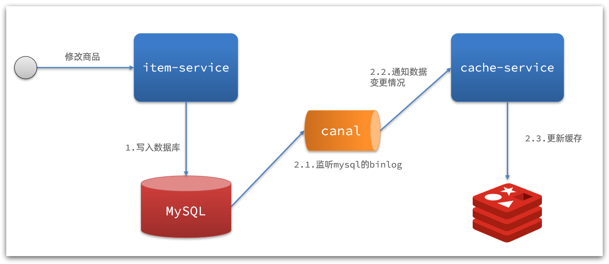

# redis多级缓存

传统的缓存策略一般是请求到达Tomcat后，先查询Redis，如果未命中则查询数据库

存在下面的问题：

•请求要经过Tomcat处理，Tomcat的性能成为整个系统的瓶颈
•Redis缓存失效时，会对数据库产生冲击

多级缓存就是充分利用请求处理的每个环节，分别添加缓存，减轻Tomcat压力，提升服务性能：

- 浏览器访问静态资源时，优先读取浏览器本地缓存
- 访问非静态资源（ajax查询数据）时，访问服务端
- 请求到达Nginx后，优先读取Nginx本地缓存
- 如果Nginx本地缓存未命中，则去直接查询Redis（不经过Tomcat）
- 如果Redis查询未命中，则查询Tomcat
- 请求进入Tomcat后，优先查询JVM进程缓存
- 如果JVM进程缓存未命中，则查询数据库

在多级缓存架构中，Nginx内部需要编写本地缓存查询、Redis查询、Tomcat查询的业务逻辑，因此这样的nginx服务不再是一个**反向代理服务器**，而是一个编写**业务的Web服务器了**。

因此这样的业务Nginx服务也需要搭建集群来提高并发，再有专门的nginx服务来做反向代理，如图：

另外，我们的Tomcat服务将来也会部署为集群模式：

可见，多级缓存的关键有两个：

- 一个是在nginx中编写业务，实现nginx本地缓存、Redis、Tomcat的查询

- 另一个就是在Tomcat中实现JVM进程缓存

其中Nginx编程则会用到OpenResty框架结合Lua这样的语言。

# 2.JVM进程缓存

## 2.2.初识Caffeine

缓存在日常开发中启动至关重要的作用，由于是存储在内存中，数据的读取速度是非常快的，能大量减少对数据库的访问，减少数据库的压力。我们把缓存分为两类：

- 分布式缓存，例如Redis：
  - 优点：存储容量更大、可靠性更好、可以在集群间共享
  - 缺点：访问缓存有网络开销
  - 场景：缓存数据量较大、可靠性要求较高、需要在集群间共享
- 进程本地缓存，例如HashMap、GuavaCache：
  - 优点：读取本地内存，没有网络开销，速度更快
  - 缺点：存储容量有限、可靠性较低、无法共享
  - 场景：性能要求较高，缓存数据量较小

我们今天会利用Caffeine框架来实现JVM进程缓存。

**Caffeine**是一个基于Java8开发的，提供了近乎最佳命中率的高性能的本地缓存库。目前Spring内部的缓存使用的就是Caffeine。

Caffeine既然是缓存的一种，肯定需要有缓存的清除策略，不然的话内存总会有耗尽的时候。Caffeine提供了三种缓存驱逐策略：

- **基于容量**：设置缓存的数量上限
- **基于时间**：设置缓存的有效时间
- **基于引用**：设置缓存为软引用或弱引用，利用GC来回收缓存数据。性能较差，不建议使用。

**注意**：在默认情况下，当一个缓存元素过期的时候，Caffeine不会自动立即将其清理和驱逐。而是在一次读或写操作后，或者在空闲时间完成对失效数据的驱逐。

## 2.3.实现JVM进程缓存

### 2.3.1.需求

利用Caffeine实现下列需求：

- 给根据id查询商品的业务添加缓存，缓存未命中时查询数据库
- 给根据id查询商品库存的业务添加缓存，缓存未命中时查询数据库
- 缓存初始大小为100
- 缓存上限为10000

# 4.实现多级缓存

多级缓存的实现离不开Nginx编程，而Nginx编程又离不开OpenResty。

## 4.1.安装OpenResty

OpenResty® 是一个基于 Nginx的高性能 Web 平台，用于方便地搭建能够处理超高并发、扩展性极高的动态 Web 应用、Web 服务和动态网关。具备下列特点：

- 具备Nginx的完整功能
- 基于Lua语言进行扩展，集成了大量精良的 Lua 库、第三方模块
- 允许使用Lua**自定义业务逻辑**、**自定义库**

## 4.2.OpenResty快速入门

我们希望达到的多级缓存架构如图：

其中：

- windows上的nginx用来做反向代理服务，将前端的查询商品的ajax请求代理到OpenResty集群

- OpenResty集群用来编写多级缓存业务

### 4.2.1.反向代理流程

现在，商品详情页使用的是假的商品数据。不过在浏览器中，可以看到页面有发起ajax请求查询真实商品数据。

请求地址是localhost，端口是80，就被windows上安装的Nginx服务给接收到了。然后代理给了OpenResty集群：我们需要在OpenResty中编写业务，查询商品数据并返回到浏览器。

### 4.4.5.基于ID负载均衡

刚才的代码中，我们的tomcat是单机部署。而实际开发中，tomcat一定是集群模式：

因此，OpenResty需要对tomcat集群做负载均衡。

而默认的负载均衡规则是轮询模式，当我们查询/item/10001时：

- 第一次会访问8081端口的tomcat服务，在该服务内部就形成了JVM进程缓存
- 第二次会访问8082端口的tomcat服务，该服务内部没有JVM缓存（因为JVM缓存无法共享），会查询数据库
- ...

你看，因为轮询的原因，第一次查询8081形成的JVM缓存并未生效，直到下一次再次访问到8081时才可以生效，缓存命中率太低了。

怎么办？

如果能让同一个商品，每次查询时都访问同一个tomcat服务，那么JVM缓存就一定能生效了。

也就是说，我们需要根据商品id做负载均衡，而不是轮询。

#### 1）原理

nginx提供了基于请求路径做负载均衡的算法：

nginx根据请求路径做hash运算，把得到的数值对tomcat服务的数量取余，余数是几，就访问第几个服务，实现负载均衡。

例如：

- 我们的请求路径是 /item/10001
- tomcat总数为2台（8081、8082）
- 对请求路径/item/1001做hash运算求余的结果为1
- 则访问第一个tomcat服务，也就是8081

只要id不变，每次hash运算结果也不会变，那就可以保证同一个商品，一直访问同一个tomcat服务，确保JVM缓存生效。

## 4.5.Redis缓存预热

Redis缓存会面临冷启动问题：

**冷启动**：服务刚刚启动时，Redis中并没有缓存，如果所有商品数据都在第一次查询时添加缓存，可能会给数据库带来较大压力。

**缓存预热**：在实际开发中，我们可以利用大数据统计用户访问的热点数据，在项目启动时将这些热点数据提前查询并保存到Redis中。

## 4.6.查询Redis缓存

现在，Redis缓存已经准备就绪，我们可以再OpenResty中实现查询Redis的逻辑了。如下图红框所示：

当请求进入OpenResty之后：

- 优先查询Redis缓存
- 如果Redis缓存未命中，再查询Tomcat

## 4.7.Nginx本地缓存

### 4.7.1.本地缓存API

OpenResty为Nginx提供了**shard dict**的功能，可以在nginx的多个worker之间共享数据，实现缓存功能。

这里给商品基本信息设置超时时间为30分钟，库存为1分钟。

因为库存更新频率较高，如果缓存时间过长，可能与数据库差异较大。

# 5.缓存同步

大多数情况下，浏览器查询到的都是缓存数据，如果缓存数据与数据库数据存在较大差异，可能会产生比较严重的后果。

所以我们必须保证数据库数据、缓存数据的一致性，这就是缓存与数据库的同步。

缓存数据同步的常见方式有三种：

**设置有效期**：给缓存设置有效期，到期后自动删除。再次查询时更新

- 优势：简单、方便
- 缺点：时效性差，缓存过期之前可能不一致
- 场景：更新频率较低，时效性要求低的业务

**同步双写**：在修改数据库的同时，直接修改缓存

- 优势：时效性强，缓存与数据库强一致
- 缺点：有代码侵入，耦合度高；
- 场景：对一致性、时效性要求较高的缓存数据

**异步通知：**修改数据库时发送事件通知，相关服务监听到通知后修改缓存数据

- 优势：低耦合，可以同时通知多个缓存服务
- 缺点：时效性一般，可能存在中间不一致状态
- 场景：时效性要求一般，有多个服务需要同步

而异步实现又可以基于MQ或者Canal来实现：

1）基于MQ的异步通知：

解读：

- 商品服务完成对数据的修改后，只需要发送一条消息到MQ中。
- 缓存服务监听MQ消息，然后完成对缓存的更新

依然有少量的代码侵入。

2）基于Canal的通知

解读：

- 商品服务完成商品修改后，业务直接结束，没有任何代码侵入
- Canal监听MySQL变化，当发现变化后，立即通知缓存服务
- 缓存服务接收到canal通知，更新缓存

代码零侵入

## 5.2.安装Canal

### 5.2.1.认识Canal

**Canal [kə'næl]**，译意为水道/管道/沟渠，canal是阿里巴巴旗下的一款开源项目，基于Java开发。基于数据库增量日志解析，提供增量数据订阅&消费。

Canal是基于mysql的主从同步来实现的，MySQL主从同步的原理如下：

- 1）MySQL master 将数据变更写入二进制日志( binary log），其中记录的数据叫做binary log events
- 2）MySQL slave 将 master 的 binary log events拷贝到它的中继日志(relay log)
- 3）MySQL slave 重放 relay log 中事件，将数据变更反映它自己的数据

而Canal就是把自己伪装成MySQL的一个slave节点，从而监听master的binary log变化。再把得到的变化信息通知给Canal的客户端，进而完成对其它数据库的同步。

