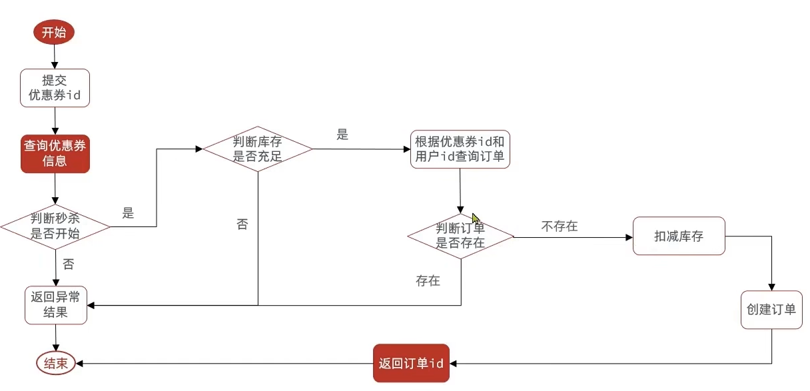

# redis锁

## 秒杀下单

秒杀下单应该思考的内容：

下单时需要判断两点：

秒杀是否开始或结束，如果尚未开始或已经结束则无法下单
库存是否充足，不足则无法下单
下单核心逻辑分析：

当用户开始进行下单，我们应当去查询优惠卷信息，查询到优惠卷信息，判断是否满足秒杀条件

比如时间是否充足，如果时间充足，则进一步判断库存是否足够，如果两者都满足，则扣减库存，创建订单，然后返回订单id，如果有一个条件不满足则直接结束。

## 库存超卖问题分析

假设线程1过来查询库存，判断出来库存大于1，正准备去扣减库存，但是还没有来得及去扣减，此时线程2过来，线程2也去查询库存，发现这个数量一定也大于1，那么这两个线程都会去扣减库存，最终多个线程相当于一起去扣减库存，此时就会出现库存的超卖问题。

## [乐观锁与悲观锁](https://javaguide.cn/java/concurrent/optimistic-lock-and-pessimistic-lock.html)

### 悲观锁
悲观锁总是假设最坏的情况，认为共享资源每次被访问的时候就会出现问题(比如共享数据被修改)，所以每次在获取资源操作的时候都会上锁，这样其他线程想拿到这个资源就会阻塞直到锁被上一个持有者释放。也就是说，共享资源每次只给一个线程使用，其它线程阻塞，用完后再把资源转让给其它线程。像 Java 中`synchronized`和`ReentrantLock`等独占锁就是悲观锁思想的实现。

高并发的场景下，激烈的锁竞争会造成线程阻塞，大量阻塞线程会导致系统的上下文切换，增加系统的性能开销。并且，悲观锁还可能会存在死锁问题（线程获得锁的顺序不当时），影响代码的正常运行。

### 乐观锁
乐观锁总是假设最好的情况，认为共享资源每次被访问的时候不会出现问题，线程可以不停地执行，无需加锁也无需等待，只是在提交修改的时候去验证对应的资源（也就是数据）是否被其它线程修改了（具体方法可以使用版本号机制或 CAS 算法）。

高并发的场景下，乐观锁相比悲观锁来说，不存在锁竞争造成线程阻塞，也不会有死锁问题，在性能上往往会更胜一筹。但是，如果冲突频繁发生（写占比非常多的情况），会频繁失败并重试，这样同样会非常影响性能，导致 CPU 飙升。

### 如何实现乐观锁？

1. 版本号控制

    一般是在数据表中加上一个数据版本号 version 字段，表示数据被修改的次数。当数据被修改时，version 值会加一。当线程 A 要更新数据值时，在读取数据的同时也会读取 version 值，在提交更新时，若刚才读取到的 version 值为当前数据库中的 version 值相等时才更新，否则重试更新操作，直到更新成功。

2. CAS 算法

    CAS 的全称是 Compare And Swap（比较与交换）, CAS 涉及到三个操作数：

    1. V：要更新的变量值(Var)
    2. E：预期值(Expected)
    3. N：拟写入的新值(New)

    当且仅当 V 的值等于 E 时，CAS 通过原子方式用新值 N 来更新 V 的值。如果不等，说明已经有其它线程更新了 V，则当前线程放弃更新。

## 优惠券秒杀-一人一单

需求：修改秒杀业务，要求同一个优惠券，一个用户只能下一单

现在的问题在于：

优惠卷是为了引流，但是目前的情况是，一个人可以无限制的抢这个优惠卷，所以我们应当增加一层逻辑，让一个用户只能下一个单，而不是让一个用户下多个单

具体操作逻辑如下：比如时间是否充足，如果时间充足，则进一步判断库存是否足够，然后再根据优惠卷id和用户id查询是否已经下过这个订单，如果下过这个订单，则不再下单，否则进行下单

## 分布式锁

由于现在我们部署了多个tomcat，每个tomcat都有一个属于自己的jvm，那么假设在服务器A的tomcat内部，有两个线程，这两个线程由于使用的是同一份代码，那么他们的锁对象是同一个，是可以实现互斥的，但是如果现在是服务器B的tomcat内部，又有两个线程，但是他们的锁对象写的虽然和服务器A一样，但是锁对象却不是同一个，所以线程3和线程4可以实现互斥，但是却无法和线程1和线程2实现互斥，这就是 集群环境下，syn锁失效的原因，在这种情况下，我们就需要使用分布式锁来解决这个问题。

分布式锁的核心思想就是让大家都使用同一把锁，只要大家使用的是同一把锁，那么我们就能锁住线程，不让线程进行，让程序串行执行，这就是分布式锁的核心思路

常见的分布式锁有三种

1. Mysql：mysql本身就带有锁机制，但是由于mysql性能本身一般，所以采用分布式锁的情况下，其实使用mysql作为分布式锁比较少见

2. Redis：redis作为分布式锁是非常常见的一种使用方式，现在企业级开发中基本都使用redis或者zookeeper作为分布式锁，利用setnx这个方法，如果插入key成功，则表示获得到了锁，如果有人插入成功，其他人插入失败则表示无法获得到锁，利用这套逻辑来实现分布式锁

3. Zookeeper：zookeeper也是企业级开发中较好的一个实现分布式锁的方案，由于本套视频并不讲解zookeeper的原理和分布式锁的实现，所以不过多阐述

## Redis分布式锁的实现核心思路

实现分布式锁时需要实现的两个基本方法：

- 获取锁：

    - 互斥：确保只能有一个线程获取锁
    - 非阻塞：尝试一次，成功返回true，失败返回false

- 释放锁：

    - 手动释放
    - 超时释放：获取锁时添加一个超时时间

核心思路：

我们利用redis 的setNx 方法，当有多个线程进入时，我们就利用该方法，第一个线程进入时，redis 中就有这个key 了，返回了1，如果结果是1，则表示他抢到了锁，那么他去执行业务，然后再删除锁，退出锁逻辑，没有抢到锁的哥们，等待一定时间后重试即可

## Redis分布式锁误删情况说明

持有锁的线程在锁的内部出现了阻塞，导致他的锁自动释放，这时其他线程，线程2来尝试获得锁，就拿到了这把锁，然后线程2在持有锁执行过程中，线程1反应过来，继续执行，而线程1执行过程中，走到了删除锁逻辑，此时就会把本应该属于线程2的锁进行删除，这就是误删别人锁的情况说明

解决方案：解决方案就是在每个线程释放锁的时候，去判断一下当前这把锁是否属于自己，如果属于自己，则不进行锁的删除，假设还是上边的情况，线程1卡顿，锁自动释放，线程2进入到锁的内部执行逻辑，此时线程1反应过来，然后删除锁，但是线程1，一看当前这把锁不是属于自己，于是不进行删除锁逻辑，当线程2走到删除锁逻辑时，如果没有卡过自动释放锁的时间点，则判断当前这把锁是属于自己的，于是删除这把锁。

## 分布式锁的原子性问题

线程1现在持有锁之后，在执行业务逻辑过程中，他正准备删除锁，而且已经走到了条件判断的过程中，比如他已经拿到了当前这把锁确实是属于他自己的，正准备删除锁，但是此时他的锁到期了，那么此时线程2进来，但是线程1他会接着往后执行，当他卡顿结束后，他直接就会执行删除锁那行代码，相当于条件判断并没有起到作用，这就是删锁时的原子性问题，之所以有这个问题，是因为线程1的拿锁，比锁，删锁，实际上并不是原子性的，我们要防止刚才的情况发生，

Redis提供了Lua脚本功能，在一个脚本中编写多条Redis命令，确保多条命令执行时的原子性。

## 分布式锁-redission

基于setnx实现的分布式锁存在下面的问题：

**重入问题**：重入问题是指 获得锁的线程可以再次进入到相同的锁的代码块中，可重入锁的意义在于防止死锁，比如HashTable这样的代码中，他的方法都是使用synchronized修饰的，假如他在一个方法内，调用另一个方法，那么此时如果是不可重入的，不就死锁了吗？所以可重入锁他的主要意义是防止死锁，我们的synchronized和Lock锁都是可重入的。

**不可重试**：是指目前的分布式只能尝试一次，我们认为合理的情况是：当线程在获得锁失败后，他应该能再次尝试获得锁。

**超时释放：**我们在加锁时增加了过期时间，这样的我们可以防止死锁，但是如果卡顿的时间超长，虽然我们采用了lua表达式防止删锁的时候，误删别人的锁，但是毕竟没有锁住，有安全隐患

**主从一致性：** 如果Redis提供了主从集群，当我们向集群写数据时，主机需要异步的将数据同步给从机，而万一在同步过去之前，主机宕机了，就会出现死锁问题。

那么什么是Redission呢

Redisson是一个在Redis的基础上实现的Java驻内存数据网格（In-Memory Data Grid）。它不仅提供了一系列的分布式的Java常用对象，还提供了许多分布式服务，其中就包含了各种分布式锁的实现。

### 分布式锁-redission可重入锁原理

在Lock锁中，他是借助于底层的一个voaltile的一个state变量来记录重入的状态的，比如当前没有人持有这把锁，那么state=0，假如有人持有这把锁，那么state=1，如果持有这把锁的人再次持有这把锁，那么state就会+1 ，如果是对于synchronized而言，他在c语言代码中会有一个count，原理和state类似，也是重入一次就加一，释放一次就-1 ，直到减少成0 时，表示当前这把锁没有被人持有。

### 分布式锁-redission锁的MutiLock原理

为了提高redis的可用性，我们会搭建集群或者主从，现在以主从为例

此时我们去写命令，写在主机上， 主机会将数据同步给从机，但是假设在主机还没有来得及把数据写入到从机去的时候，此时主机宕机，哨兵会发现主机宕机，并且选举一个slave变成master，而此时新的master中实际上并没有锁信息，此时锁信息就已经丢掉了。

为了解决这个问题，redission提出来了MutiLock锁，使用这把锁咱们就不使用主从了，每个节点的地位都是一样的， 这把锁加锁的逻辑需要写入到每一个主丛节点上，只有所有的服务器都写入成功，此时才是加锁成功，假设现在某个节点挂了，那么他去获得锁的时候，只要有一个节点拿不到，都不能算是加锁成功，就保证了加锁的可靠性。

