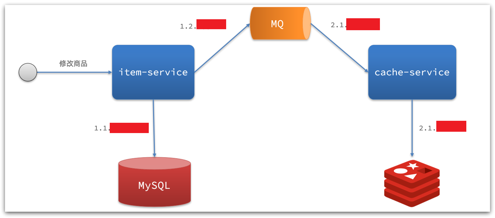
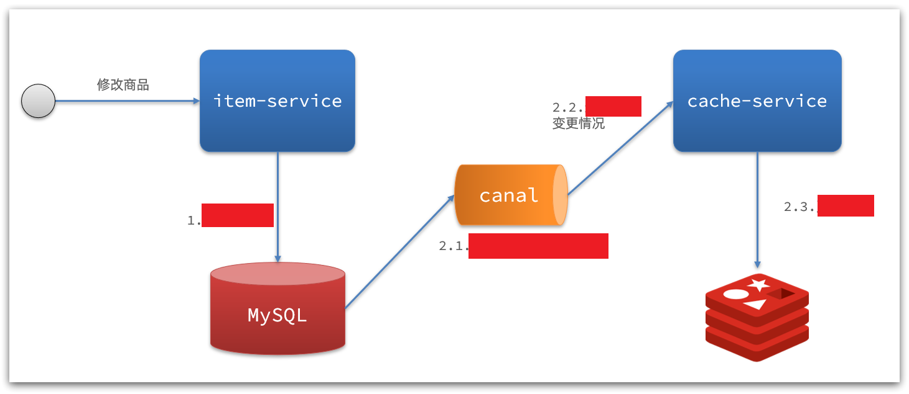
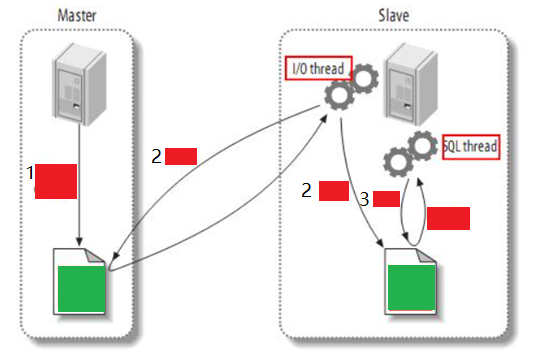
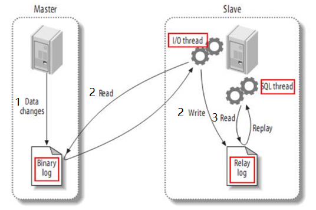

# 缓存同步

## 最佳实践

### 考察问
- 缓存数据同步的方式三种：
    - `()`：给缓存设置有效期，到期后自动删除。再次查询时更新
    - `()`：在修改数据库的同时，直接修改缓存
    - `()`：修改数据库时发送事件通知，相关服务监听到通知后修改缓存数据

    xx|编程|一致性|耦合度
    --|--|--|--
    设置有效期|`()`|`()`, 缓存过期之前可能不一致|`()`, 无代码侵入
    同步双写|`()`|`()`，缓存与数据库强一致|`()`, 大量代码侵入
    异步通知|`()`|`()`，可能存在中间不一致状态|`()`, 自己实现少量侵入, canal无代码侵入

- 同步双写

    - 数据库更新时, 是删除缓存还是更新缓存: `()`
    - 数据库更新时, 是先删除缓存还是先更新数据库？先更新`()`
    - 如何保证缓存与数据库的操作的同时成功或失败？`()`

- 异步通知
    - 基于MQ的异步通知

        

    - 基于cannal异步通知

        

- MySQL主从同步

    

### 考察点

- 缓存数据同步的方式三种：
    - `设置有效期`：给缓存设置有效期，到期后自动删除。再次查询时更新
    - `同步双写`：在修改数据库的同时，直接修改缓存
    - `异步通知`：修改数据库时发送事件通知，相关服务监听到通知后修改缓存数据

    xx|编程|一致性|耦合度
    --|--|--|--
    设置有效期|`易`|`差`, 缓存过期之前可能不一致|`低`, 无代码侵入
    同步双写|`中`|`强`，缓存与数据库强一致|`高`, 大量代码侵入
    异步通知|`难`|`一般`，可能存在中间不一致状态|`中`, 自己实现少量侵入, canal无代码侵入

- 同步双写

    - 数据库更新时, 是删除缓存还是更新缓存: `删除`
    - 数据库更新时, 是先删除缓存还是先更新数据库？先更新`数据库`
    - 如何保证缓存与数据库的操作的同时成功或失败？`事务`

- 异步通知
    - 基于MQ的异步通知

        

    - 基于cannal异步通知

        

- MySQL主从同步

    

## 缓存同步

大多数情况下，浏览器查询到的都是缓存数据，如果缓存数据与数据库数据存在较大差异，可能会产生比较严重的后果。

所以我们必须保证数据库数据、缓存数据的一致性，这就是缓存与数据库的同步。

## 数据库缓存不一致解决方案

缓存数据同步的常见方式有三种：

- `设置有效期`：给缓存设置有效期，到期后自动删除。再次查询时更新
- `同步双写`：在修改数据库的同时，直接修改缓存
- `异步通知`：修改数据库时发送事件通知，相关服务监听到通知后修改缓存数据

xx|编程|一致性|耦合度
--|--|--|--
设置有效期|`易`|`差`, 缓存过期之前可能不一致|`低`, 无代码侵入
同步双写|`中`|`强`，缓存与数据库强一致|`高`, 大量代码侵入
异步通知|`难`|`一般`，可能存在中间不一致状态|`中`, 自己实现少量侵入, canal无代码侵入

### 同步双写

- 数据库更新时, 是删除缓存还是更新缓存: `删除`
    - 删除缓存：更新数据库时让缓存失效，查询时再更新缓存
    - 更新缓存：每次更新数据库都更新缓存，无效写操作较多, 因为中间可能没有人查询, 这个更新动作实际上只有最后一次生效

- 数据库更新时, 是先删除缓存还是先更新数据库？先更新`数据库`
    - 先删除缓存，再操作数据库, 可能被其他线程在更新数据库前从新更新了缓存
    - 先操作数据库，再删除缓存

    

- 如何保证缓存与数据库的操作的同时成功或失败？`事务`

    - 单体系统，将缓存与数据库操作放在一个事务
    - 分布式系统，利用TCC等分布式事务方案

### 异步通知

异步实现又可以基于MQ或者Canal来实现：

#### 基于MQ的异步通知

解读：

- 商品服务完成对数据的修改后，只需要发送一条消息到MQ中。
- 缓存服务监听MQ消息，然后完成对缓存的更新

#### 基于Canal的通知

`Canal [kə'næl]`，译意为水道/管道/沟渠，canal是阿里巴巴旗下的一款开源项目，基于Java开发。基于数据库增量日志解析，提供增量数据订阅&消费。

Canal是基于mysql的主从同步来实现的，MySQL主从同步的原理如下：

1. MySQL master 将数据变更写入二进制日志(binary log)，其中记录的数据叫做binary log events
2. MySQL slave 将 master 的 binary log events拷贝到它的中继日志(relay log)
3. MySQL slave 重放relay log 中事件，将数据变更反映它自己的数据

而Canal就是把自己伪装成MySQL的一个slave节点，从而监听master的binary log变化。再把得到的变化信息通知给Canal的客户端，进而完成对其它数据库的同步。

基于Canal的异步通知

解读：

- 商品服务完成商品修改后，业务直接结束，没有任何代码侵入
- Canal监听MySQL变化，当发现变化后，立即通知缓存服务
- 缓存服务接收到canal通知，更新缓存

