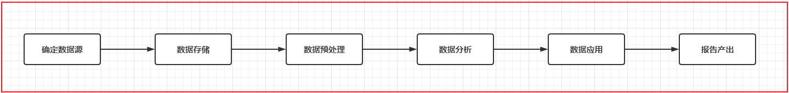

# oozie

Oozie是一个用于管理Apache Hadoop作业的工作流调度程序系统。

Oozie由Cloudera公司贡献给Apache的基于工作流引擎的开源框架,是用于Hadoop平台的开源的工作流调度引擎,是用来管理Hadoop作业,属于web应用程序，由Oozie client和Oozie Server两个组件构成,Oozie Server运行于Java Servlet容器（Tomcat）中的web程序。

工作流（Workflow），指“业务过程的部分或整体在计算机应用环境下的自动化”。

1) 整个业务流程需要周期性重复干
2) 整个业务流程可以被划分为多个阶段
3) 每一个阶段存在依赖关系,前序没有操作, 后续也无法执行

如果发现实际生产中的某些业务满足了以上特征, 就可以尝试使用工作流来解决

请问, 大数据的工作流程是否可以使用工作流来解决呢? 完全可以的

oozie本质是将工作流翻译为MR程序来运行

oozie vs azkaban:

单独使用:
- azkaban: 来源于领英公司  配置工作流的方式是通过类似于properties文件的方式来配置, 只需要简单的几行即可配置,提供了一个非常的好可视化界面, 通过界面可以对工作流进行监控管理, 号称 只要能够被shell所执行, azkaban都可以进行调度, 所以azkaban就是一个shell客户端软件

- oozie: 来源于apache 出现时间较早一款工作流调度工具, 整个工作流的配置主要采用XML方式进行配置, 整个XML配置是非常繁琐的, 如果配置一个MR, 相当于将MR重写一遍, 而且虽然提供了一个管理界面, 但是这个界面仅能查看, 无法进行操作, 而且界面异常卡顿

总结: azkaban要比oozie更加好用
	

如何和HUE结合使用:
	
- azkaban由于不属于apache旗下, 所以无法和HUE集成
- hue是属于apache旗下的, 所以HUE像集成一款工作流的调度工具, 肯定优先集成自家产品. ooize也是属于apache旗下的, HUE对oozie是可以直接集成的, 集成之后, 只需要用户通过鼠标的方式点一点即可实现工作流的配置
	
总结: hue加入后, oozie要比azkaban更加好用