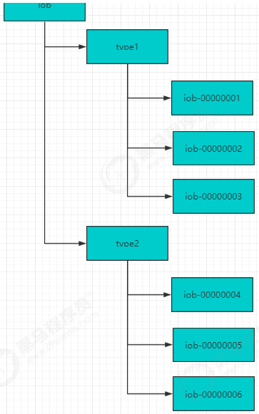
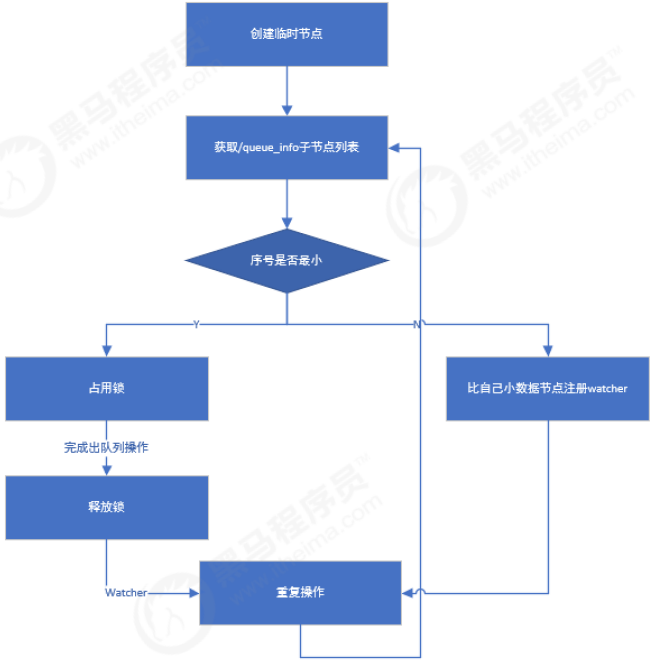
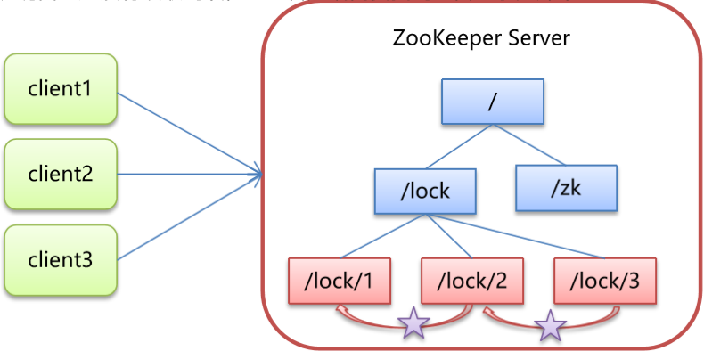

zooKeeper是一个经典的分布式数据一致性解决方案，致力于为分布式应用提供一个高性能、高可用，且具有严格顺序访问控制能力的分布式协调存储服务。

1. 高性能: zooKeeper将全量数据存储在内存中，并直接服务于客户端的所有非事务请求，尤其适用于以读为主的应用场景
2. 高可用: zooKeeper一般以集群的方式对外提供服务，一般3 ~ 5台机器就可以组成一个可用的Zookeeper集群了，每台机器都会在内存中维护当前的服务器状态，并且每台机器之间都相互保持着通信。只要集群中超过一半的机器都能够正常工作，那么整个集群就能够正常对外服务
3. 严格顺序访问: 对于来自客户端的每个更新请求，ZooKeeper都会分配一个全局唯一的递增编号，这个编号反映了所有事务操作的先后顺序

## zookeeper基本使用

zookeeper的数据节点可以视为树状结构（或者目录），树中的各节点被称为znode（即zookeeper node），一个znode可以有多个子节点。zookeeper节点在结构上表现为树状；使用路径path来定位某个znode，比如/ns-1/itcast/mysql/schema1/table1，此处ns-1、itcast、mysql、schema1、table1分别是根节点、2级节点、3级节点以及4级节点；其中ns-1是itcast的父节点，itcast是ns-1的子节点，itcast是mysql的父节点，mysql是itcast的子节点，以此类推。

znode，兼具文件和目录两种特点。既像文件一样维护着数据、元信息、ACL、时间戳等数据结构，又像目录一样可以作为路径标识的一部分。

一个znode大体上分为3各部分：

- 节点的数据：即znode data(节点path, 节点data)的关系就像是java map中(key, value)的关系
- 节点的子节点children
- 节点的状态stat：用来描述当前节点的创建、修改记录，包括cZxid、ctime等

节点的属性包含:

- cZxid：数据节点创建时的事务 ID
- ctime：数据节点创建时的时间
- mZxid：数据节点最后一次更新时的事务 ID
- mtime：数据节点最后一次更新时的时间
- pZxid：数据节点的子节点最后一次被修改时的事务 ID
- cversion：子节点的更改次数
- dataVersion：节点数据的更改次数
- aclVersion：节点的 ACL 的更改次数
- ephemeralOwner：如果节点是临时节点，则表示创建该节点的会话的
- SessionID；如果节点是持久节点，则该属性值为 0
- dataLength：数据内容的长度
- numChildren：数据节点当前的子节点个数

✨节点各个属性如下表。其中一个重要的概念是 Zxid(ZooKeeper Transaction Id)，ZooKeeper 节点的每一次更改都具有唯一的 Zxid，如果 Zxid1 小于 Zxid2，则 Zxid1 的更改发生在 Zxid2 更改之前。

Znode节点类型:
zookeeper中的节点有两种，分别为临时节点和永久节点。节点的类型在创建时即被确定，并且不能改变。

- 临时节点：该节点的生命周期依赖于创建它们的会话。一旦会话(Session)结束，临时节点将被自动删除，当然可以也可以手动删除。虽然每个临时的Znode都会绑定到一个客户端会话，但他们对所有的客户端还是可见的。另外，ZooKeeper的临时节点不允许拥有子节点。
- 持久化节点：该节点的生命周期不依赖于会话，并且只有在客户端显示执行删除操作的时候，他们才能被删除

## zookeeper应用场景

### 配置中心

java编程经常会遇到配置项，比如数据库的url、schema、user和password等。通常这些配置项我们会放置在配置文件中，再将配置文件放置在服务器上当需要更改配置项时，需要去服务器上修改对应的配置文件。但是随着分布式系统的兴起，由于许多服务都需要使用到该配置文件，因此有必须保证该配置服务的高可用性（high availability）和各台服务器上配置数据的一致性。通常会将配置文件部署在一个集群上，然而一个集群动辄上千台服务器，此时如果再一台台服务器逐个修改配置文件那将是非常繁琐且危险的的操作，因此就需要一种服务，能够高效快速且可靠地完成配置项的更改等操作，并能够保证各配置项在每台服务器上的数据一致性。

zookeeper就可以提供这样一种服务，其使用Zab这种一致性协议来保证一致性。现在有很多开源项目使用zookeeper来维护配置，比如在hbase中，客户端就是连接一个zookeeper，获得必要的hbase集群的配置信息，然后才可以进一步操作。还有在开源的消息队列kafka中，也使用zookeeper来维护broker的信息。在alibaba开源的soa框架dubbo中也广泛的使用zookeeper管理一些配置来实现服务治理。

我们将配置信息存在zk中的一个节点中，同时给该节点注册一个数据节点变更的watcher监听，一旦节点数据发生变更，所有的订阅该节点的客户端都可以获取数据变更通知。

工作中有这样的一个场景: 数据库用户名和密码信息放在一个配置文件中，应用读取该配置文件，配置文件信息放入缓存。

若数据库的用户名和密码改变时候，还需要重新加载缓存，比较麻烦，通过ZooKeeper可以轻松完成，当数据库发生变化时自动完成缓存同步。

设计思路：

1. 连接zookeeper服务器
2. 读取zookeeper中的配置信息，注册watcher监听器，存入本地变量
3. 当zookeeper中的配置信息发生变化时，通过watcher的回调方法捕获数据变化事件
4. 重新获取配置信息

## 命名服务

命名服务是分布式系统中的基本功能之一。被命名的实体通常可以是集群中的机器、提供的服务地址或者远程对象，这些都可以称作为名字。常见的就是一些分布式服务框架（RPC、RMI）中的服务地址列表，通过使用名称服务客户端可以获取资源的实体、服务地址和提供者信息。命名服务就是通过一个资源引用的方式来实现对资源的定位和使用。在分布式环境中，上层应用仅仅需要一个全局唯一名称，就像数据库中的主键。

在单库单表系统中可以通过自增ID来标识每一条记录，但是随着规模变大分库分表很常见，那么自增ID有仅能针对单一表生成ID，所以在这种情况下无法依靠这个来标识唯一ID。UUID就是一种全局唯一标识符。但是长度过长不易识别。

1. 在Zookeeper中通过创建顺序节点就可以实现，所有客户端都会根据自己的任务类型来创建一个顺序节点，例如 job-00000001
1. 节点创建完毕后，create()接口会返回一个完整的节点名，例如：job-00000002

    - 拼接type类型和完整节点名作为全局唯一的ID

在过去的单库单表型系统中，通常可以使用数据库字段自带的auto_increment属性来自动为每条记录生成一个唯一的ID。但是分库分表后，就无法在依靠数据库的auto_increment属性来唯一标识一条记录了。此时我们就可以用zookeeper在分布式环境下生成全局唯一ID。

设计思路：
1.连接zookeeper服务器
2.指定路径生成临时有序节点
3.取序列号及为分布式环境下的唯一ID

## 集群管理

随着分布式系统规模日益扩大，集群中机器的数量越来越多。有效的集群管理越来越重要了，zookeeper集群管理主要利用了watcher机制和创建临时节点来实现。以机器上下线和机器监控为例：

1. 机器上下线

    新增机器的时候，将Agent部署到新增的机器上，当Agent部署启动时，会向zookeeper指定的节点下创建一个临时子节点，当Agent在zk上创建完这个临时节点后，当关注的节点zookeeper/machines下的子节点新加入新的节点时或删除都会发送通知，这样就对机器的上下线进行监控。

2. 机器监控

    在机器运行过程中，Agent会定时将主机的的运行状态信息写入到/machines/hostn主机节点，监控中心通过订阅这些节点的数据变化来获取主机的运行信息。

## 分布式锁

一个集群是一个分布式系统，由多台服务器组成。为了提高并发度和可靠性，多台服务器上运行着同一种服务。当多个服务在运行时就需要协调各服务的进度，有时候需要保证当某个服务在进行某个操作时，其他的服务都不能进行该操作，即对该操作进行加锁，如果当前机器挂掉后，释放锁并fail over 到其他的机器继续执行该服务。

### 数据库实现分布式锁

1. 首先我们创建一张锁表，锁表中字段设置唯一约束
2. 定义锁，实现Lock接口，tryLock()尝试获取锁，从锁表中查询指定的锁记 录，如果查询到记录，说明已经上锁，不能再上锁
3. 在lock方法获取锁之前先调用tryLock()方法尝试获取锁，如果未加锁则向锁表中插入一条锁记录来获取锁，这里我们通过循环，如果上锁我们一致等待锁的释放
4. 释放锁，即是将数据库中对应的锁表记录删除

### redis实现分布式锁

redis分布式锁的实现基于setnx（set if not exists），设置成功，返回1；设置失败，返回0，释放锁的操作通过del指令来完成

如果设置锁后在执行中间过程时，程序抛出异常，导致del指令没有调用，锁永远无法释放，这样就会陷入死锁。所以我们拿到锁之后会给锁加上一个过期时间，这样即使中间出现异常，过期时间到后会自动释放锁。

同时在setnx 和 expire 如果进程挂掉，expire不能执行也会死锁。所以要保证setnx和expire是一个原子性操作即可。redis 2.8之后推出了setnx和expire的组合指令

`set key value ex 5 nx`

redis实现分布式锁存在的问题，为了解决redis单点问题，我们会部署redis集群，在 Sentinel 集群中，主节点突然挂掉了。同时主节点中有把锁还没有来得及同步到从节点。这样就会导致系统中同样一把锁被两个客户端同时持有，不安全性由此产生。redis官方为了解决这个问题，推出了Redlock 算法解决这个问题。但是带来的网络消耗较大。

### zookeeper实现分布式锁

分布式锁有多种实现方式，比如通过数据库、redis都可实现。作为分布式协同工具ZooKeeper，当然也有着标准的实现方式。下面介绍在zookeeper中如何实现排他锁。

设计思路：

核心思想：当客户端要获取锁，则创建节点，使用完锁，则删除该节点。

1. 客户端获取锁时，在lock节点下创建临时顺序节点。
2. 然后获取lock下面的所有子节点，客户端获取到所有的子节点之后，如果发现自己创建的子节点序号最小，那么就认为该客户端获取到了锁。使用完锁后，将该节点删除。
3. 如果发现自己创建的节点并非lock所有子节点中最小的，说明自己还没有获取到锁，此时客户端需要找到比自己小的那个节点，同时对其注册事件监听器，监听删除事件。
4. 如果发现比自己小的那个节点被删除，则客户端的
    Watcher会收到相应通知，此时再次判断自己创建的节点是否是lock子节点中序号最小的，如果是则获取到了锁，如果不是则重复以上步骤继续获取到比自己小的一个节点并注册监听。

## 分布式队列

1. 在队列节点下创建临时顺序节点 例如/queue_info/192.168.1.1-0000001
2. 调用getChildren()接口来获取/queue_info节点下所有子节点，获取队列中所有元素
3. 比较自己节点是否是序号最小的节点，如果不是，则等待其他节点出队列，在序号最小的节点注册watcher
4. 获取watcher通知后，重复步骤

## 集群管理

一个集群有时会因为各种软硬件故障或者网络故障，出现某些服务器挂掉而被移除集群，而某些服务器加入到集群中的情况，zookeeper会将这些服务器加入/移出的情况通知给集群中的其他正常工作的服务器，以及时调整存储和计算等任务的分配和执行等。此外zookeeper还会对故障的服务器做出诊断并尝试修复。
