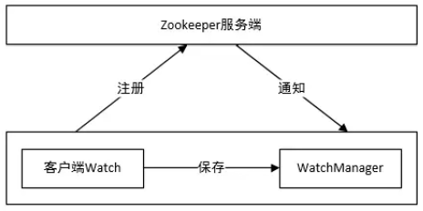

# zookeeper监听机制

## watcher概念

zookeeper提供了数据的发布/订阅功能，多个订阅者可同时监听某一特定主题对象，当该主题对象的自身状态发生变化时(例如节点内容改变、节点下的子节点列表改变等)，会实时、主动通知所有订阅者

zookeeper采用了Watcher机制实现数据的发布/订阅功能。该机制在被订阅对象发生变化时会异步通知客户端，因此客户端不必在Watcher注册后轮询阻塞，从而减轻了客户端压力。

watcher机制实际上与观察者模式类似，也可看作是一种观察者模式在分布式场景下的实现方式。

## watcher架构

Watcher实现由三个部分组成：
- Zookeeper服务端
- Zookeeper客户端
- 客户端的ZKWatchManager对象

客户端首先将Watcher注册到服务端，同时将Watcher对象保存到客户端的Watch管理器中。当ZooKeeper服务端监听的数据状态发生变化时，服务端会主动通知客户端，接着客户端的Watch管理器会触发相关Watcher来回调相应处理逻辑，从而完成整体的数据发布/订阅流程。

