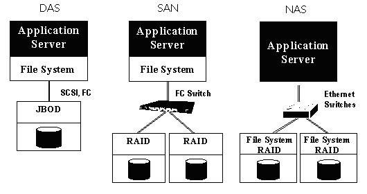

# 块存储, 文件存储和对象存储

## 块存储(Block Storage)

块存储是一种低级的存储系统，它将数据以块的形式存储在磁盘上。操作系统可以直接访问这些块，并将其视为本地磁盘。

核心概念

- 块存储的组成：块存储通常以硬盘驱动器（HDD）或固态驱动器（SSD）的形式存在。
- 卷与分区：在块存储中，您可以创建卷，并对卷进行分区和格式化。例如，一个1000GB的卷可以分为-800GB的C盘和200GB的D盘。
- 文件系统：块存储支持多种文件系统，例如Windows中的FAT32或NTFS。
- 操作系统支持：块存储可以直接安装操作系统。

实例代码, 以下是一个简单的块存储分区示例（Linux系统）：

```sh
# 创建一个1000GB的卷
sudo lvcreate -L 1000G -n myvolume myvg

# 对卷进行分区
sudo parted /dev/myvg/myvolume mklabel gpt
sudo parted /dev/myvg/myvolume mkpart primary 0% 800GB
sudo parted /dev/myvg/myvolume mkpart primary 800GB 100%

# 格式化分区
sudo mkfs.ext4 /dev/myvg/myvolume1
sudo mkfs.ext4 /dev/myvg/myvolume2
```

DAS和SAN。

- DAS即直接连接存储（Direct Attached Storage）: 硬盘，虚拟硬盘
- SAN即存储区域网络（Storage Area Network）: 磁盘阵列

### DAS

比如个人PC上的硬盘，服务器上的硬盘，外置设备通过SCSI或者FC接口直接连接到电脑上的。

SCSI（Small Computer System Interface）小型计算机系统接口，一种用于计算机和智能设备之间（硬盘、软驱、光驱、打印机、扫描仪等）系统级接口的独立处理器标准。

DAS的性能瓶颈来自于主板的卡槽数量。很难做scale out扩展（即横向扩展）。比如我们的笔记本一般只能装一个硬盘+SSD基本上已经没有位置再做扩展了。

### SAN

根据SAN的实现形式来看，其实是通过光交换机，将各块硬盘连接起来，然后通过ISCSI协议来传递数据。通过FC交换机解决了机器主板只有几个卡槽的问题，利用FC交换机，就仿佛实现了这样一种机制，即我们拥有一个无限卡槽的主板，上面都是接口，你可以通过这个接口插上你的硬盘。

## 文件存储(File Storage)

文件存储是一种基于文件的存储系统，它通过网络共享文件系统。用户可以通过网络接口访问文件存储系统。

核心概念:

- 网络附加存储（NAS）：文件存储通常通过NAS实现，NAS是一个独立的设备，包含多个硬盘，并已创建文件系统。
- 访问方式：用户可以通过网络将驱动器映射到本地系统，例如在Windows中映射为Z盘。
- 共享文件系统：文件存储系统可以共享给多个用户使用，适合团队协作。

NAS好比是一个共享文件夹，文件系统已经存在，用户可以直接将自己的数据存放在NAS上。NAS以文件为传输协议，开销很大，不利于在高性能集群中使用。

NAS是一种通过网络达成存储目的的设备，NAS传输数据依靠的是TCP/IP网络协议栈，这是NAS存储于上文的DAS和SAN存储最大的不同之处。

示例代码: 以下是一个在Linux系统中挂载NAS的示例：

```sh
# 创建挂载点
sudo mkdir /mnt/nas

# 挂载NAS
sudo mount -t nfs 192.168.1.100:/shared /mnt/nas

# 检查挂载状态
df -h
```

## 块存储和文件存储的异同

- 数据传输方式不同：
    - 块存储依靠SCSI或者ISCSI接口，以块方式交换数据，数据传输速度快；\
    - 文件存储依靠TCP/IP协议栈进行数据传输，网络带宽是I/O的性能瓶颈。
- 文件系统的位置：NAS和SAN存储系统的区别就是NAS有自已的文件管理系统。如图所示，
    - SAN结构中，文件管理系统（FS）分别在每一个应用服务器上面，
    - NAS则是每个应用服务器通过网络共享协议，使用同一个文件管理系统。即

    

- 使用方式不同：
    - 块存储设备使用的时候，还需要进一步进行分区，将设备格式为某种文件系统才可以继续使用；
    - 而文件存储就相当于你多了一个共享文件夹，文件存储带着自己本身的文件系统。

## 对象存储(Object Storage)


对象存储是一种基于HTTP协议的存储系统，它通过REST API进行数据的上传和下载。对象存储适合存储大量的非结构化数据。


核心概念
- 容器（Bucket）：对象存储中的数据存储在容器中，容器类似于文件夹。
- HTTP操作：对象存储支持HTTP的GET、PUT、POST、DELETE等操作。
- 无层次结构：对象存储中没有目录层次结构，所有对象都位于同一级别。
- 可扩展性：对象存储具有极高的可扩展性，适合存储大量数据。

示例代码: 以下是一个使用AWS CLI上传对象到S3的示例：

```sh

# 配置AWS CLI
aws configure

# 创建一个S3桶
aws s3 mb s3://mybucket

# 上传文件到S3桶
aws s3 cp myobject.txt s3://mybucket/

# 下载文件
aws s3 cp s3://mybucket/myobject.txt .

```


对象存储:也叫做基于对象的存储，是用来描述解决和处理离散单元的方法的通用术语，这些离散单元被称作为对象。对象存储同兼具SAN高速直接访问磁盘特点及NAS的分布式共享特点。

- SAN（Storage Area Network）结构

    采用SCSI 块I/O的命令集，通过在磁盘或FC（Fiber Channel）级的数据访问提供高性能的随机I/O和数据吞吐率，它具有高带宽、低延迟的优势，在高性能计算中占有一席之地，如SGI的CXFS文件系统就是基于SAN实现高性能文件存储的，但是由于SAN系统的价格较高，且可扩展性较差，已不能满足成千上万个CPU规模的系统。

- NAS（Network Attached Storage）结构

    它采用NFS或CIFS命令集访问数据，以文件为传输协议，通过TCP/IP实现网络化存储，可扩展性好、价格便宜、用户易管理，如目前在集群计算中应用较多的NFS文件系统，但由于NAS的协议开销高、带宽低、延迟大，不利于在高性能集群中应用。

对象存储的优点

- 对象存储相比块存储、文件存储的一个最本质的区别是无层次结构。

    我们都知道，一般的存储（比如你自己的PC的文件系统）是有一个目录树概念的，要找到一个文件需要先找到这个文件所属的目录。

    而对象存储是没有文件目录树这个概念的，所有的数据都在同一个层次中，仅仅通过数据的唯一地址标识来识别并查找数据。

- 鉴于对象存储的无层次结构特点，对象存储有以下优点：

    - 效率更高。不受复杂目录系统对性能的影响。
    - 可扩展性更强。分布式架构，更便于进行水平扩展，从而容纳进任意大规模的数据。
    - 可用性更强。数据一般都会有多个位于不同机器的复制，确保数据不丢失。

## 三者区别

|特性|块存储|文件存储|对象存储|
|------------|----------------------|------------------------|------------------------|
|数据结构|原始块（无结构）|目录树（文件/文件夹）|扁平化对象（唯一ID+元数据）|
|访问方式|块设备接口（SCSI/iSCSI）|文件协议（NFS/SMB）|RESTfulAPI（HTTP/HTTPS）|
|性能|极高（微秒级延迟）|中等（毫秒级延迟）|较低（百毫秒级延迟）|
|扩展性|有限（依赖硬件）|中等（横向扩展NAS）|无限（分布式架构）|
|成本|高（高性能硬件）|中等|低（弹性扩展）|
|典型应用|数据库、虚拟机|企业共享、多媒体编辑|云存储、大数据分析|


## 参考

- <https://www.cnblogs.com/qingbaizhinian/p/13697867.html>
- https://edu.51cto.com/article/note/17675.html
- https://juejin.cn/post/7474653652759789620
