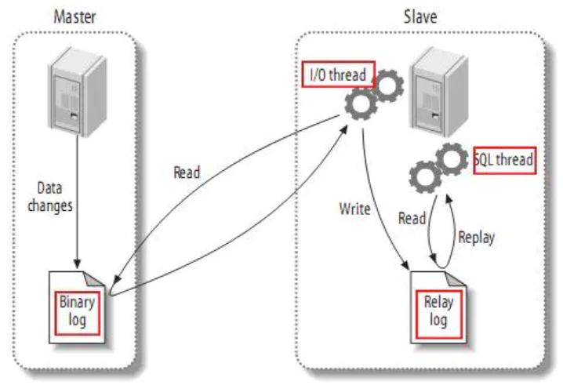
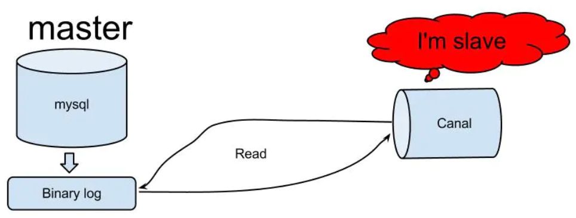
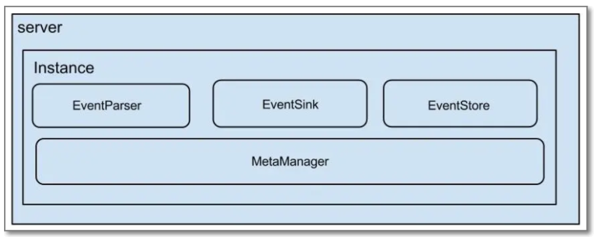
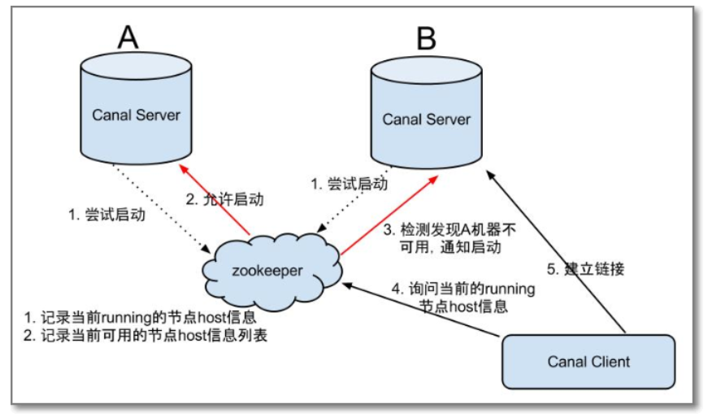

# canal基础概念

canal译意为水道/管道，主要用途是基于 MySQL 数据库增量日志解析，提供增量数据订阅和消费。

早期阿里巴巴因为杭州和美国双机房部署，存在跨机房同步的业务需求，实现方式主要是基于业务 trigger 获取增量变更。从 2010 年开始，业务逐步尝试数据库日志解析获取增量变更进行同步，由此衍生出了大量的数据库增量订阅和消费业务。

基于日志增量订阅和消费的业务包括

- 数据库镜像
- 数据库实时备份
- 索引构建和实时维护(拆分异构索引、倒排索引等)
- 业务 cache 刷新
- 带业务逻辑的增量数据处理

## 工作原理

MySQL主从复制原理

- MySQL master 将数据变更写入二进制日志( binary log, 其中记录叫做二进制日志事件binary log events)
- MySQL slave 将 master 的 binary log events 拷贝到它的中继日志(relay log)
- MySQL slave 重放 relay log 中事件，将数据变更反映它自己的数据

canal 工作原理

- canal 模拟 MySQL slave 的交互协议，伪装自己为 MySQL slave ，向 MySQL master 发送dump 协议
- MySQL master 收到 dump 请求，开始推送 binary log 给 slave (即 canal )
- canal 解析 binary log 对象(原始为 byte 流)

架构

说明：

- server 代表一个canal服务，管理多个instance
- instance 伪装成一个slave,从mysql dump数据

instance模块：

- eventParser (数据源接入，模拟slave协议和master进行交互，协议解析)
- eventSink (Parser和Store链接器，进行数据过滤，加工，分发的工作)
- eventStore (数据存储)
- metaManager (增量订阅&消费信息管理器)

## HA机制设计

canal的高可用HA(High Availability)

为了减少对mysql dump的请求，要求同一时间只能有一个处于running，其他的处于standby状态

大致步骤：

- canal server要启动某个canal instance时都先向zookeeper进行一次尝试启动判断 (实现：创建短暂的节点，谁创建成功就允许谁启动)
- 创建zookeeper节点成功后，对应的canal server就启动对应的canal instance，没有创建成功的canal instance就会处于备用状态
- 一旦zookeeper发现canal server A创建的节点消失后，立即通知其他的canal server再次进行步骤1的操作，重新选出一个canal server启动instance.
- canal client每次进行连接时，会首先向zookeeper询问当前是谁启动了canal instance，然后和其建立链接，一旦链接不可用，会重新尝试connect

