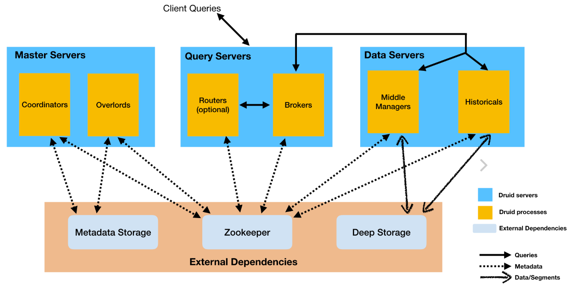

# druid基本概念

[Apache Druid](http://www.apache-druid.cn/)是一个开源、分布式、高性能的实时数据分析的数据存储系统。能快速的实现查询与数据分析，具有高可用、高拓展的能力。

Druid的常用应用领域包括：

- 点击流分析(web和移动分析)
- 网络遥测分析(网络性能监控)
- 服务器指标存储
- 供应链分析（制造指标）
- 应用程序性能度量
- 数字营销/广告分析
- 商业智能/联机分析处理

Druid适合于以下场景：

- 插入频繁，但很少更新
- 大多数查询都是聚合和报告性质的查询（“group by”查询）
- 查询延迟要求为100毫秒到几秒
- 数据中有一个时间组件（Druid包括具体与时间相关的优化和设计选择）
- 有高基数数据列（例如URL，用户ID），需要对它们进行快速计数和排名✨高基数数据,有一列或多列包含大量的唯一值。例如,用户名、电子邮件地址和银行帐号
- 希望从Kafka，HDFS，文件或对象存储（如Amazon S3）中加载数据

## druid的特点

Druid的核心架构结合了数据仓库，时间序列数据库和日志搜索系统的创意。Druid的一些主要特点是：

- 列式存储格式 Druid使用面向列的存储，这意味着它只需要加载特定的查询所需的精确列。这为仅查看几列的查询提供了巨大的速度提升。此外，每列都针对其特定数据类型进行了优化，支持快速扫描和聚合。
- 可扩展的分布式系统 Druid通常部署在数十到数百台服务器的集群中，可以提供数百万条记录/秒的摄取率，保留数万亿条记录，以及亚秒级到几秒钟的查询延迟。
- 大规模并行处理 Druid可以在整个集群中并行处理查询。
- 实时或批量采集 Druid可以实时流式采集数据（采集的数据可立即用于查询）或批量采集。
- 自愈，自平衡，易于操作 作为运营商，要将群集扩展或缩小，只需添加或删除服务器，群集将在后台自动重新平衡，无需任何停机时间。如果任何Druid服务器发生故障，系统将自动绕过损坏路由，直到可以更换这些服务器。Druid旨在全天候运行，无需任何原因计划停机，包括配置更改和软件更新。
- 云本机，容错架构，不会丢失数据 一旦Druid采集了您的数据，副本就会安全地存储在[深层存储]（通常是云存储，HDFS或共享文件系统）中。即使每个Druid服务器都出现故障，您的数据也可以从深层存储中恢复。对于仅影响少数Druid服务器的更有限的故障，复制可确保在系统恢复时仍可进行查询。
- 用于快速过滤的索引 Druid使用[CONCISE]或 [Roaring]压缩bitmap索引来创建索引，这些索引可以跨多个列进行快速过滤和搜索。
- 基于时间的分区 Druid首先按时间划分数据，并且可以基于其他字段进行额外划分。这意味着基于时间的查询将仅访问与查询的时间范围匹配的分区。这导致基于时间的数据的显着性能改进。
- 近似算法 Druid包括用于近似count-distinct的算法，近似排序以及近似直方图和分位数的计算的算法。这些算法提供有限的内存使用，并且通常比精确计算快得多。对于精度比速度更重要的情况，Druid还提供精确的count-distinct以及精确的排序。
- 在采集时自动汇总 Druid可选择在采集时支持数据汇总。提前预聚合数据，可以节省大量存储成本并提高性能。

## druid的进程和服务

Druid是一个多进程、分布式的架构。每个Druid进程都可以独立配置和扩展，在集群上提供最大的灵活性。

Druid有以下几个进程：

- Coordinator： 管理集群上的数据可用性
- Overlord： 控制数据摄取工作负载的分配
- Broker： 处理来自外部客户端的查询请求
- Router： 可选进程，可以将请求路由到Brokers, Coordinators, and Overlords
- Historical： 存储历史查询到的数据
- MiddleManager： 负责摄取数据

Druid进程可以按您喜欢的任何方式部署，但是为了便于部署，我们建议将它们组织成三种服务器类型:主服务器（Master）、查询服务器（Query）和数据服务器（Data）。

- Master：运行Coordinator和Overlord进程，管理数据可用性和摄取。
- Query：运行Broker和可选的Router进程，处理来自外部客户端的查询。
- Data：运行Historical和MiddleManager进程，运行数据的采集以及存储所有历史查询数据负载。

## 数据结构
Druid中的所有数据都被组织成段，这些段是数据文件，通常每个段最多有几百万行。在Druid中加载数据称为摄取，它包括从源系统读取数据并基于该数据创建段。在大多数摄取方法中，加载数据的工作由MiddleManager进程完成。

Druid数据存储在数据源中，与传统关系型数据库中的表类似。

Druid把数据集分为三个部分：

- Timestamp column（时间戳）:将时间字段单独处理，是因为Druid的所有查询都是围绕时间轴进行的。
- Dimension columns（维度列）: 维度列是数据的属性，是按原样存储的列，可以在查询时以特殊方式对维度进行分组、筛选或应用聚合器。
- Metric columns（指标列）:指标列是以聚合形式存储的列，用来做数据的聚合计算。指标列一般是可以衡量的数据，一般可以做count、sum等操作。

