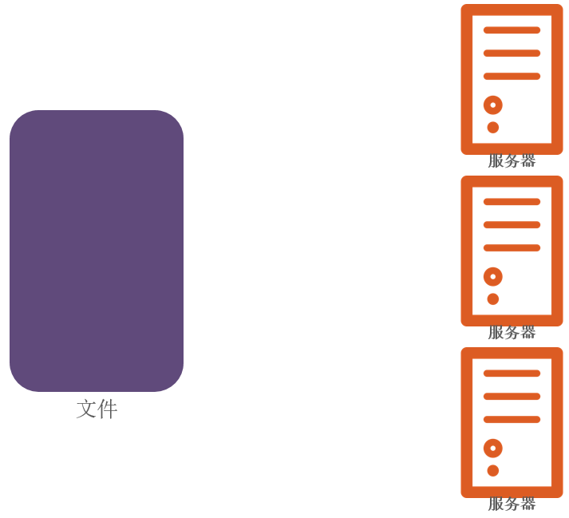
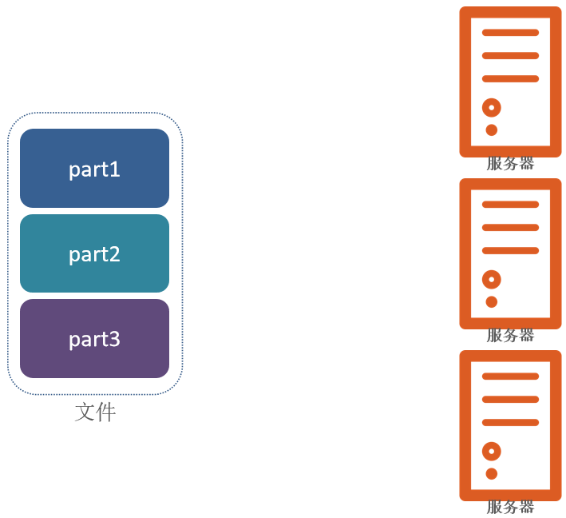
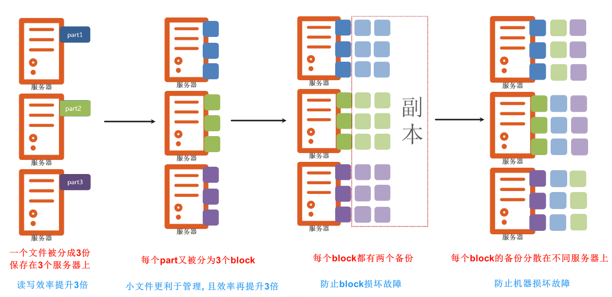
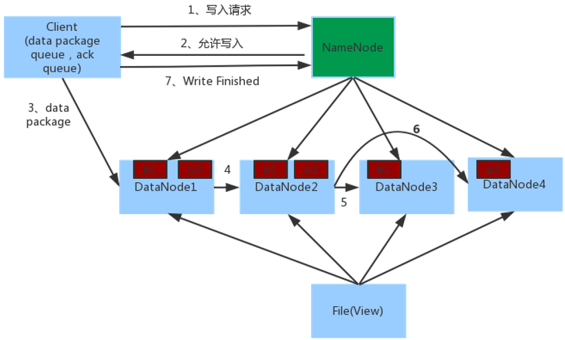
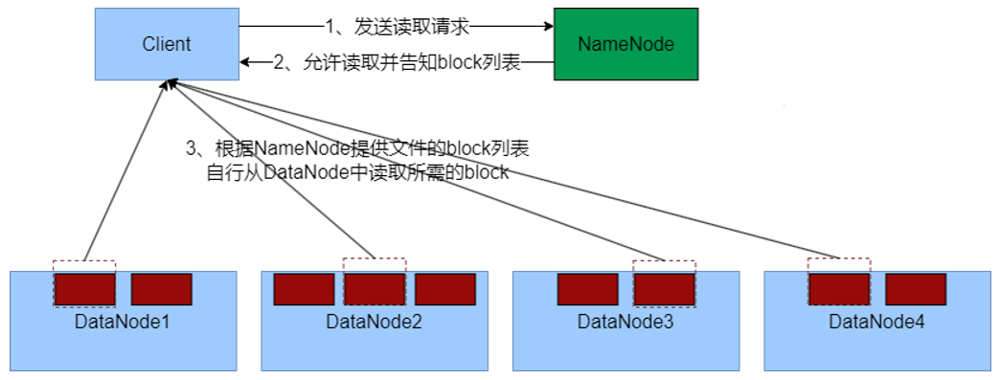

Hadoop Distributed File System（Hadoop分布式文件系统）

- 主角色：NameNode
    - HDFS系统的主角色，是一个独立的进程
    - 负责管理HDFS整个文件系统
    - 负责管理DataNode

- 从角色：DataNode

    - HDFS系统的从角色，是一个独立进程
    - 主要负责数据的存储，即存入数据和取出数据

- 主角色辅助角色：SecondaryNameNode

    - NameNode的辅助，是一个独立进程
    - 主要帮助NameNode完成元数据整理工作（打杂）

## 数据存储原理

## 数据写入流程

1. 客户端向NameNode发起请求
2. NameNode审核权限、剩余空间后，满足条件允许写入，并告知客户端写入的DataNode地址
3. 客户端向指定的DataNode发送数据包
4. 被写入数据的DataNode同时完成数据副本的复制工作，将其接收的数据分发给其它DataNode
5. 如上图，DataNode1复制给DataNode2，然后基于DataNode2复制给Datanode3和DataNode4
6. 写入完成客户端通知NameNode，NameNode做元数据记录工作

✨关键信息点：
- NameNode不负责数据写入，只负责元数据记录和权限审批
- 客户端直接向1台DataNode写数据，这个DataNode一般是离客户端最近（网络距离）的那一个
- 数据块副本的复制工作，由DataNode之间自行完成（构建一个PipLine，按顺序复制分发，如图1给2, 2给3和4）

## 数据读取流程

1. 客户端向NameNode申请读取某文件
2. NameNode判断客户端权限等细节后，允许读取，并返回此文件的block列表
3. 客户端拿到block列表后自行寻找DataNode读取即可

✨关键点：
- 数据同样不通过NameNode提供
- NameNode提供的block列表，会基于网络距离计算尽量提供离客户端最近的这是因为1个block有3份，会尽量找离客户端最近的那一份让其读取

|对比项目|Hadoop|Spark|
| ---- | ---- | ---- |
|类型|基础平台，包含计算、存储、调度|纯计算工具（分布式）|
|场景|海量数据批处理（磁盘迭代计算）|海量数据的批处理（内存迭代计算、交互式计算）、海量数据流计算|
|价格|对机器要求低，便宜|对内存有要求，相对较贵|
|编程范式|Map + Reduce，API 较为底层，算法适应性差|RDD 组成 DAG 有向无环图，API 较为顶层，方便使用|
|数据存储结构|MapReduce 中间计算结果在 HDFS 磁盘上，延迟大|RDD 中间运算结果在内存中，延迟小|
|运行方式|Task 以进程方式维护，任务启动慢|Task 以线程方式维护，任务启动快，可批量创建提高并行能力|

整个Spark 框架模块包含：Spark Core、 Spark SQL、 Spark Streaming、 Spark GraphX、 Spark MLlib，而后四项的能力都是建立在核心引擎之上

- Spark Core：Spark的核心，Spark核心功能均由Spark Core模块提供，是Spark运行的基础。Spark Core以RDD为数据抽象，提供Python、Java、
Scala、R语言的API，可以编程进行海量离线数据批处理计算。
- SparkSQL：基于SparkCore之上，提供结构化数据的处理模块。SparkSQL支持以SQL语言对数据进行处理，SparkSQL本身针对离线计算场景。同
时基于SparkSQL，Spark提供了StructuredStreaming模块，可以以SparkSQL为基础，进行数据的流式计算。
- SparkStreaming：以SparkCore为基础，提供数据的流式计算功能。
- MLlib：以SparkCore为基础，进行机器学习计算，内置了大量的机器学习库和API算法等。方便用户以分布式计算的模式进行机器学习计算。
- GraphX：以SparkCore为基础，进行图计算，提供了大量的图计算API，方便用于以分布式计算模式进行图计算。

## Spark的架构角色

YARN主要有4类角色，从2个层面去看：

- 资源管理层面
    - 集群资源管理者（Master）：ResourceManager
    - 单机资源管理者（Worker）：NodeManager
- 任务计算层面
    - 单任务管理者（Master）：ApplicationMaster
    - 单任务执行者（Worker）：Task（容器内计算框架的工作角色）

