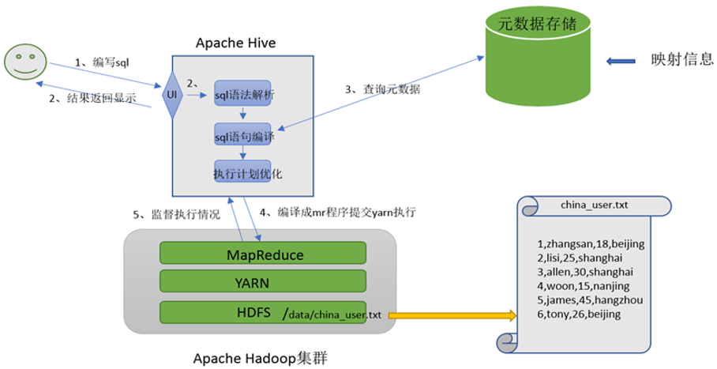
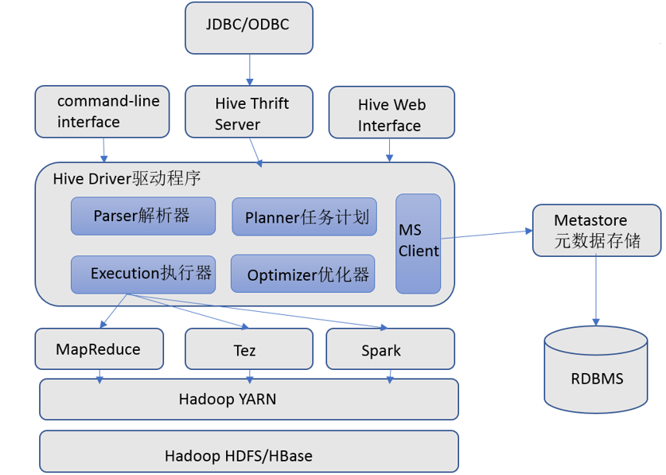
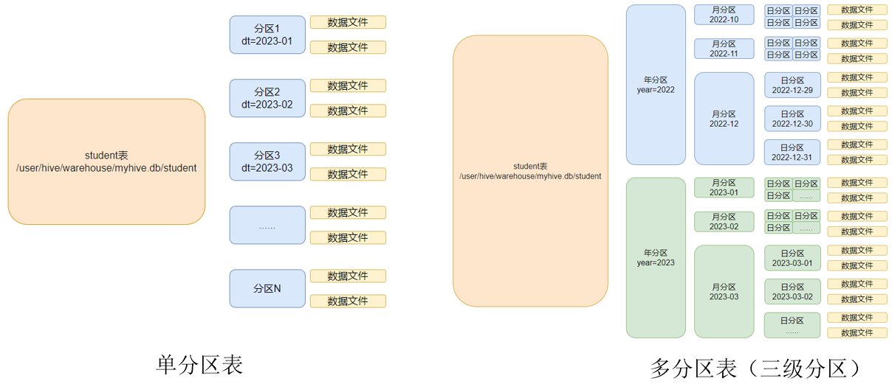
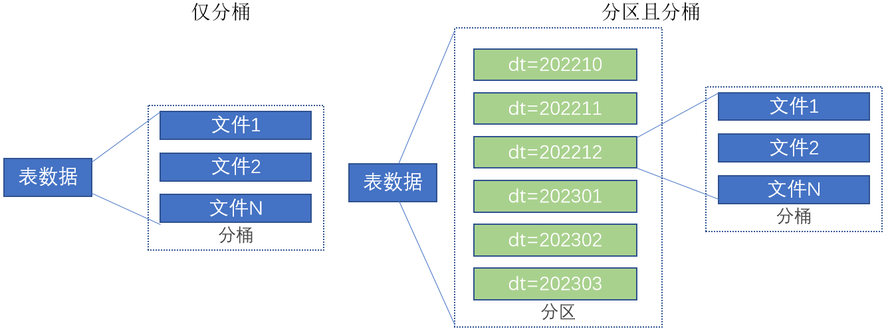
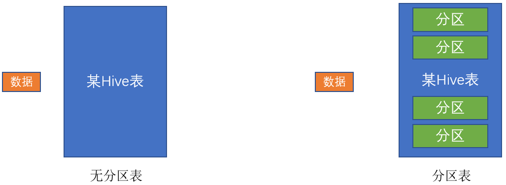
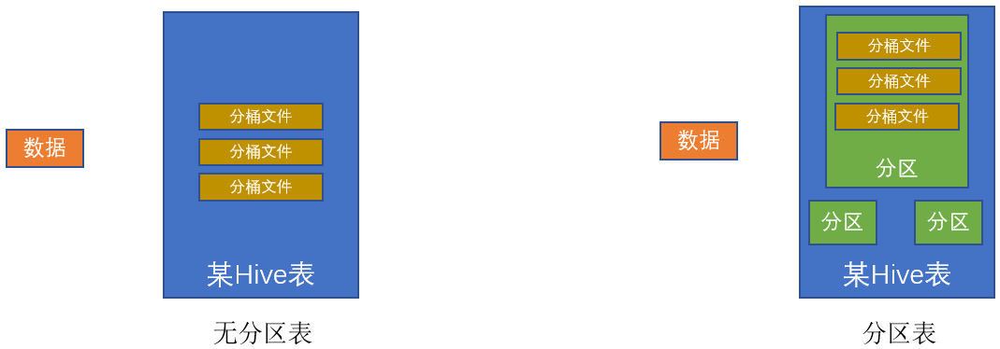
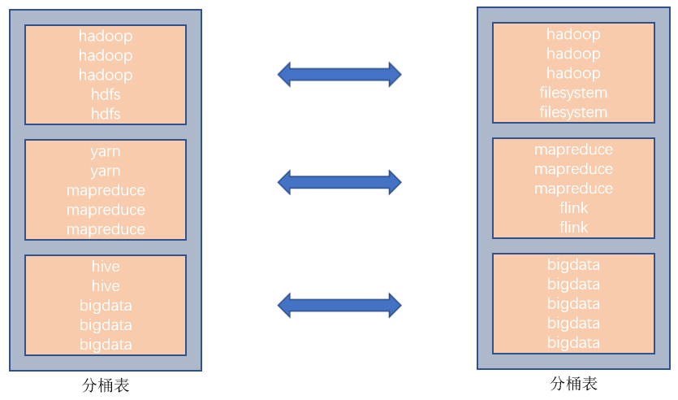

# hive

Apache Hive其2大主要组件就是：SQL解析器以及元数据存储， 如下图。

1. 用户接口

    包括 CLI、JDBC/ODBC、WebGUI。其中，CLI(command line interface)为shell命令行；Hive中的Thrift服务器允许外部客户端通过网络与Hive进行交互，类似于JDBC或ODBC协议。WebGUI是通过浏览器访问Hive。

1. 元数据存储

    通常是存储在关系数据库如 mysql/derby中。Hive 中的元数据包括表的名字，表的列和分区及其属性，表的属性（是否为外部表等），表的数据所在目录等。

2. Driver驱动程序

    包括语法解析器、计划编译器、优化器、执行器

    完成 HQL 查询语句从词法分析、语法分析、编译、优化以及查询计划的生成。生成的查询计划存储在 HDFS 中，并在随后有执行引擎调用执行。

## 分区

个典型的按月份分区的表, 每一个分区，是一个文件夹

## 分桶

和分区不同，分区是将表拆分到不同的子文件夹中进行存储，而分桶是将表拆分到固定数量的不同文件中进行存储。

桶表的数据加载通过load  data无法执行，只能通过insert  select.

为什么不可以用load data，必须用insert select插入数据

如果没有分桶设置，插入（加载）数据只是简单的将数据放入到：

- 表的数据存储文件夹中（没有分区）
- 表指定分区的文件夹中（带有分区）

一旦有了分桶设置，比如分桶数量为3，那么，表内文件或分区内数据文件的数量就限定为3, 当数据插入的时候，需要一分为3，进入三个桶文件内。

问题就在于：如何将数据分成三份，划分的规则是什么？
数据的三份划分基于分桶列的值进行hash取模来决定
由于load data不会触发MapReduce，也就是没有计算过程（无法执行Hash算法），只是简单的移动数据而已所以无法用于分桶表数据插入。

Hash算法是一种数据加密算法，其原理我们不去详细讨论，我们只需要知道其主要特征：
- 同样的值被Hash加密后的结果是一致的
    - 比如字符串“hadoop”被Hash后的结果是12345（仅作为示意），那么无论计算多少次，字符串“hadoop”的结果都会是12345。
    - 比如字符串“bigdata”被Hash后的结果是56789（仅作为示意），那么无论计算多少次，字符串“bigdata”的结果都会是56789。
- 基于如上特征，在辅以有3个分桶文件的基础上，将Hash的结果基于3取模（除以3 取余数）那么，可以得到如下结果：
    - 无论什么数据，得到的取模结果均是：0、1、2 其中一个
    - 同样的数据得到的结果一致，如hadoop hash取模结果是1，无论计算多少次，字符串hadoop的取模结果都是1

所以，必须使用insert select的语法，因为会触发MapReduce，进行hash取模计算

如果说分区表的性能提升是：在指定分区列的前提下，减少被操作的数据量，从而提升性能。
分桶表的性能提升就是：基于分桶列的特定操作, 相同的字段对分配在同一个桶内,，如：过滤、JOIN、分组，均可带来性能提升。

