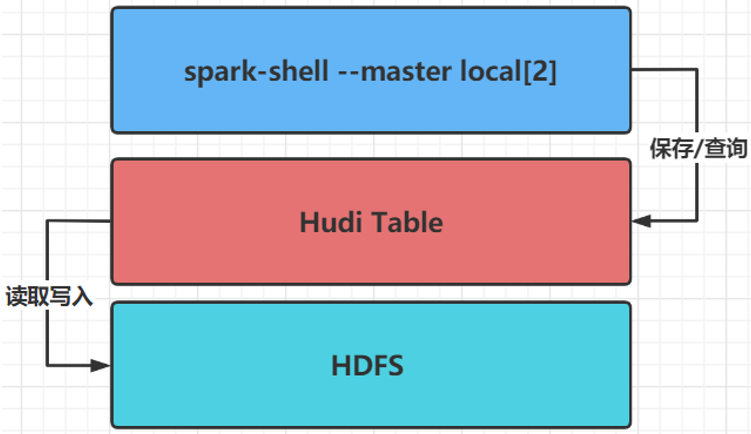
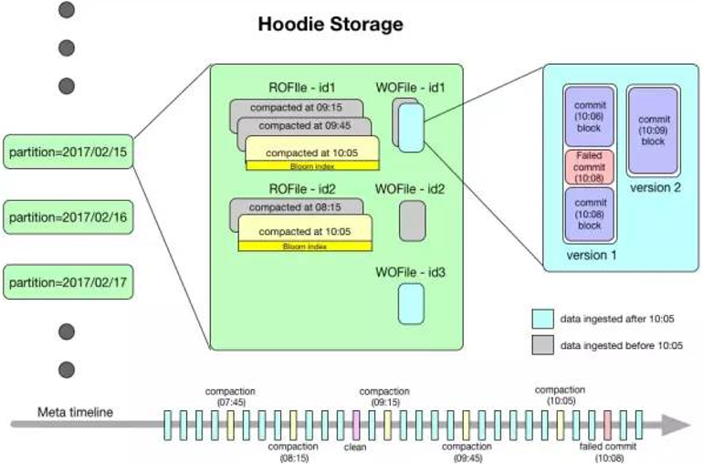
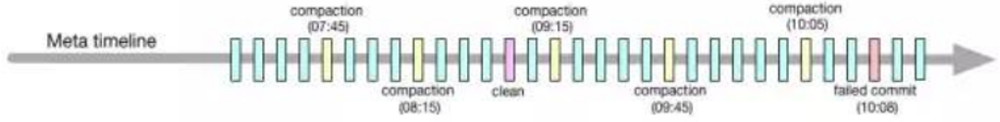
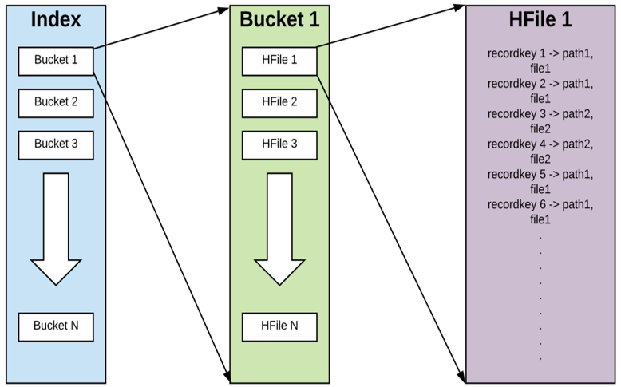
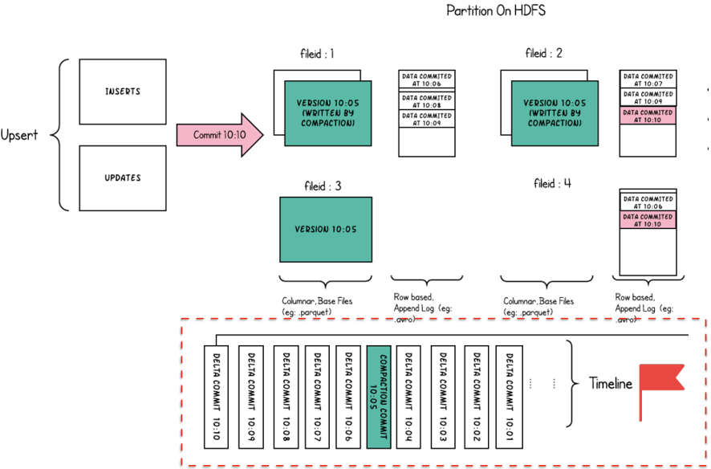

# hudi使用

基本软件框架: Hudi 流式数据湖平台，协助管理数据，借助HDFS文件系统存储数据，使用Spark操作数据

## 启动客户端

首先使用spark-shell命令行，以本地模式（LocalMode：--master local[2]）方式运行，模拟产生Trip乘车交易数据，将其保存至Hudi表，并且从Hudi表加载数据查询分析，其中Hudi表数据最后存储在HDFS分布式文件系统上。



在spark-shell命令行，对Hudi表数据进行操作，需要运行spark-shell命令时，添加相关依赖包

```sh
spark-shell \
--master local[2] \
--packages org.apache.hudi:hudi-spark3-bundle_2.12:0.9.0,org.apache.spark:spark-avro_2.12:3.0.1 \
--conf "spark.serializer=org.apache.spark.serializer.KryoSerializer"
```

启动spark-shell命令以后，编写scala语言代码，保存数据至Hudi表及从Hudi表加载数据

## 模拟数据

1. 导入Spark及Hudi相关包和定义变量（表的名称和数据存储路径）

    ```scala
    import org.apache.hudi.QuickstartUtils._
    import scala.collection.JavaConversions._
    import org.apache.spark.sql.SaveMode._
    import org.apache.hudi.DataSourceReadOptions._
    import org.apache.hudi.DataSourceWriteOptions._
    import org.apache.hudi.config.HoodieWriteConfig._

    val tableName = "hudi_trips_cow"
    val basePath = "hdfs://node1.itcast.cn:8020/datas/hudi-warehouse/hudi_trips_cow"
    val dataGen = new DataGenerator
    ```

2. 构建DataGenerator对象，用于模拟生成Trip乘车数据

    `val inserts = convertToStringList(dataGen.generateInserts(10))`

    模拟产生10条Trip乘车数据，为JSON格式

    ```json
    {
        "ts": 1620884930573,
        "uuid": "24d44a55-861c-446c-91d2-bcd2140b696a",
        "rider": "rider-213",
        "driver": "driver-213",
        "begin_lat": 0.4726905879569653,
        "begin_lon": 0.46157858450465483,
        "end_lat": 0.754803407008858,
        "end_lon": 0.9671159942018241,
        "fare": 34.158284716382845,
        "partitionpath": "americas/brazil/sao_paulo"
    }
    ```

3. 将模拟数据List转换为DataFrame数据集

    ```scala
    val df = spark.read.json(spark.sparkContext.parallelize(inserts, 2))
    ```

4. 查看转换后DataFrame数据集的Schema信息
  
    ```scala
    scala> df.printSchema()
    root
    |-- begin_lat: double (nullable = true)
    |-- begin_lon: double (nullable = true)
    |-- driver: string (nullable = true)
    |-- end_lat: double (nullable = true)
    |-- end_lon: double (nullable = true)
    |-- fare: double (nullable = true)
    |-- partitionpath: string (nullable = true)
    |-- rider: string (nullable = true)
    |-- ts: long (nullable = true)
    |-- uuid: string (nullable = true)
    ```

5. 选择相关字段，查看模拟样本数据, 显示结果如下：

    ```scala
    scala> df.select("rider", "begin_lat", "begin_lon", "driver", "fare", "uuid", "ts").show(10, truncate=false)
    +--------+-------------------+-------------------+----------+-------------------+------------------------------------+-------------------+
    |rider   |begin_lat          |begin_lon          |driver    |fare               |uuid                                |ts                 |
    +--------+-------------------+-------------------+----------+-------------------+------------------------------------+-------------------+
    |rider-213|0.4726905879569653 |0.46157858450465483|driver-213|34.158284716382845  |78068464-7b78-437d-b2be-3a72517b7747|1621288097274      |
    |rider-213|0.6100070562136587 |0.8779402295427752 |driver-213|43.4923811219014    |fc4bd1d0-4669-4dfa-a277-8831807a6127|1621250500666      |
    |rider-213|0.5731835407930634 |0.4923479652912024 |driver-213|64.27696295884016   |9029f151-c225-4f69-b108-49b9765b149e|1621566653049      |
    |rider-213|0.21624150367601136|0.14285051259466197|driver-213|93.56018115236618   |cb732713-9bf6-4528-a6b0-838caca3befe|1621245148846      |
    |rider-213|0.40613510977307   |0.5644092139040959 |driver-213|17.851135255091155  |9d16ca06-6552-49f5-a486-03f98408be45|1621593389490      |
    |rider-213|0.8742041826408587 |0.7528268153249502 |driver-213|19.179139106643607  |560a4274-4aaa-49aa-ae24-eebba5b355fd|1621367922897      |
    |rider-213|0.1856408505068272 |0.9694586417848392 |driver-213|33.92216483948643   |028d3998-fc04-4356-830d-541fb29d427de|1621298940267      |
    |rider-213|0.0750588760043035 |0.03844104444445928|driver-213|66.62084366450246   |6bb6b590-0656-4476-8c2e-55969483cfdf|1621539835522      |
    |rider-213|0.651058505660742  |0.8192868687714224 |driver-213|41.06290929046368   |dd217972-c733-460f-88be-83ead98a6c72|1621326489339      |
    |rider-213|0.11488393157088261|0.6273212202489661 |driver-213|27.79478688582596   |314813c7-7960-4375-abbd-cbe3afe03344|1621452732418      |
    +--------+-------------------+-------------------+----------+-------------------+------------------------------------+-------------------+
    ```

## 插入数据

将模拟产生Trip数据，保存到Hudi表中，由于Hudi诞生时基于Spark框架，所以SparkSQL支持Hudi数据源，直接通过`format`指定数据源Source，设置相关属性保存数据即可。

```scala
df.write
  .mode(Overwrite)
  .format("hudi")
  .options(getQuickstartWriteConfigs)  # 设置写入/更新数据至Hudi时，Shuffle时分区数目
  .option(PRECOMBINE_FIELD_OPT_KEY, "ts")  # 数据合并时，依据主键字段
  .option(RECORDKEY_FIELD_OPT_KEY, "uuid")  # 每条记录的唯一id，支持多个字段
  .option(PARTITIONPATH_FIELD_OPT_KEY, "partitionpath")  # 用于存放数据的分区字段
  .option(TABLE_NAME, tableName)
  .save(basePath)
```

Hudi表数据存储在HDFS上，以**PARQUET**列式方式存储的，查看HDFS文件系统目录：`/datas/hudi-warehouse/hudi_trips_cow`，结构如下：

```
hudi_trips_cow
├── americas
│   ├── brazil
│   │   └── sao_paulo
│   │       └── d4faa3ec-a51d-45ab-98e2-1cb47aa442d2-0_0-26-32_20210519161456.parquet
│   └── united_states
│       └── san_francisco
│           └── 2c694324-0cd4-4d95-bf51-9dfa9ab33e07-0_1-26-33_20210519161456.parquet
└── asia
    └── india
        └── chennai
            └── 50d5366f-cfd2-4327-abfd-c1871d4e0518-0_2-26-34_20210519161456.parquet
```

## 查询数据

- 从Hudi表中读取数据，同样采用SparkSQL外部数据源加载数据方式，指定`format`数据源和相关参数`options`. 其中指定Hudi表数据存储路径即可，采用正则Regex匹配方式，由于保存Hudi表属于分区表，并且为三级分区（相当于Hive中表指定三个分区字段），使用表达式：`/*/*/*/*` 加载所有数据。

    ```scala
    val tripsSnapshotDF = spark.read.format("hudi").load(basePath + "/*/*/*/*")
    hudi_trips_cow
    ├── americas
    │   ├── brazil
    │   │   └── sao_paulo  3级分区
    │   │       └── d4faa3ec-a51d-45ab-98e2-1cb47aa442d2-0_0-26-32_20210519161456.parquet
    │   └── united_states
    │       └── san_francisco
    │           └── 2c694324-0cd4-4d95-bf51-9dfa9ab33e07-0_1-26-33_20210519161456.parquet
    ```

- 打印获取Hudi表数据的Schema信息, 比原先保存到Hudi表中数据多5个字段(前5个)，这些字段属于Hudi管理数据时使用的相关字段。

    ```scala
    scala> tripsSnapshotDF.printSchema()
    root
    |-- _hoodie_commit_time: string (nullable = true)
    |-- _hoodie_commit_seqno: string (nullable = true)
    |-- _hoodie_record_key: string (nullable = true)
    |-- _hoodie_partition_path: string (nullable = true)
    |-- _hoodie_file_name: string (nullable = true)
    |-- begin_lat: double (nullable = true)
    |-- begin_lon: double (nullable = true)
    |-- driver: string (nullable = true)
    |-- end_lat: double (nullable = true)
    |-- end_lon: double (nullable = true)
    |-- fare: double (nullable = true)
    |-- partitionpath: string (nullable = true)
    |-- rider: string (nullable = true)
    |-- ts: long (nullable = true)
    |-- uuid: string (nullable = true)
    ```

- 将获取Hudi表数据DataFrame注册为临时视图，采用SQL方式依据业务查询分析数据

  ```scala
  tripsSnapshotDF.createOrReplaceTempView("hudi_trips_snapshot")
  ```

- 查询业务一：乘车费用 大于 20 信息数据

    ```scala
    spark.sql("select fare, begin_lon, begin_lat, ts from hudi_trips_snapshot where fare > 20.0").show()
  
    |fare|begin_lon|begin_lat|ts|
    +-------------------+-------------------+-------------------+-------------------+
    |93.56018115236618|0.14285051259466197|0.21624150367601136|1621245148846|
    |27.79478688582596|0.6273212202489661|0.11488393157088261|1621452732418|
    |64.27696295884016|0.4923479652912024|0.5731835407930634|1621566653049|
    |33.92216483948643|0.9694586417848392|0.1856408505068272|1621298940267|
    |43.4923811219014|0.8779402295427752|0.6100070562136587|1621250500666|
    |34.158284716382845|0.46157858450465483|0.4726905879569653|1621288097274|
    |66.62084366450246|0.03844104444445928|0.0750588760043035|1621539835522|
    |41.06290929046368|0.8192868687714224|0.651058505660742|1621326489339|
    ```

## 表数据结构

Hudi表的数据文件，可以使用操作系统的文件系统存储，也可以使用HDFS这种分布式的文件系统存储。为了后续分析性能和数据的可靠性，一般使用HDFS进行存储。以HDFS存储来看，一个Hudi表的存储文件分为两类。

- `.hoodie` 文件：由于CRUD的零散性，每一次的操作都会生成一个文件，这些小文件越来越多后，会严重影响HDFS的性能，Hudi设计了一套文件合并机制。`.hoodie`文件夹中存放了对应的**文件合并操作**相关的日志文件。
- `americas`和`asia`相关的路径是实际的数据文件，**按分区存储**，分区的路径key是可以指定的。

```
root@node1 ~]# hdfs dfs -ls /datas/hudi-warehouse/hudi_trips_cow
found 3 items
lrwxr-xr-x  - root supergroup        0 2021-05-23 17:44 /datas/hudi-warehouse/hudi_trips_cow/.hoodie
lrwxr-xr-x  - root supergroup        0 2021-05-23 17:44 /datas/hudi-warehouse/hudi_trips_cow/americas
lrwxr-xr-x  - root supergroup        0 2021-05-23 17:44 /datas/hudi-warehouse/hudi_trips_cow/asia
```

### .hoodie文件

- Hudi把随着时间流逝，对表的一系列CRUD操作叫做**Timeline**，Timeline中某一次的操作，叫做**Instant**。
    - Instant Action，记录本次操作是一次数据提交（COMMITS），还是文件合并（COMPACTION），或者是文件清理（CLEANS）；
    - Instant Time，本次操作发生的时间；
    - State，操作的状态，发起(REQUESTED)，进行中(INFLIGHT)，还是已完成(COMPLETED)；
- .hoodie文件夹中存放对应操作的状态记录：

```
[root@node1 ~]# hdfs dfs -ls /datas/hudi-warehouse/hudi_trips_cow/.hoodie
Found 7 items
drwxr-xr-x  - root supergroup        0 2021-05-23 17:44 /datas/hudi-warehouse/hudi_trips_cow/.hoodie/.aux
drwxr-xr-x  - root supergroup        0 2021-05-23 17:44 /datas/hudi-warehouse/hudi_trips_cow/.hoodie/.temp
-rw-r--r--  1 root supergroup     4187 2021-05-23 17:44 /datas/hudi-warehouse/hudi_trips_cow/.hoodie/20210523174441.commit
-rw-r--r--  1 root supergroup        0 2021-05-23 17:44 /datas/hudi-warehouse/hudi_trips_cow/.hoodie/20210523174441.commit.requested
-rw-r--r--  1 root supergroup     2594 2021-05-23 17:44 /datas/hudi-warehouse/hudi_trips_cow/.hoodie/20210523174441.inflight
drwxr-xr-x  - root supergroup        0 2021-05-23 17:44 /datas/hudi-warehouse/hudi_trips_cow/.hoodie/archived
-rw-r--r--  1 root supergroup      268 2021-05-23 17:44 /datas/hudi-warehouse/hudi_trips_cow/.hoodie/hoodie.properties
```

### 数据文件

- Hudi真实的数据文件使用Parquet文件格式存储

    ```
    [root@node1 ~]# hdfs dfs -ls /datas/hudi-warehouse/hudi_trips_cow/asia/india/chennai
    Found 2 items
    -rw-r--r--  1 root supergroup        93 2021-05-23 17:44 /datas/hudi-warehouse/hudi_trips_cow/asia/india/chennai/.hoodie_partition_metadata
    -rw-r--r--  1 root supergroup    437200 2021-05-23 17:44 /datas/hudi-warehouse/hudi_trips_cow/asia/india/chennai/fbd5f23d-891e-475e-a4fd-f482d95bfcfb-0_2-57-72_20210523174441.parquet
    ```

- 其中包含一个metadata元数据文件和数据文件parquet列式存储。
- Hudi为了实现数据的CRUD，需要能够唯一标识一条记录，Hudi将把数据集中的唯一字段（record key） + 数据所在分区（partitionPath）联合起来当做**数据的唯一键**。


## 数据存储概述


Hudi数据集的组织目录结构与Hive表示非常相似，一份数据集对应这一个根目录。数据集被打散为多个分区，分区字段以文件夹形式存在，该文件夹包含该分区的所有文件。

1. 在根目录下，每个分区都有唯一的分区路径，每个分区数据存储在多个文件中。
2. 每个文件都有惟一的fileId和生成文件的commit所标识。如果发生更新操作时，多个文件共享相同的fileId，但会有不同的commit。




## 时间轴
以时间轴（timeline）的形式将数据集上的各项操作元数据维护起来，以支持数据集的瞬态视图，这部分元数据存储于根目录下的元数据目录。一共有三种类型的元数据：
- Commits：一个单独的commit包含对数据集之上一批数据的一次原子写入操作的相关信息。我们用单调递增的时间戳来标识commits，标定的是一次写入操作的开始。
- Cleans：用于清除数据集中不再被查询所用到的旧版本文件的后台活动。
- Compactions：用于协调Hudi内部的数据结构差异的后台活动。例如，将更新操作由基于行存的日志文件归集到列存数据上



## Index 索引


Hudi维护着一个索引，以支持在记录key存在情况下，将新记录的key快速映射到对应的fileId。
- Bloom filter：存储于数据文件页脚。默认选项，不依赖外部系统实现。数据和索引始终保持一致。
- Apache HBase ：可高效查找一小批key。在索引标记期间，此选项可能快几秒钟


## Data 数据

Hudi以两种不同的存储格式存储所有摄取的数据，用户可选择满足下列条件的任意数据格式：

- 读优化的列存格式（ROFormat）：缺省值为Apache Parquet；
- 写优化的行存格式（WOFormat）：缺省值为Apache Avro；




