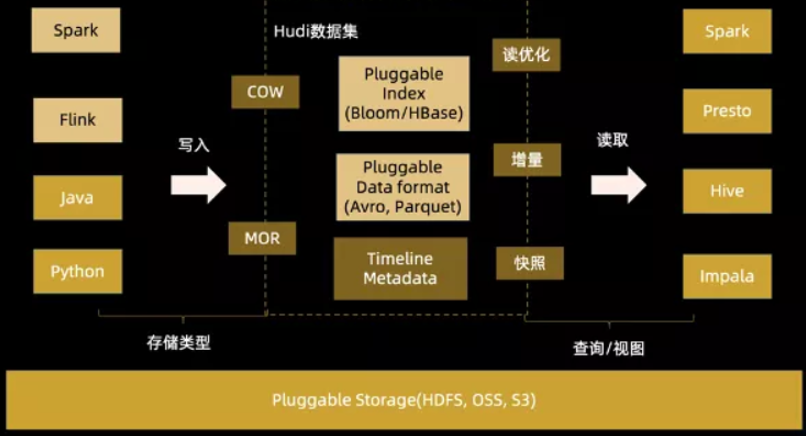

# hudi基本概念

数仓的概念:

- 数据仓库（英语：Data Warehouse，简称数仓、DW）,是一个用于存储、分析、报告的数据系统。
- 数据仓库的目的是构建面向分析的集成化数据环境，分析结果为企业提供决策支持（Decision Support）。
- 数据仓库的特点是本身不生产数据，也不最终消费数据。
- 每个企业根据自己的业务需求可以分成不同的层次。但是最基础的分层思想，理论上分为三个层：操作型数据层（ODS）、数据仓库层(DW)和数据应用层(DA)。

数据湖的概念:

- 数据湖（Data Lake）和数据库、数据仓库一样，都是数据存储的设计模式，现在企业的数据仓库都会通过分层的方式将数据存储在文件夹、文件中。
- 数据湖是一个集中式数据存储库，用来存储大量的原始数据，使用平面架构来存储数据。
- 定义：一个以原始格式(通常是对象块或文件)存储数据的系统或存储库，通常是所有企业数据的单一存储。
- 数据湖可以包括来自关系数据库的结构化数据(行和列)、半结构化数据(CSV、日志、XML、JSON)、非结构化数据(电子邮件、文档、pdf)和二进制数据(图像、音频、视频)。
- 数据湖越来越多的用于描述任何的大型数据池，数据都是以原始数据方式存储，知道需要查询应用数据的时候才会开始分析数据需求和应用架构。

|特性|数据仓库|数据湖|
|----|----|----|
|数据|来自事务系统、运营数据库和业务线应用程序的关系数据|来自IoT设备、网站、移动应用程序、社交媒体和企业应用程序的非关系和关系数据|
|Schema|设计在数据仓库实施之前（写入型Schema）|写入在分析时（读取型Schema）|
|性价比|更快速查询结果会带来较高存储成本|更快速查询结果只需要较低存储成本|
|数据质量|可作为重要事实依据的高度监管数据|任何可以或无法进行监管的数据（例如原始数据）|
|用户|业务分析师|数据科学家、数据开发人员和业务分析师（使用监管数据）|
|分析|批处理报告、BI和可视化|机器学习、预测分析、数据发现和分析|

数据湖并不能替代数据仓库，数据仓库在高效的报表和可视化分析中仍有优势。

## 仓湖一体DataLake House

数据仓库 VS 数据湖

数据仓库：使用良好范式规范数据，无法生成数据所需的洞察。
数据湖：新的原始数据存储和处理范式，缺乏结构和治理，会迅速沦为“数据沼泽”。

Data Lakehouse（湖仓一体）是新出现的一种数据架构，它同时吸收了数据仓库和数据湖的优势，数据分析师和数据科学家可以在同一个数据存储中对数据进行操作，同时它也能为公司进行数据治理带来更多的便利性。

LakeHouse使用新的系统设计：直接在用于数据湖的低成本存储上实现与数据仓库中类似的数据结构和数据管理功能

## hudi

Apache Hudi：提供的fast upsert/delete以及compaction等功能，管理存储在HDFS上数据，设计目标正如其名，Hadoop Upserts Deletes and Incrementals（原为 Hadoop Upserts anD Incrementals）。

hudi的基础架构

1. 通过DeltaStreammer、Flink、Spark等工具，将数据摄取到数据湖存储，可使用HDFS作为数据湖的数据存储；
2. 基于HDFS可以构建Hudi的数据湖；
3. Hudi提供统一的访问Spark数据源和Flink数据源；
4. 外部通过不同引擎，如：Spark、Flink、Presto、Hive、Impala、Aliyun DLA、AWS Redshit访问接口；

Apache Hudi 本身不存储数据，仅仅管理数据，借助外部存储引擎存储数据，比如HDFS；
此外，Apache Hudi 也不分析数据，需要使用计算分析引擎，查询和保存数据，比如Spark或Flink；

