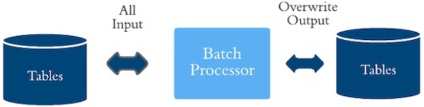
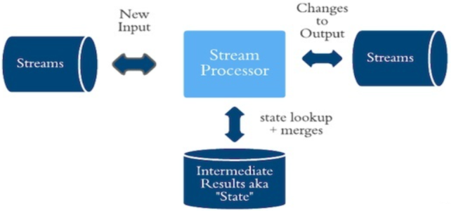
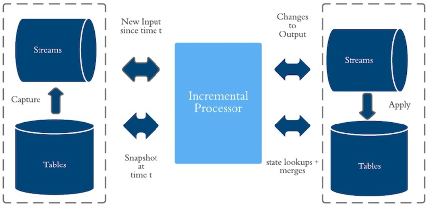
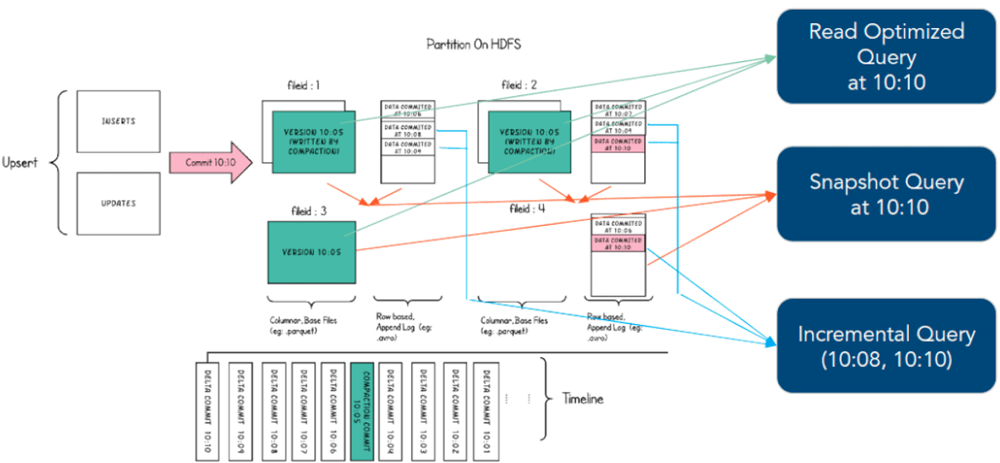
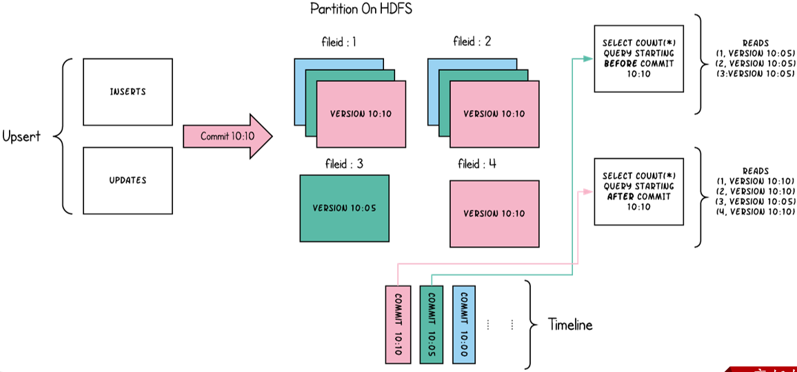
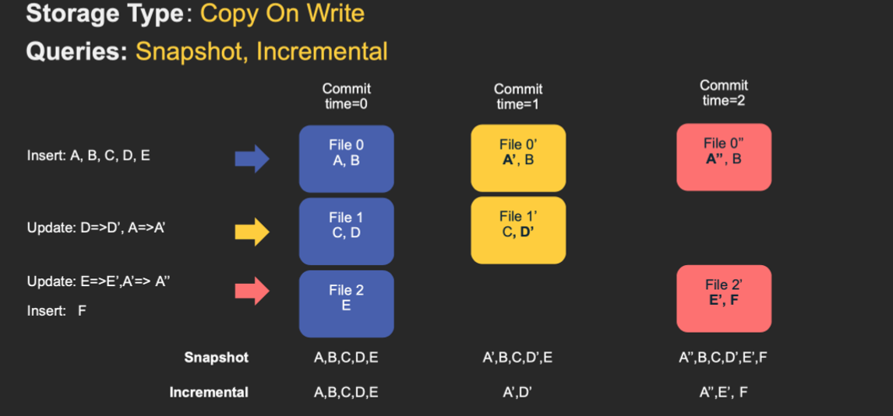
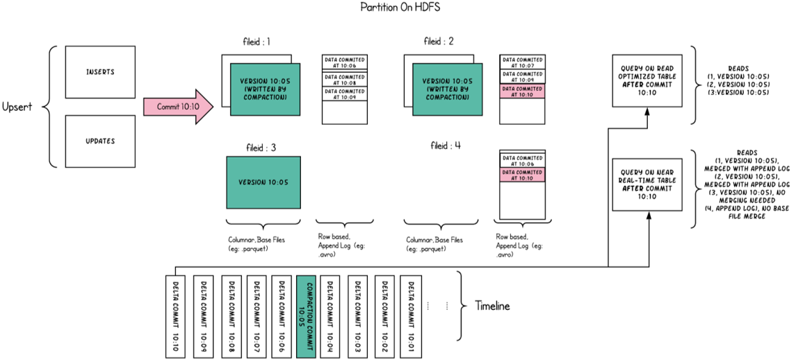
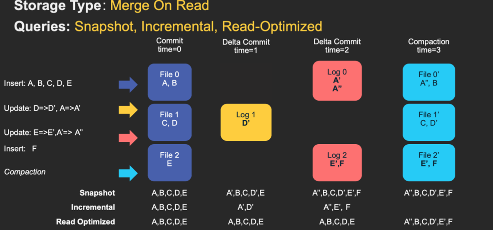

# 表的存储类型

Hudi提供两类型表：写时复制（Copy on Write，COW）表和读时合并（Merge On Read，MOR）表。
- 对于 Copy-On-Write Table，用户的 update 会重写数据所在的文件，所以是一个写放大很高，但是读放大为 0，适合写少读多的场景。
- 对于 Merge-On-Read Table，整体的结构有点像 LSM-Tree，用户的写入先写入到 delta data 中，这部分数据使用行存，这部分 delta data 可以手动 merge 到存量文件中，整理为 parquet 的列存结构。

## 数据计算模型

在 Hudi 过去的使用场景里，和大部分公司的架构类似，采用批式和流式共存的 Lambda 架构，后来Uber提出增量Incremental模型，相对批式来讲，更加实时；相对流式而言，更加经济。

批式(Batch)模型就是使用 MapReduce、Hive、Spark 等典型的批计算引擎，以小时任务或者天任务的形式来做数据计算。
1、延迟：小时级延迟或者天级别延迟。这里的延迟不单单指的是定时任务的时间，在数据架构里，这里的延迟时间通常是定时任务间隔时间 + 一系列依赖任务的计算时间 + 数据平台最终可以展示结果的时间。数据量大、逻辑复杂的情况下，小时任务计算的数据通常真正延迟的时间是 2-3 小时。
2、数据完整度：数据较完整。以处理时间为例，小时级别的任务，通常计算的原始数据已经包含了小时内的所有数据，所以得到的数据相对较完整。但如果业务需求是事件时间，这里涉及到终端的一些延迟上报机制，在这里，批式计算任务就很难派上用场。
3、成本：成本很低。只有在做任务计算时，才会占用资源，如果不做任务计算，可以将这部分批式计算资源出让给在线业务使用。从另一个角度来说成本是挺高的，如原始数据做了一些增删改查，数据晚到的情况，那么批式任务是要全量重新计算。

流式(Stream)模型，典型的就是使用 Flink 来进行实时的数据计算。
1、延迟：很短，甚至是实时。
2、数据完整度：较差。因为流式引擎不会等到所有数据到齐之后再开始计算，所以有一个 watermark 的概念，当数据的时间小于 watermark 时，就会被丢弃，这样是无法对数据完整度有一个绝对的报障。在互联网场景中，流式模型主要用于活动时的数据大盘展示，对数据的完整度要求并不算很高。在大部分场景中，用户需要开发两个程序，一是流式数据生产流式结果，二是批式计算任务，用于次日修复实时结果。
3、成本：很高。因为流式任务是常驻的，并且对于多流 Join 的场景，通常要借助内存或者数据库来做 state 的存储，不管是序列化开销，还是和外部组件交互产生的额外 IO，在大数据量下都是不容忽视的。

针对批式和流式的优缺点，Uber 提出了增量模型（Incremental Mode），相对批式来讲，更加实时；相对流式而言，更加经济。

增量模型(Incremental)，简单来讲，是以 mini batch 的形式来跑准实时任务。Hudi 在增量模型中支持了两个最重要的特性：
1、Upsert：这个主要是解决批式模型中，数据不能插入、更新的问题，有了这个特性，可以往 Hive 中写入增量数据，而不是每次进行完全的覆盖。（Hudi 自身维护了 key->file 的映射，所以当 upsert 时很容易找到 key 对应的文件）
2、Incremental Query：增量查询，减少计算的原始数据量。以 Uber 中司机和乘客的数据流 Join 为例，每次抓取两条数据流中的增量数据进行批式的 Join 即可，相比流式数据而言，成本要降低几个数量级。

## 查询类型（Query Type）

Hudi支持三种不同的查询表的方式：Snapshot Queries、Incremental Queries和Read Optimized Queries。

- Snapshot Queries（快照查询）

    - 查询某个增量提交操作中数据集的最新快照，先进行动态合并最新的基本文件(Parquet)和增量文件(Avro)来提供近实时数据集（通常会存在几分钟的延迟）。
    - 读取所有 partiiton 下每个 FileGroup 最新的 FileSlice 中的文件，Copy On Write 表读 parquet 文件，Merge On Read 表读 parquet + log 文件

- 类型二：Incremental Queries（增量查询）

    - 仅查询新写入数据集的文件，需要指定一个Commit/Compaction的即时时间（位于Timeline上的某个Instant）作为条件，来查询此条件之后的新数据。
    - 可查看自给定commit/delta commit即时操作以来新写入的数据，有效的提供变更流来启用增量数据管道。

- 类型三：Read Optimized Queries（读优化查询）

    - 直接查询基本文件（数据集的最新快照），其实就是列式文件（Parquet）。并保证与非Hudi列式数据集相比，具有相同的列式查询性能。
    - 可查看给定的commit/compact即时操作的表的最新快照。
    - 读优化查询和快照查询相同仅访问基本文件，提供给定文件片自上次执行压缩操作以来的数据。通常查询数据的最新程度的保证取决于压缩策略

## Copy On Write

- 简称COW，顾名思义，它是在数据写入的时候，复制一份原来的拷贝，在其基础上添加新数据。
- 正在读数据的请求，读取的是最近的完整副本，这类似Mysql 的MVCC的思想。

Copy On Write 表

- 优点：读取时，只读取对应分区的一个数据文件即可，较为高效；
- 缺点：数据写入的时候，需要复制一个先前的副本再在其基础上生成新的数据文件，这个过程比较耗时。

COW表主要使用列式文件格式（Parquet）存储数据，在写入数据过程中，执行同步合并，更新数据版本并重写数据文件，类似RDBMS中的B-Tree更新。
1）、更新update：在更新记录时，Hudi会先找到包含更新数据的文件，然后再使用更新值（最新的数据）重写该文件，包含其他记录的文件保持不变。当突然有大量写操作时会导致重写大量文件，从而导致极大的I/O开销。
2）、读取read：在读取数据时，通过读取最新的数据文件来获取最新的更新，此存储类型适用于少量写入和大量读取的场景

## Merge On Read

- 简称MOR，新插入的数据存储在delta log 中，定期再将delta log合并进行parquet数据文件。
- 读取数据时，会将delta log跟老的数据文件做merge，得到完整的数据返回。下图演示了MOR的两种数据读写方式

Merge On Read 表

- 优点：由于写入数据先写delta log，且delta log较小，所以写入成本较低；
- 缺点：需要定期合并整理compact，否则碎片文件较多。读取性能较差，因为需要将delta log和老数据文件合并

MOR表是COW表的升级版，它使用列式（parquet）与行式（avro）文件混合的方式存储数据。在更新记录时，类似NoSQL中的LSM-Tree更新。
1) 更新：在更新记录时，仅更新到增量文件（Avro）中，然后进行异步（或同步）的compaction，最后创建列式文件（parquet）的新版本。此存储类型适合频繁写的工作负载，因为新记录是以追加的模式写入增量文件中。
2) 读取：在读取数据集时，需要先将增量文件与旧文件进行合并，然后生成列式文件成功后，再进行查询

## COW vs MOR
对于写时复制（COW）和读时合并（MOR）writer来说，Hudi的WriteClient是相同的。
- COW表，用户在 snapshot 读取的时候会扫描所有最新的 FileSlice 下的 base file。
- MOR表，在 READ OPTIMIZED 模式下，只会读最近的经过 compaction 的 commit。

|权衡|写时复制COW|读时合并MOR|
|----|-----------------------------|-----------------------------|
|数据延迟|更高|更低|
|更新代价(I/O)|更高（重写整个parquet文件）|更低（追加到增量日志）|
|Parquet文件大小|更小（高更新代价（I/O））|更大（低更新代价）|
|写放大|更高|更低（取决于压缩策略）|
|适用场景|写少读多|写多读少|

