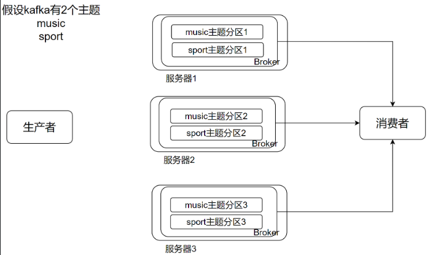
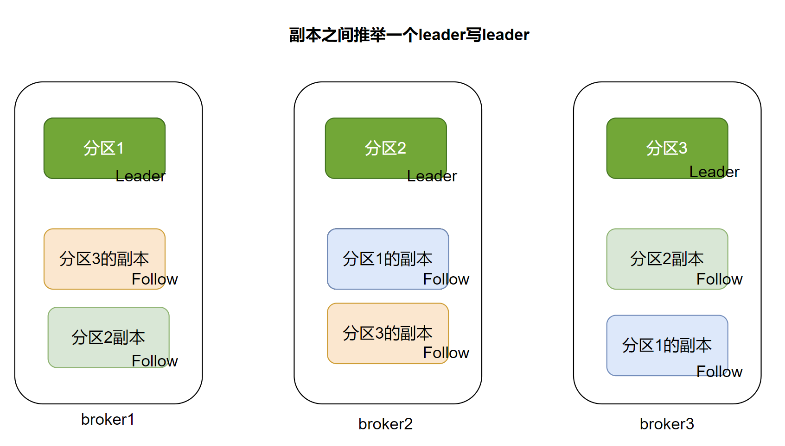
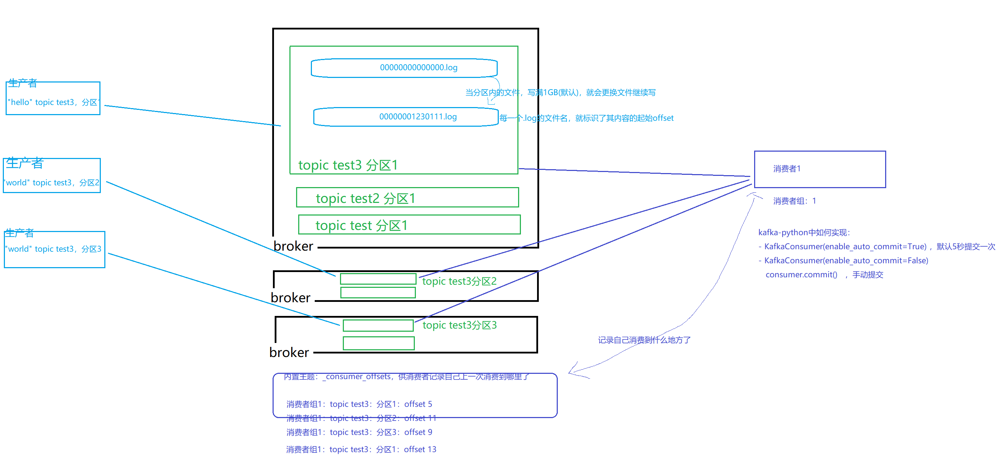

# kafka基本概念





- Kafka Cluster：由多个服务器组成。每个服务器单独的名字broker（掮客）。
- kafka broker：kafka集群中包含的服务器✨Kafka没有所谓的主节点，凡是启动的kafka工作进程，都叫broker（代理人）
- Kafka Producer：消息生产者、发布消息到 kafka 集群的终端或服务。
- Kafka consumer：消息消费者、负责消费数据。
- Kafka Topic: 主题，一类消息的名称。存储数据时将一类数据存放在某个topci下，消费数据也是消费一类数据。✨topic主题分区：如图可见，在kafka集群中，主题是可以有多分区的，分区可以存在broker之上。
    - 订单系统：创建一个topic，叫做order。
    - 用户系统：创建一个topic，叫做user。
    - 商品系统：创建一个topic，叫做product。 
- 注意：Kafka的元数据都是存放在zookeeper中。


## Kafka的分区和副本


如图：

- Kafka的主题是支持多个分区的
- 分区为了确保安全性也可以设置副本
- 如上图，就是一个主题有3个分区，每个分区有2个备份（3份副本）
- Kafka会在副本间推选一个Leader副本
- 数据在写入的时候，会直接写Leader副本
- 由Leader将数据复制（同步）给其它的副本

对于消费者：

- 在获取数据的时候，也是优先找Leader取数据
- 因为Leader的数据是最及时的，副本的数据因为要同步延迟更高


✨分区是确保性能的, 副本是确保安全性的


✨数据写入Leader是确保同步的管道的顺向性（不会出现副本之间互相同步复制，统一从Leader获取数据）
✨数据读取优先找Leader是确保消息的延迟更低




## Ack级别

生产者在写入数据的时候，有3种选择：

1. 将数据提交给Kafka后，不关心了，成不成功无所谓。 `ACK级别就是：0`
2. 将数据提交给Leader副本后，表示写入成功。 `ACK级别就是：1`
3. 将数据提交给Leader副本后，并等待Leader和它的Follow之间同步完成，才表示数据写入成功。 `ACK级别是-1`


在性能和安全性上：

- ack为0，最好，数据很可能丢失
- ack为1，略好，数据也有一定安全性
- ack为-1，性能最差，安全性最高


一般在企业中：

- 做测试、开发的时候，设置0方便省事
- 在生产环境中
  - 数据量太大的时候，设置为1较多
  - 数据不太重要，丢一点无所谓的时候设置1的时候较多
- 在生产环境中
  - 数据非常重要设置为-1较多，同时还会保留物理备份


```python
producer = KafkaProducer(
    bootstrap_servers=['node1:9092', 'node2:9092', 'node3:9092'], 
    ack=0,	# 设置ack0
    ack=1,	# 设置ack1
    ack='all'	# 设置ack -1
)
# 如上
```


## 消费者如何不丢失数据

### 前提

Kafka的数据是`不会因为消费被删除的`，只要进入kafka的数据，不论被消费多少次都不会被删除掉。

只有数据到期了，才会被kafka清理。

> 默认kafka数据的到期时间是7天。
>
> 可以通过配置server.properties文件来修改：
>
> ```shell
> # The minimum age of a log file to be eligible for deletion due to age
> log.retention.hours=168
> # 单位是小时
> ```


### 消费者的offset记录

消费者的述求是，希望能够记录自己，上一次消费的位置，从而让自己在下一次启动的时候，可以续上（不重复也不遗漏）

比如，kafka-python这个库，它的代码中就有自动记录offset的功能。


#### kafka-python库的自动记录功能

```python
consumer = KafkaConsumer(
    '0629',  # topic
    group_id="aaa",    # 组id
    bootstrap_servers=['node1:9092', 'node2:9092', 'node3:9092'],    # broker地址
    enable_auto_commit=False,
    auto_offset_reset='earliest'
)

- enable_auto_commit:设置为True，表示会自动记录上一次消费到哪里
- enable_auto_commit:设置为False，表示不会自动记录
	不会自动记录，我们可以手动去记录，使用consumer.commit()即可手动记录

```

> 如果使用自动记录功能，那么它不是一条记录一次，而是隔一段时间记录一次

```shell
# 自动提交默认是5秒，但是可以修改
consumer = KafkaConsumer(
    '0629',  # topic
    group_id="aaa",    # 组id
    bootstrap_servers=['node1:9092', 'node2:9092', 'node3:9092'],    # broker地址
    enable_auto_commit=False,
    auto_commit_interval_ms=1000,
    auto_offset_reset='earliest'
)
- auto_commit_interval_ms=1000 表示将自动提交的间隔修改为1秒
```


> - 自动提交不管间隔时间设置的再小，总归不是一条一次记录，有可能导致重复取到数据，但是不会丢
>   - 自动提交用于那种对重复数据不敏感，要确保不要漏掉数据的场景
> - 手动提交就是自行控制了。我们可以自行控制一条一次提交，这样就非常精准，性能会降低。


## kafka组


在Kafka中，消费者`必须`归属于一个消费者组（consumer group）

一个组内的多个消费者程序，是均分数据的。


1. topic有3个分区，一个组只有1个消费者，这个消费者一人独享3个分区的数据
2. topic有3个分区，一个组只有2个消费者，这2个消费者，1个占2个分区, 1个占1个分区
3. topic有3个分区，一个组只有3个消费者，这3个消费者，均分3个分区的数据
4. topic有3个分区，一个组只有4个消费者，3个消费者均分3个分区，1个消费者没事做（没数据）


Kafka：
- 一个主题的一个分区，只会给一个消费者组的一个消费者提供数据
- 一个分区，可以给多个消费者组提供服务




如图可以看到：

- 组aaa，中topic testpython2的分区1 被组aaa的消费者2所消费
- 组aaa，中topic testpython2的分区0 被组aaa的消费者1所消费
- 组aaa，中topic testpython2的分区2 被组aaa的消费者3所消费


