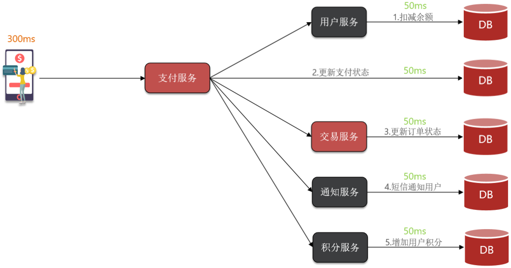
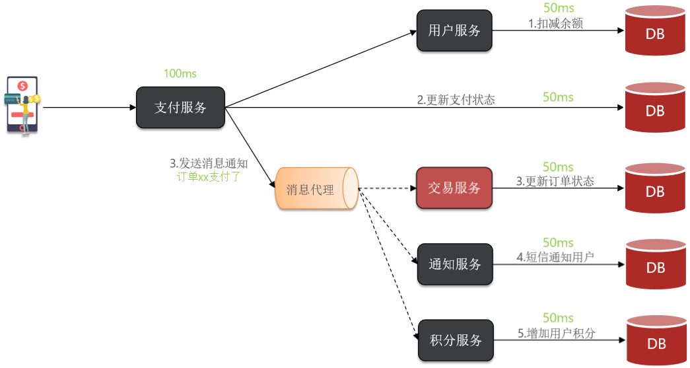
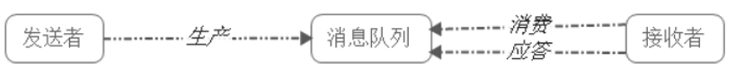
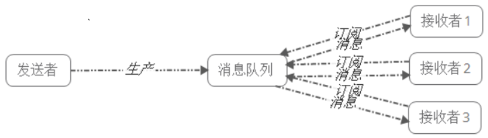

# 消息队列的基本概念

## 同步调用

同步是指，做事情按照顺序并且会等待上一个完成才会做下一个事情。

同步调用的优势是什么？

- 时效性强，等待到结果后才返回。

同步调用的问题是什么？
- 拓展性差
- 性能下降
- 级联失败问题

## 异步调用
异步：上一件事情没有完成，也会做下一件事情。

支付服务不再同步调用业务关联度低的服务，而是发送消息通知到Broker。

具备下列优势：
- 解除耦合，拓展性强
- 无需等待，性能好
- 故障隔离
- 缓存消息，流量削峰填谷

异调用的优势是什么？
- 耦合度低，拓展性强
- 异步调用，无需等待，性能好
- 故障隔离，下游服务故障不影响上游业务
- 缓存消息，流量削峰填谷
异步调用的问题是什么？
- 不能立即得到调用结果，时效性差
- 不确定下游业务执行是否成功
- 业务安全依赖于Broker的可靠性

举例：
1. 同步：给学生发红包，按顺序一个个发，上一个点了红包才会发下一个
2. 异步：给学生发红包，按顺序一个个发，发了一个不关心是否领取，就直接给下一个人发。

## 技术选型

RabbitMQ、ActiveMQ、RocketMQ是后端开发领域的明星产品，专注于消息的一致性、低延迟传输，海量数据下性能表现不足。

Kafka是大数据体系下的明星产品，专注于消息的海量传输的保证一致性以及一定的低延迟。

| 特性         | RabbitMQ                     | ActiveMQ                          | RocketMQ       | Kafka            |
|--------------|------------------------------|-----------------------------------|----------------|------------------|
| 公司/社区    | Rabbit                       | Apache                            | 阿里           | Apache           |
| 开发语言     | Erlang                       | Java                              | Java           | Scala&Java       |
| 协议支持     | AMQP，XMPP，SMTP，STOMP      | OpenWire,STOMP，REST,XMPP,AMQP    | 自定义协议     | 自定义协议       |
| 可用性       | 高                           | 一般                              | 高             | 高               |
| 单机吞吐量   | 一般                         | 差                                | 高             | 非常高           |
| 消息延迟     | 微秒级                       | 毫秒级                            | 毫秒级         | 毫秒以内         |
| 消息可靠性   | 高                           | 一般                              | 高             | 一般             |

## 消息队列的应用场景
- 1）应用耦合：
多应用间通过消息队列对同一消息进行处理，避免调用接口失败导致整个过程失败；
- 2）异步（并行）处理：
多应用对消息队列中同一消息进行处理，应用间并发处理消息，相比串行处理，减少处理时间；
- 3）限流削峰：
广泛应用于秒杀或抢购活动中，避免流量过大导致应用系统挂掉的情况；
不管什么场景，本质上就是借助消息队列，完成：数据（消息、事件）的传输。

## 消息队列的两种模式

点对点模式下包括三个角色
- 消息队列
- 发送者 (生产者)
- 接收者（消费者）

消息发送者生产消息发送到queue中，然后消息接收者从queue中取出并且消费消息。消息被消费以后，queue中不再有存储，所以消息接收者不可能消费到已经被消费的消息。

点对点模式特点：
- 每个消息只有一个接收者（Consumer）(即一旦被消费，消息就不再在消息队列中)；
- 发送者和接收者间没有依赖性，发送者发送消息之后，不管有没有接收者在运行，都不会影响到发送者下次发送消息；
- 接收者在成功接收消息之后需向队列应答成功，以便消息队列删除当前接收的消息；

## 发布/订阅模式

发布/订阅模式下包括三个角色：
- 角色主题（Topic）
- 发布者(Publisher)
- 订阅者(Subscriber)

发布者将消息发送到Topic,系统将这些消息传递给多个订阅者。
发布/订阅模式特点：
- 每个消息可以有多个订阅者；
- 发布者和订阅者之间有时间上的依赖性。针对某个主题（Topic）的订阅者，它必须创建一个订阅者之后，才能消费发布者的消息。
- 为了消费消息，订阅者需要提前订阅该角色主题，并保持在线运行；

