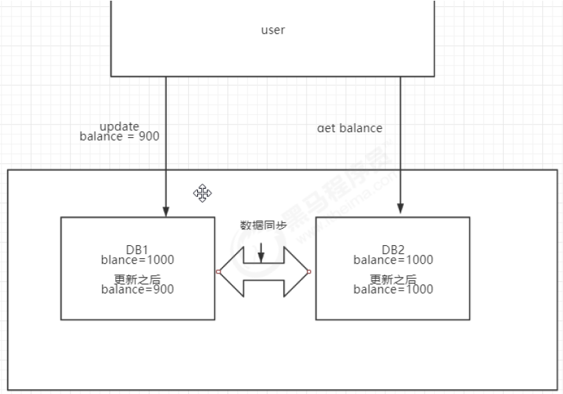
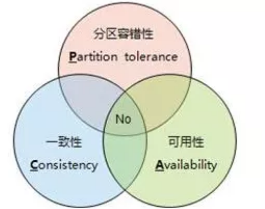
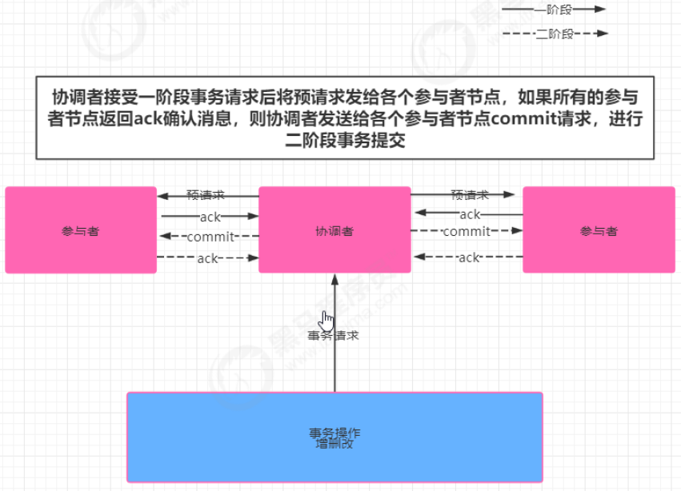
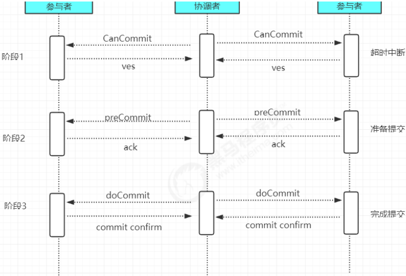
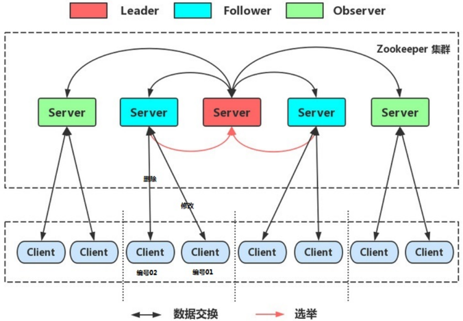

如图在上图中有用户user在DB1中修改balance=900,如果user下一次read请求到DB2数据，此时DB1的数据还没及时更新到DB2中，就会造成整个数据库集群数据不一致。

数据一致性分为强一致性和最终一致性，强一致性指的如果数据不一致，就不对外提供数据服务，保证用户读取的数据始终是一致的。
- 数据强一致性只需要通过锁机制即可解决，在案例中通过在DB2没有从DB1同步数据之前上锁，不对外提供读操作。只有当同步完成以后才对外提供服务。
- 而最终一致性要求数据最终同步即可，没有实时性要求。

## CAP原则

CAP在分布式系统中主要指的是一致性（Consistency）、可用性（Availability）和分区容错性（Partition tolerance）

1. 一致性： 指数据在多个副本之间能够保持一致的特性（严格的一致性）
2. 可用性： 指系统提供的服务必须一直处于可用的状态，每次请求都消获取到归非错的响应一但是不保证获取的数据为最新数据。
3. 分区容错性： 分布式系统在遇到任何网络分区故障的时候，仍需要能够保证对外提供一致性和可用性服务，除非是整个网络都发生故障。

在一个分布式系统中不可能同时满足一致性、可用性、分区容错性，最多满足两个，对于分布式互联网应用而言，必须保证P，所以要么满足AP模型、要么满足CP模型

一致性和可用性，为什么不可能同时成立？答案很简单，因为可能通信失败（即出现分区容错）。
- 如果保证 G2 的一致性，那么 G1 必须在写操作时，锁定 G2 的读操作和写操作。只有数据同步后，才能重新开放读写。锁定期间，G2 不能读写，没有可用性不。
- 如果保证 G2 的可用性，那么势必不能锁定 G2，所以一致性不成立。
综上所述，G2 无法同时做到一致性和可用性。系统设计时只能选择一个目标。如果追求一致性，那么无法保证所有节点的可用性；如果追求所有节点的可用性，那就没法做到一致性。

|组合|分析结果|
| ---- | ---- |
|CA|满足原子和可用，放弃分区容错。说白了，就是一个整体的应用。|
|CP|满足原子和分区容错，也就是说，要放弃可用。当系统被分区，为了保证原子性，必须放弃可用性，让服务停用。|
|AP|满足可用性和分区容错，当出现分区，同时为了保证可用性，必须让节点继续对外服务，这样必然导致失去原子性。|

## 一致性协议

事务需要跨多个分布式节点时，为了保证事务的ACID特性，需要选举出一个协调者来协调分布式各个节
点的调度，基于这个思想衍生了多种一致性协议:

### 2PC 二阶段提交

阶段一 提交事务请求

1. 协调者向所有的参与者节点发送事务内容，询问是否可以执行事务操作，并等待其他参与者节点的反馈
2. 各参与者节点反馈给协调者，事务是否可以执行

阶段二 事务提交

根据一阶段各个参与者节点反馈的ack,如果所有参与者节点反馈ack，则执行事务提交，否则中断事务事务提交：

1. 协调者向各个参与者节点发送commit请求
2. 参与者节点接受到commit请求后，执行事务的提交操作
3. 各参与者节点完成事务提交后，向协调者返送提交commit成功确认消息
4. 协调者接受各个参与者节点的ack后，完成事务commit

中断事务：
1、发送回滚请求
2、各个参与者节点回滚事务
3、反馈给协调者事务回滚结果
4、协调者接受各参与者节点ack后回滚事务

二阶段提交存在的问题：

- 同步阻塞: 二阶段提交过程中，所有参与事务操作的节点处于同步阻塞状态，无法进行其他的操作单点问题
-  一旦协调者出现单点故障，无法保证事务的一致性操作
-  脑裂导致数据不一致: 如果分布式节点出现网络分区，某些参与者未收到commit提交命令。则出现部分参与者完成数据提交。未收到commit的命令的参与者则无法进行事务提交，整个分布式系统便出现了数据不一致性现象。

### 3PC 三阶段提交

3PC是2PC的改进版，实质是将2PC中提交事务请求拆分为两步，形成了CanCommit、PreCommit、doCommit三个阶段的事务一致性协议

阶段一 : CanCommit

1、事务询问
2、各参与者节点向协调者反馈事务询问的响应

阶段二 : PreCommit  

根据阶段一的反馈结果分为两种情况
1、执行事务预提交

1）发送预提交请求: 协调者向所有参与者节点发送preCommit请求，进入prepared阶段
2）事务预提交: 各参与者节点接受到preCommit请求后，执行事务操作
3）各参与者节点向协调者反馈事务执行

2、中断事务
任意一个参与者节点反馈给协调者响应No时，或者在等待超时后，协调者还未收到参与者的反馈，就中断事务，中断事务分为两步：
1）协调者向各个参与者节点发送abort请求
2）参与者收到abort请求，或者等待超时时间后，中断事务

### Paxos算法

3PC相较于2PC而言，解决了协调者挂点后参与者无限阻塞和单点问题，但是仍然无法解决网络分区问题

Paxos算法是Leslie Lamport 1990年提出的一种一致性算法，该算法是一种提高分布式系统容错性的一致性算法，解决了3PC中网络分区的问题，paxos算法可以在节点失效、网络分区、网络延迟等各种异常情况下保证所有节点都处于同一状态，同时paxos算法引入了“过半”理念，即少数服从多数原则。

### ZAB协议(Fast Paxos)

由于paxos算法实现起来较难，存在活锁和全序问题（无法保证两次最终提交的顺序），所以zookeeper并没有使用paxos作为一致性协议，而是使用了ZAB协议。

ZAB（ zookeeper atomic broadcast ）:是一种支持崩溃恢复的原子广播协议，基于Fast paxos实现

ZooKeeper使用单一主进程Leader用于处理客户端所有事务请求,，即写请求。当服务器数据发生变更好，集群采用ZAB原子广播协议，以事务提交proposal的形式广播到所有的副本进程，每一个事务分配一个全局的递增的事务编号xid。

若客户端提交的请求为读请求时，则接受请求的节点直接根据自己保存的数据响应。若是写请求，且当前节点不是leader，那么该节点就会将请求转发给leader，leader会以提案的方式广播此写请求，如果超过半数的节点同意写请求，则该写请求就会提交。leader会通知所有的订阅者同步数据。

zookeeper的三种角色 ：为了避免zk的单点问题，zk采用集群方式保证zk高可用

1. leader
    1. 处理事务请求
    2. 集群内部各服务器的调度者

2. follower
    1. 处理客户端非事务请求，转发事务请求给Leader服务器
    2. 参与Leader选举投票

3. observer
    1. 处理客户端非事务请求，转发事务请求给Leader服务器

    observer可以理解为没有投票权的follower，主要职责是协助follower处理读请求。那么当整个zk集群读请求负载很高时，为什么不增加follower节点呢？原因是增加follower节点会让leader在提出写请求提案时，需要半数以上的follower投票节点同意，这样会增加leader和follower的通信通信压力，降低写操作效率。

zab广播模式工作原理，通过类似两阶段提交协议的方式解决数据一致性：
1. leader从客户端收到一个写请求
2. leader生成一个新的事务并为这个事务生成一个唯一的ZXID
3. leader将这个事务提议(propose)发送给所有的follows节点
4. follower节点将收到的事务请求加入到历史队列(history queue)中,并发送ack给leader
5. 当leader收到大多数follower（半数以上节点）的ack消息，leader会发送commit请求
6. 当follower收到commit请求时，从历史队列中将事务请求commit

## zookeeper的leader选举

### 服务器状态  
​looking：寻找leader状态。当服务器处于该状态时，它会认为当前集群中没有leader，因此需要进入leader选举状态。
​
1. leading：    领导者状态。表明当前服务器角色是leader。
2. following： 跟随者状态。表明当前服务器角色是follower。
3. observing：观察者状态。表明当前服务器角色是observer。

### 服务器启动时期的leader选举

在集群初始化阶段，当有一台服务器server1启动时，其单独无法进行和完成leader选举，当第二台服务器server2启动时，此时两台机器可以相互通信，每台机器都试图找到leader，于是进入leader选举过程。选举过程如下:

1. 每个server发出一个投票。由于是初始情况，server1和server2都会将自己作为leader服务器来进行投票，每次投票会包含所推举的服务器的myid和zxid，使用(myid, zxid)来表示，此时server1的投票为(1, 0)，server2的投票为(2, 0)，然后各自将这个投票发给集群中其他机器。
2. 集群中的每台服务器接收来自集群中各个服务器的投票。
3. 处理投票。针对每一个投票，服务器都需要将别人的投票和自己的投票进行pk，pk规则如下

    1. 优先检查zxid。zxid比较大的服务器优先作为leader。
    2. 如果zxid相同，那么就比较myid。myid较大的服务器作为leader服务器。
​
    对于Server1而言，它的投票是(1, 0)，接收Server2的投票为(2, 0)，首先会比较两者的zxid，均为0，再比较myid，此时server2的myid最大，于是更新自己的投票为(2, 0)，然后重新投票，对于server2而言，其无须更新自己的投票，只是再次向集群中所有机器发出上一次投票信息即可。
4. 统计投票。每次投票后，服务器都会统计投票信息，判断是否已经有过半机器接受到相同的投票信息，对于server1、server2而言，都统计出集群中已经有两台机器接受了(2, 0)的投票信息，此时便认为已经选出了leader
5. 改变服务器状态。一旦确定了leader，每个服务器就会更新自己的状态，如果是follower，那么就变更为following，如果是leader，就变更为leading。

## 服务器运行时期的Leader选举

在zookeeper运行期间，leader与非leader服务器各司其职，即便当有非leader服务器宕机或新加入，此时也不会影响leader，但是一旦leader服务器挂了，那么整个集群将暂停对外服务，进入新一轮leader选举，其过程和启动时期的Leader选举过程基本一致。

假设正在运行的有server1、server2、server3三台服务器，当前leader是server2，若某一时刻leader挂了，此时便开始Leader选举。选举过程如下:

1. 变更状态。leader挂后，余下的服务器都会将自己的服务器状态变更为looking，然后开始进入leader选举过程。
2. 每个server会发出一个投票。在运行期间，每个服务器上的zxid可能不同，此时假定server1的zxid为122，server3的zxid为122，在第一轮投票中，server1和server3都会投自己，产生投票(1, 122)，(3, 122)，然后各自将投票发送给集群中所有机器。
3. 接收来自各个服务器的投票。与启动时过程相同
4. 处理投票。与启动时过程相同，此时，server3将会成为leader。
5. 统计投票。与启动时过程相同。
6. 改变服务器的状态。与启动时过程相同。

