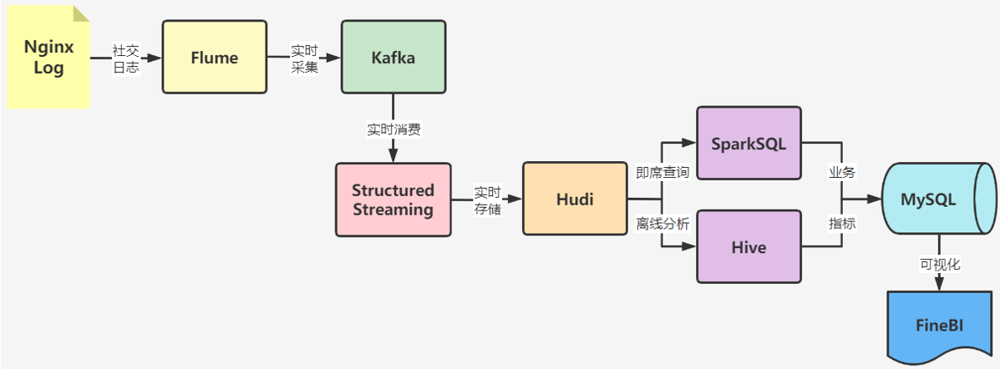
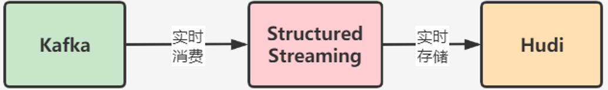
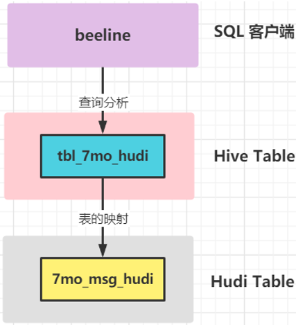
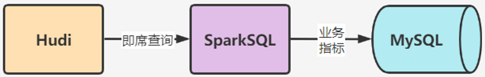

实时采集七陌用户聊天信息数据，存储消息队列Kafka，再实时将数据处理转换，将其消息存储Hudi表中，最终使用Hive和Spark业务指标统计，基于FanBI可视化报表展示。





1、Apache Flume：分布式实时日志数据采集框架
    由于业务端数据在不断的在往一个目录下进行生产, 我们需要实时的进行数据采集, 而flume就是一个专门用于数据采集工具,比如就可以监控某个目录下文件, 一旦有新的文件产生即可立即采集。
2、Apache Kafka：分布式消息队列
    Flume 采集过程中, 如果消息非常的快, Flume也会高效的将数据进行采集, 那么就需要一个能够快速承载数据容器, 而且后续还要对数据进行相关处理转换操作, 此时可以将flume采集过来的数据写入到Kafka中,进行消息数据传输，而Kafka也是整个集团中心所有业务线统一使用的消息系统, 用来对接后续的业务(离线或者实时)。
3、Apache Spark：分布式内存计算引擎，离线和流式数据分析处理
    整个七陌社交案例, 需要进行实时采集，那么此时也就意味着数据来一条就需要处理一条, 来一条处理一条, 此时就需要一些流式处理的框架，Structured Streaming或者Flink均可。
    此外，七陌案例中，对每日用户消息数据按照业务指标分析，最终存储MySQL数据库中，选择SparkSQL。
4、Apache Hudi：数据湖框架
    七陌用户聊天消息数据，最终存储到Hudi表（底层存储：HDFS分布式文件系统），统一管理数据文件，后期与Spark和Hive集成，进行业务指标分析。
5、Apache Hive：大数据数仓框架
    与Hudi表集成，对七陌聊天数据进行分析，直接编写SQL即可。
6、MySQL：关系型数据库
    将业务指标分析结果存储在MySQL数据库中，后期便于指标报表展示。
7、FineBI：报表工具
    帆软公司的一款商业图表工具, 让图表制作更加简单


## 数据采集

七陌社交数据源特点：持续不断的向某一个目录下得一个文件输出消息。

功能要求：实时监控某一个目录下的文件, 一旦发现有新的文件,立即将其进行采集到Kafka中。


编写采集配置文件：`7mo_mem_kafka.properties`

```properties
# define a1
a1.sources = s1
a1.channels = c1
a1.sinks = k1

#define s1
a1.sources.s1.type = TAILDIR
#指定一个元数据记录文件
a1.sources.s1.positionFile = /export/server/flume/position/taildir_7mo_kafka.json
#将所有需要监控的数据源变成一个组
a1.sources.s1.filegroups = f1
#指定了f1是谁：监控目录下所有文件
a1.sources.s1.filegroups.f1 = /export/data/7mo_data/.*
#指定f1采集到的数据的header中包含一个KV对
a1.sources.s1.headers.f1.type = 7mo
a1.sources.s1.fileHeader = true

#define c1
a1.channels.c1.type = memory
a1.channels.c1.capacity = 10000
a1.channels.c1.transactionCapacity = 1000

#define k1
a1.sinks.k1.type = org.apache.flume.sink.kafka.KafkaSink
a1.sinks.k1.kafka.topic = 7MO-MSG
a1.sinks.k1.kafka.bootstrap.servers = node1.itcast.cn:9092
a1.sinks.k1.kafka.flumeBatchSize = 10
a1.sinks.k1.kafka.producer.acks = 1
a1.sinks.k1.kafka.producer.linger.ms = 100

#bind
a1.sources.s1.channels = c1
a1.sinks.k1.channel = c1

```


## 实时存储七陌数据

编写Spark中流式程序：StructuredStreaming，实时从Kafka消费获取社交数据，经过转换（数据字段提取等）处理，最终保存到Hudi表中，表的格式：ROM。



下面是主函数, 具体方法封装不再展示:

```scala
def main(args: Array[String]): Unit = {
    // step1、构建SparkSession实例对象
    val spark: SparkSession = createSparkSession(this.getClass)

    // step2、从Kafka实时消费数据
    val kafkaStreamDF: DataFrame = readFromKafka(spark, topicName = "7mo-msg")

    // step3、提取数据，转换数据类型
    val streamDF: DataFrame = process(kafkaStreamDF)

    // step4、保存数据至Hudi表中：MOR（读取时保存）
    //printToConsole(streamDF)
    saveToHudi(streamDF)

    // step5、流式应用启动以后，等待终止
    spark.streams.active.foreach(query => println(s"Query: ${query.name} is Running ............."))
    spark.streams.awaitAnyTermination()
}
```

## hive离线查询

将Hudi表数据，与Hive表进行关联，使用beeline等客户端，编写SQL分析Hudi表数据。




## sparkSQL即时查询

编写SparkSQL程序，加载Hudi表数据封装到DataFrame中，按照业务指标需要，编写SQL分析数据，最终保存到MySQL数据库表中，流程示意图如下：




## 报表可视化

使用FineBI，连接数据MySQL数据库，加载业务指标报表数据，以不同图表展示。


