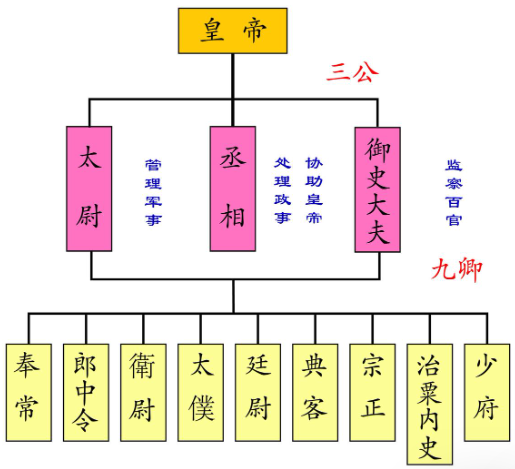

# 三国军衔

## 三公九卿

秦始皇统一天下后，建立了百官的职务体系，就是著名的三公九卿制度，后世王朝的官制基本都是从这个体系中慢慢演变出来的。

最为尊贵的就是丞相、太尉、御史大夫。丞相主管所有政事，太尉主管军事，御史大夫主管监察。

刘邦建国后，主承秦制，但是对掌管军事的很多武官都不放心，这“太尉”就时常空缺。楚汉之争的时候，刘邦其实还在下风，很多人士官出逃，其中就有韩信。萧何月下追回韩信，向刘邦保举，最终刘邦就拜韩信为汉军的第一任大将军，这也是汉帝国第一任的大将军。

霍去病和他的舅舅卫青都为西汉立下了赫赫战功，卫青被汉武帝授予“大将军”的称号，为了显示独一无二的恩宠，在封赏霍去病时，武帝便想出了“骠骑将军”这个称号，来彰显霍去病领军打仗时的英勇。

为了制约丞相，汉武帝设立了一个新的机构叫"中朝"（也叫内朝）。汉武帝很多决策基本都在内朝定论，定论后再交给丞相去执行，如此改革，内朝基本就凌驾于丞相之上了。那么汉武帝这个内朝最高的官员叫什么呢？答案就是：大司马！由卫青和霍去病同时担任，两人官级俸禄一样。卫青的职务就是“大司马大将军”、霍去病的职务是“大司马骠骑将军”。

1. 将军
    1. 大将军(大司马)
    2. 骠骑将军
    3. 车骑将军
    4. 卫将军
    5. 四征四镇前后左右将军
    6. 杂号将军
    7. 偏将军
    8. 裨将军
2. 中郎将
3. 校尉
4. 都尉

### 都尉

尉，左下角的“小”字，在小篆中本写作“火”；右边的“寸”，本写作“又”，“又”表示手。原始义是把火盛于斗中使斗受热，然后手持斗柄来熨烫缯帛。固而“尉”字有“镇服”“慑服”之义，以暴力镇服天下。

“都”则是总指挥之意，都尉应当指的是高级武官。

### 校尉

所以“校”就是军中的一部，一个单位，而统帅校的指挥官，就被称之为校尉。

西汉初期，都尉地方化泛滥化时，校尉便取代都尉，成为军中仅次于将军的高级武官。

比如张骞就曾“以校尉从大将军(卫青)击匈奴”，霍去病的嫖姚校尉，虽从属于大将军卫青，但其本身的八百骑却是一支独立的军队。

### 中郎将

秦朝时，九卿之一郎中令（汉武帝时改为光禄勋）就是众多郎官的最高长官，郎中令（光禄勋）的次一级就是中郎将。

因中郎将靠近皇帝，地位比较尊贵，所以皇帝经常派他们去执行一些任务，久而久之，就在上述诸中郎将之外又出现了一些新的中郎将。

比如董卓，“(董卓)乃使东中郎将董越屯黾池，中郎将段煨屯华阴，中郎将牛辅屯安邑，其余中郎将、校尉布在诸县，以御山东。”

董卓时期还属于东汉后期，将军的名号暂时比较尊贵与稀少，所以中郎将就是军衔的“终点”了。

### 裨将军

裨将军是汉末三国时期将军号最低的一等，其称号直接来源于战国以来的裨将，相当于副将。

如“武安君白起为上将军，而王龁为尉裨将"，白起为主将，王龁为副将，，“梁为会稽将，籍为裨将”，项梁起兵时，项羽为副将。

### 偏将军

裨将军之上为偏将军。古时，将协同主力军队作战的侧翼军队称之为偏师，而偏将即为偏师的统帅。如《后汉书》；“禹以期为能，独拜偏将军，授兵二千人……"，禹中东汉大将邓禹，期为铫期，一员偏军统帅。

### 杂号将军

杂号将军是相当对重号将军而言的，杂号将军处在偏将军之上，重号将军之下。杂号将军的命名主要分为二类，一类以所担职责、执掌冠名，如楼船将军、轻车将军；第二类也是最多的一类，以各种美称和威名冠名，如奋威将军、扬武将军、荡寇将军等等

汉武帝根据军种、军阵、征讨目的地等特点，任命了很多牌号的将军，而且汉武帝本人一般亲自操刀制定作战计划，然后下令后，就让几个将军分头按计划进军，最后先实现战略目标，比如：

汉武帝元光二年六月，汉武帝任命御史大夫韩安国卫护军将军，卫尉李广卫骁骑将军，太仆公孙贺为轻车将军，大行王恢为将屯将军，太中大夫李息卫材官将军，统帅战车、骑兵、步兵共三十多万人暗中埋伏在马邑附近的山谷，合围匈奴单于。

大家可以发现，这些人并非都是武官，而是根据任务所需安排，而且将军名号都可以从字面意思推测这路军队主要兵种、或任务是什么，都有一定的临时性。

### 重号将军

重号将军主要指“四征”“四镇”，前后左右将军，卫将军，车骑将军，骠骑将军，大将军。

四征将军指征东将军、征西将军、征南将军、征北将军四将军；四镇将军指镇东将军、镇西将军、镇南将军、镇北将军四将军。

卫将军，顾名思义，其最初的职责是保卫皇宫，统领禁兵，如《汉书》中有“夜拜宋昌为卫将军，领南北军”。

车骑将军在汉代掌禁兵，负责宫廷守卫，与卫将军大致相同，应该说是卫将军的升级版。

至于骠骑将军最早见于汉武帝拜霍去病为骠骑将军，“乃置大司马位，大将军、票骑将军皆为大司马。定令，令票骑将军秩禄与大将军等”，这是汉武帝特意为霍去病设置，因为当时大将军为卫青。

而大将军则为诸将之冠，大将军一职虽是军职，但汉朝的大将军一般由外戚出任，比如霍光，窦宪、梁冀、何进等等。

### 司隶校尉

司隶校尉，是“司隶”和“校尉”两词的组合。司隶，字面意思是“掌管奴隶（的人）”。周朝时，是秋官司寇的属官。主要负责京城治安、保卫王宫，以及其他琐碎小事。校尉，是古代一种武官名称。校，营垒的意思，后来演变成一种军事单位，人数在一千左右。尉，使布料平整，有平难的意思，后来成为武官的名称。综合上文，校尉的字面意思为“掌管一个营垒，并且可以平定叛乱的人”。

捕盗、治安官员，汉代设置，成为维护京城重要的官员，据说汉桓帝时李膺任司隶校尉，把“十常侍”之一的某宦官的哥哥违法给斩杀了，吓得大小宦官休沐的时候都不敢出宫寻欢作乐了，汉桓帝不解，宦官们说：“怕李校尉!”

## 三公

秦制：丞相，太尉，御史大夫为三公（宰相级别）
汉朝: 改丞相为大司徒，太尉为大司马，御史大夫为大司空，为三公

- 太尉负责掌管军事，作为全国最高武职，相当于皇帝的最高军事顾问，但是太尉不能直接指挥军队。
- 司徒其实就是全国掌管百姓之事的最高长官。
- 司空掌管水利，其主要工作就是土木建筑工程，可能大家觉得这个职位不是很高，但是在古代，水利是国家的重中之重，保水利就是保民生，保民生就是保国家之基础

袁绍成功上位，因为其是庶子，才引起嫡子袁术的嫉妒。

[校尉和都尉](https://tieba.baidu.com/p/385417186)
[细说大汉将军牌号](https://zhuanlan.zhihu.com/p/1914980303786730560)
[都尉、校尉、中郎将与将军](https://www.toutiao.com/article/7340315679108776463/?wid=1764759603843)
[官职的今夕对比](https://www.zhihu.com/question/7408659901)
[骑都尉](https://www.qulishi.com/article/202008/431701.html)
[爵位](https://www.sohu.com/a/358023151_120009791)
[关羽的汉寿亭侯究竟是什么](https://www.163.com/dy/article/CUQI0PG50523M9JK.html)
[司马司徒司空](https://www.zhihu.com/question/371423875)

