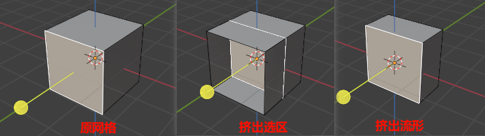
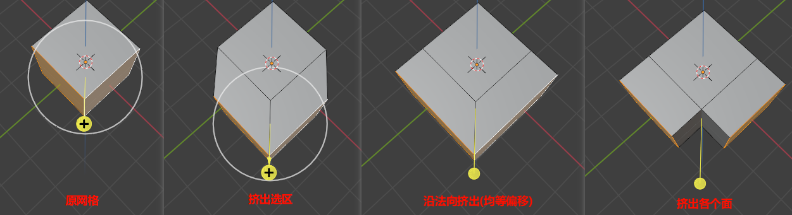
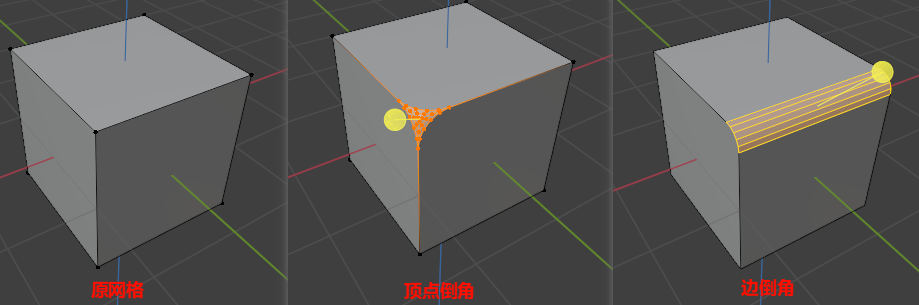
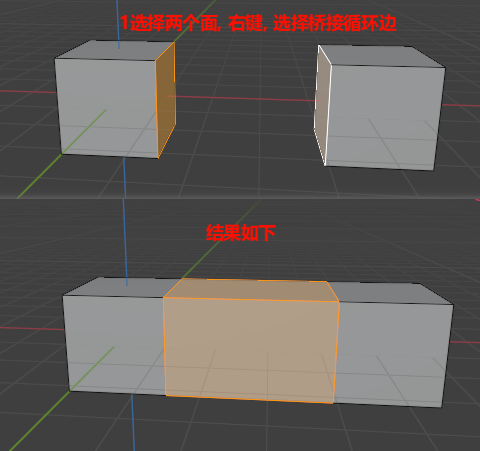

# 建模操作(编辑模式)

## 挤出(E)

1. 挤出选区(E): 点击控制头(法向量), 向内挤时, 其他面保持. 

    ✨使用E进行挤出后，按右键不会取消挤出，只是取消了移动的过程，导致重合点。取消要确定后按ctrl+z进行撤销。

2. 挤出流形(Alt+E): 向内挤时, 其他面不保持

    

3. 沿法向挤出(Alt+E): 各个面连接
4. 挤出各个面(Alt+E): 各个面不连接

    

5. 挤出至光标(Alt+E)

✨注意挤出没有创建新面, 他是将原面移动, 然后再旧的位置添加了4个边, 而没有填充成面

## 内插面(I)

## 倒角(Ctrl+B)

1. 顶点倒角(Ctrl+Shift+B): 鼠标移动控制倒角大小, 滚轮控制段数, 段数越多越平滑
2. 边倒角(Ctrl+B): 鼠标移动控制倒角大小, 滚轮控制段数, 段数越多越平滑

## 环切(Ctrl+R)

1. 环切(Ctrl+R): 切割线可以移动, 移动时按右键可以居中切割线
2. 环切偏移(Ctrl+Shift+R)

## 切割(K): 在面上手工切割出面

## 断开(V)

1. 断离顶点(V): 选择多个面相交的点, 然后指令(顶点-断离顶点)

## 合并(M)

选择断开的多个顶点, 然后指令(网格-合并, M)

1. 合并到中心: 选两个点, 按M, 选合并到中心
2. 合并到游标:
3. 合并到塌陷: 结果和合并到中点相同, 因为塌陷取的是两个点的质心点
4. 合并到首选点:
5. 合并到末选点:
6. 按距离合并(自动合并): 合并距离参数是自动合并的范围, 当目标们的距离小于合并距离时, 就会自动合并

## 连接(J)

1. 连接顶点路径(J): 选择两个点, 然后指令(顶点-连接顶点路径)
2. 合并两个对象, Ctrl+J

## 分离(P)

和Ctrl+J相反

## 填充(F)

1. 万能填充(F)
2. 偶数栅格填充(Ctrl+F): 栅格填充只能用于偶数边, 否则会报错

## 桥接

桥接的前提是必须是同一对象, 只能自己桥接自己. 如果是两个物体, 先使用Ctrl+J进行合并.

选择需要桥接的线段->边(Ctrl+E)->桥接循环边

### 镂空网格体
    
1. 选择左右两个面, 插入面(I)
2. 插入面, 右键, 桥接

### 拱桥制作

## 细分

细分(添加顶点): 鼠标选中边, 执行命令(边-细分)

## 面三角化

面三角化(Ctrl+T), 用于布线

## 布尔运算插件(Bool Tool):

1. 编辑模式:
    1. 箱选切割
    2. 圆选切割: 默认从圆周画图, Alt从中心画图. Shift画圆.
    3. 多边形切割
2. 物体模式(Ctrl+Shift+B):
    1. 差集(Ctrl+Shift+数字键盘-): 首先选择删除的物体, 再选择保留的物体
    2. 并集(Ctrl+Shift+数字键盘+):
    3. 交集(Ctrl+Shift+数字键盘*):
    4. 交集取反(Ctrl+Shift+数字键盘/):

    

## 参考

1. https://www.bilibili.com/opus/577600829897633478