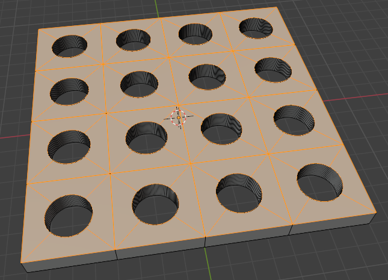

## 洞洞板制作

1. 创建平面(Shift+A), 并细分(右键->细分), 可以重复细分(Shift+R)也可以直接选择细分数.

    

2. 内插面(II)✨按两次I是每个小面插入, 按一次I是整个面插入

    

3. 扣洞
    1. 方形洞洞板扣洞, 直接删除选中面

        

    2. 圆形洞洞板扣洞
        1. 给每个小方块细分, 添加顶点组, 然后指定.  

            

        2. 删除面, 然后点击定点组的选择. 切换到定点模式, 球形化(网格->变换->球形化, Shift+Alt+S)

            

    3. 挤出立体模型

        

## 弯曲物体

### 简易变形修改器

1. 创建物体并循环切割. ✨弯曲物体必须切割, 切割数决定平滑度
2. 给物体添加修改器: 修改器属性->形变->简易形变
3. 添加弯曲参考物: 创建空物体, 并添加到简易形变修改器中
4. 调整参考物和修改器的参数调整弯曲

### 曲线修改器

1. 创建物体并循环切割. ✨弯曲物体必须切割, 切割数决定平滑度
2. 给物体添加修改器: 修改器属性->形变->曲线
3. 添加曲线: 常见曲线, 并添加曲线修改器中
4. 调整参考物和修改器的参数调整弯曲

### 弯曲命令

网格->物体->弯曲(Shift+W)

1. 选择需要弯曲的网格的所有顶点
2. 游标所在点是弯曲的起点, 所以只有一半会弯曲
3. 对称弯曲, 在弯曲过程中按Alt, 两头同时弯曲

### [桥接](2_2移动旋转缩放.md)

