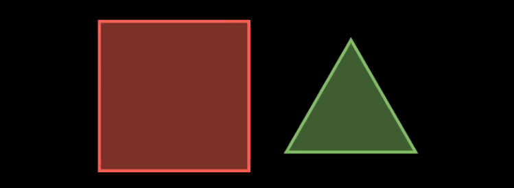
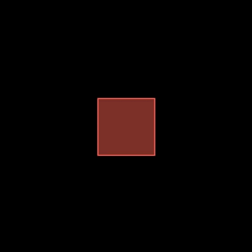
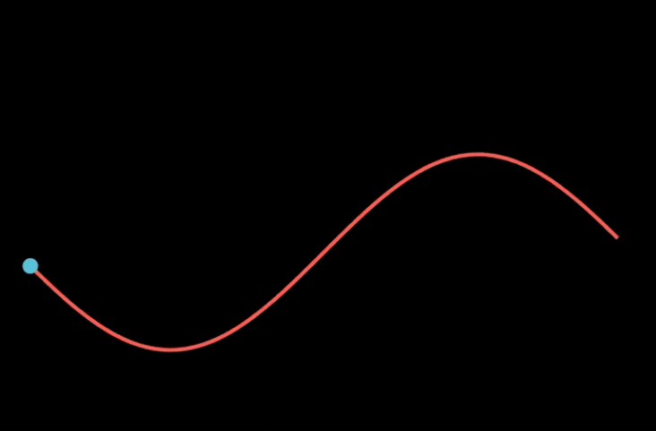
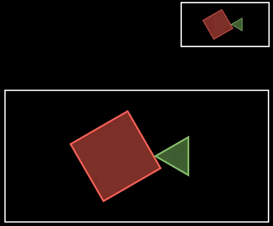
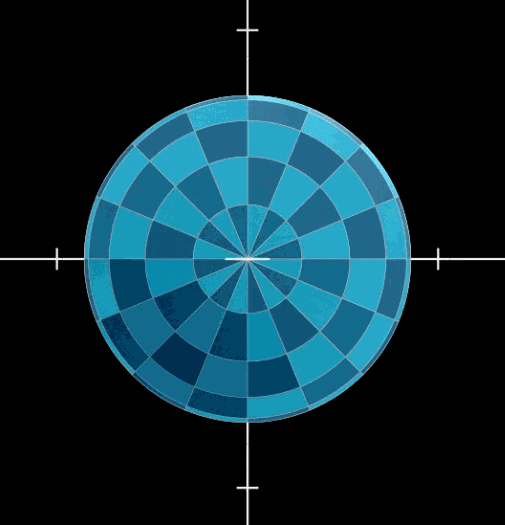

# 相机基础


相机移动常用的两种方式：

- 移动焦点：改变相机的焦点，焦点在那个元素，那个元素就会在屏幕中心
- 改变视野：改变相机与元素的距离，离得越远，物体越小。


## 2D场景相机移动

### 移动焦点

manim中移动焦点要继承 MovingCameraScene类，然后通过 self.camera.frame.animate.move_to函数来移动焦点。

下面的示例构造了一个正方形，一个三角形，然后通过改变焦点来形成元素移动的动画。实际上元素并没有移动，它们的坐标始终没变，变化的是相机的焦点。

```python
class CameraSample1(MovingCameraScene):


    def construct(self):
        s = Square(color=RED, fill_opacity=0.5)
        t = Triangle(color=GREEN, fill_opacity=0.5)
        vg = VGroup(s, t)
        vg.arrange(RIGHT, buff=MED_LARGE_BUFF)
        self.add(vg)

        self.play(self.camera.frame.animate.move_to(s))  # 焦点移动到正方形(正方形在中间)
        self.play(self.camera.frame.animate.move_to(t))  # 焦点移动到三角形(三角形在中间)
        self.play(self.camera.frame.animate.move_to(vg))  # # 焦点移动到组中心(组中心在中间)

        self.wait()
```




### 改变视野


改变视野通过 self.camera.frame.animate.set方法，通过这个方法设置视野的宽度，可以形成缩放元素的效果。

下面的示例，通过改变视野的宽度，让元素出现放大和缩小的现象，实际上元素并没有变化。变化的是相机到元素的距离。


```python
class CameraSample1(MovingCameraScene):

    def construct(self):
        s = Square(color=RED, fill_opacity=0.5)
        self.add(s)
        self.camera.frame.save_state()
        self.play(self.camera.frame.animate.set(width=s.width * 2))  # 将调整视野范围，看起来像元素放大2倍
        self.wait(0.3)
        self.play(self.camera.frame.animate.set(width=s.width * 8))  # # 将调整视野范围，看起来像元素放大2倍
        self.wait(0.3)
        self.play(Restore(self.camera.frame))

        self.wait()
```




### 追踪物体


```python
class CameraSample3(MovingCameraScene):
    def construct(self):
        self.camera.frame.save_state()

        graph = FunctionGraph(
            lambda x: np.sin(x),
            x_range=[-3, 3],
            color=RED,
        )
        d = dot(graph.get_start())
        self.add(graph, d)

        self.play(self.camera.frame.animate.scale(0.5).move_to(d))

        def update_curve(mob):
            mob.move_to(d.get_center())

        self.camera.frame.add_updater(update_curve)
        self.play(MoveAlongPath(d, graph), rate_func=linear, run_time=2)
        self.camera.frame.remove_updater(update_curve)

        self.play(Restore(self.camera.frame))
```



### 鹰眼效果

鹰眼的效果是通过两个相机来实现的，两个相机的焦点一样，但是视野不一样。鹰眼效果一般用在提供全局视图的场合，特别是当元素特别多的时候。

```python
class CameraSample2(ZoomedScene):
    def __init__(self, **kwargs):
        ZoomedScene.__init__(
            self,
            zoom_factor=3,
            zoomed_display_height=1,
            zoomed_display_width=2,
            image_frame_stroke_width=5,
            zoomed_camera_config={
                "default_frame_stroke_width": 3,
            },
            **kwargs
        )

    def construct(self):
        s = Square(color=RED, fill_opacity=0.5, side_length=1.5)
        t = Triangle(color=GREEN, fill_opacity=0.5).scale(0.5)
        vg = VGroup(s, t)
        vg.arrange(RIGHT, buff=SMALL_BUFF)
        self.add(vg)
        self.activate_zooming(animate=False)
        self.play(s.animate.shift(LEFT), t.animate.shift(RIGHT))
        self.play(s.animate.rotate(2 * PI / 3), t.animate.rotate(PI / 2))
        self.play(s.animate.shift(RIGHT), t.animate.shift(LEFT))
        self.wait()
```




## 3D场景


相机其实主要就是应用在3D场景中的，所以 manim的3D场景类 ThreeDScene中提供了一个非常方便的移动相机的方法 move_camera。示例中的球其实一直没动。


```python
class CameraSample4(ThreeDScene):
    def construct(self):
        axes = ThreeDAxes()
        sphere = Surface(
            lambda u, v: np.array(
                [
                    1.5 * np.cos(u) * np.cos(v),
                    1.5 * np.cos(u) * np.sin(v),
                    1.5 * np.sin(u),
                ]
            ),
            v_range=[0, TAU],
            u_range=[-PI / 2, PI / 2],
            checkerboard_colors=[BLUE_D, BLUE_E],
            resolution=(15, 32),
        )
        self.add(axes, sphere)

        self.move_camera(phi=75 * DEGREES, theta=30 * DEGREES)
        self.move_camera(zoom=1.5)
        self.move_camera(zoom=0.5)
        self.wait()
```




## 参考

- https://www.cnblogs.com/wang_yb/p/17334029.html


