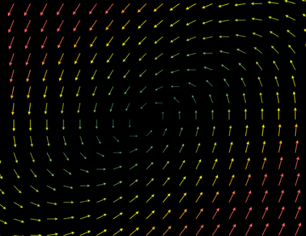

# vector_field

- ArrowVectorField：由一组变化矢量构成的矢量场（通过箭头形式，直观呈现矢量场中各点的方向与大小）

    

- StreamLines：通过运动代理的轨迹展示矢量场流动的流线（聚焦矢量场整体流动趋势，比如流体运动、场线分布状态）

    

- VectorField：基础矢量场类（定义矢量场的核心逻辑，是 ArrowVectorField、StreamLines 等类的父类，用于描述空间中各点的矢量分布规律）

