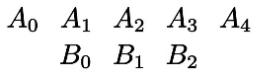

# 移动(shift和move_to)

## shift

是移动多少个单位的距离

- `shift(LEFT*5)`: 表示向左移动5个单位距离
- `shift(UP+RIGHT)`: 表示上移一个的单位距离, 再右移一个单位距离, 等价于`shift(UR)`
- `shift(UP, RIGHT)`: 表示上移一个的单位距离, 再右移一个单位距离, 注意和`shift(UP+RIGHT)`是一个参数, 而该方法是两个参数.


## move_to

是移动到指定的坐标点


- `move_to(LEFT)`: 移动到(-1, 0, 0)点, 默认是将mobject的中心点和目标点重合
- `move_to(LEFT, aligned_edge=LEFT)`: 移动到(-1, 0, 0)点, 并将mobject的做边缘和目标点对齐
- `move_to(UP, coor_mask=(1, 0, 1))`: 移动到(0, 0, 0)点, coor_mask屏蔽了UP(0, 1, 0)方向的距离量


## to_corner, to_edge


- `to_corner(UL, buff=0.5)`: 移动到左上角, 向右下偏移0.5个单位距离
- `to_edge(UP, buff=0.5)`: 移动到上边缘, 向下移动0.5个单位距离

## align_to

- `align_to(mobject, RIGHT)`: 将右边缘对齐到mobject的右边缘 

## next_to

- `next_to(mobject, UP)`: 移动到mobject上面
- `next_to(mobject, RIGHT, aligned_edge=DOWN)`: 移动到mobject的右面, 并且底部边缘线与mobject的底部边缘线对齐
- `next_to(mobject, RIGHT, buff=0.5)`: 移动到mobject的右面, 二者的间距为0.5个单位距离


## Vgroup

```python
A = VGroup(A_0, A_1, A_2, A_3, A_4)
B = VGroup(B_0, B_1, B_2)
B.next_to(A[1],D0wN,aligned_edge=LEFT)
```


[](./移动/组移动.png)


```python
B.next_to(A[2],DowNsubmobject_to_align=B[1].aligned_edge=LEFT)
```



## 参考


- https://www.bilibili.com/video/BV1p54y197cC/

